# 运算放大器的Cascode补偿

## 文献

> D. B. Ribner and M. A. Copeland, "Design techniques for cascoded CMOS op amps with improved PSRR and common-mode input range," in IEEE Journal of Solid-State Circuits, vol. 19, no. 6, pp. 919-925, Dec. 1984

## 补偿的目的

和Ahuja补偿一样，也是为了缓解普通的Miller Compensation下其中一个电源PSRR性能较差的问题

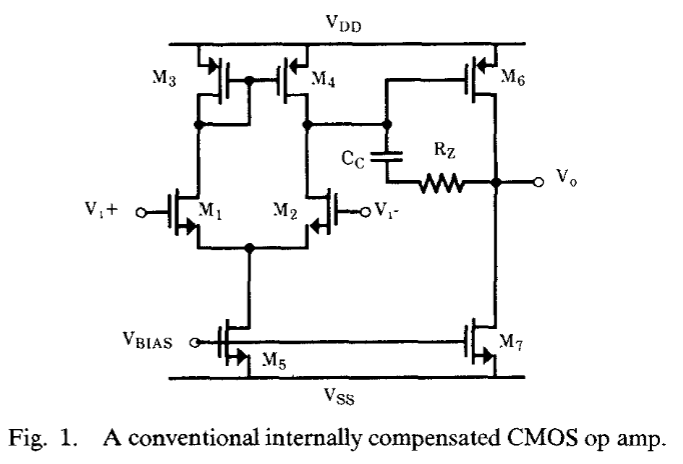
传统结构在中等/高频下，由于$C_c$电容的短路作用，第二级的PMOS驱动管相当于是二极管连接，电源$V_{DD}$的电压波动会通过电容$C_{GS}$直接耦合到输出

为了解决PSRR过早下降的问题，作者提出了Cascode补偿：
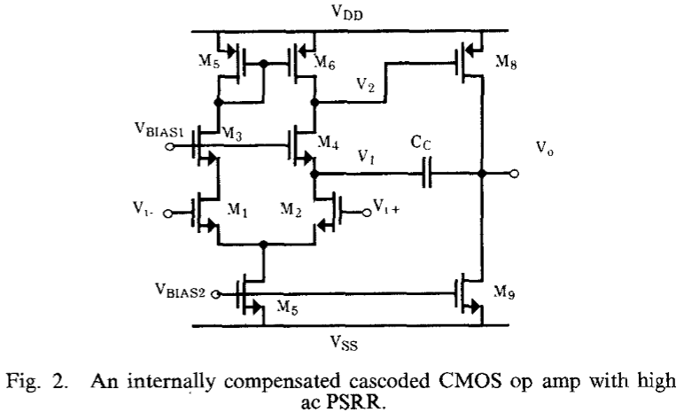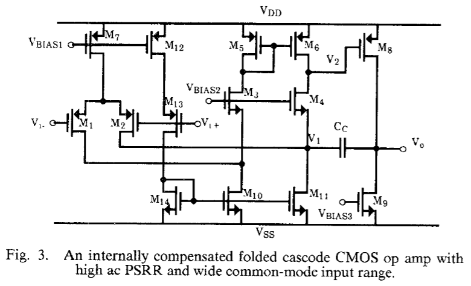

Fig3是为了改善Fig2中输入共模范围较小的问题

Fig2中，电路的共模输入范围为：$$2V_{od}+V_{TH}\leq V_{in,CM}\leq V_{DD}-2V_{od}$$
Fig3中，电路的共模输入范围为：$$V_{od}-V_{TH}\leq V_{in,CM}\leq V_{DD}-2V_{od}-V_{TH}$$

$M_{12}\sim M_{14}$三个晶体管是用作给电流做动态偏置的。因为当输入共模信号足够高时，$M_7$进入线性区，若$M_{10},M_{11}$为固定偏置电流，那么$M_5,M_6$需要提供大量的电流，从而导致第一级的输出电压非常低，进而导致输出电压非常高，接近VDD。当改用动态偏置电流$M_{10},M_{11},M_{14}$的时候可以改善这种情况，从而使得输出$V_o$不会上升太多，从而解决了上述问题

## Miller补偿——频率响应

具体电路图如图1所示，而小信号模型如下图所示
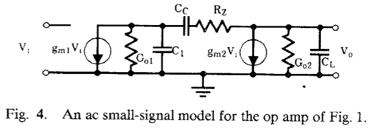
其中：
$$\begin{cases}
    G_{o1}=g_{o2}+g_{o4}=\frac{1}{r_{o2}}+\frac{1}{r_{o4}}=\frac{1}{r_{o2}||r_{o4}}\\
    G_{o2}=g_{o6}+g_{o7}=\frac{1}{r_{o6}}+\frac{1}{r_{o7}}=\frac{1}{r_{o6}||r_{o7}}\\
\end{cases}$$

这个电路的零极点是个老生常谈的问题：
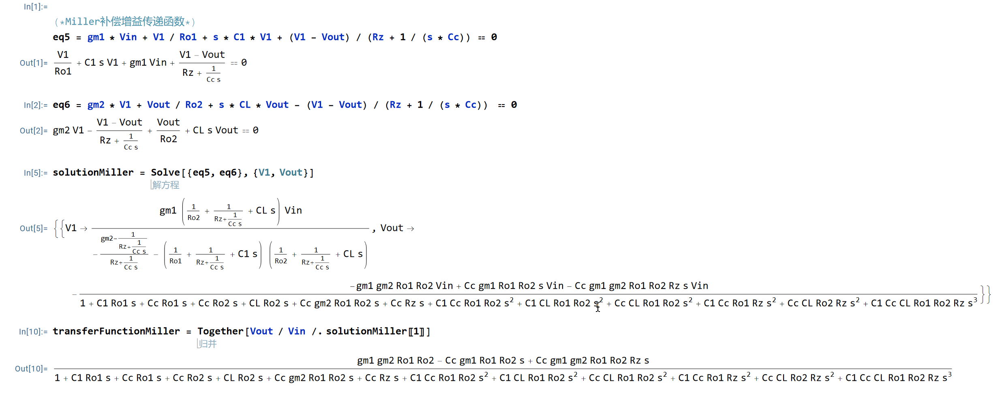
(下面解的下标是根据图1来表示的)
$$\left\{
\begin{array}
{c}\omega_{p1}\approx\frac{-1}{g_{m6}(r_{o2}\|r_{o4})(r_{o6}\|r_{o7})C_c} \\
\omega_{p2}\approx \frac{-g_{m6}}{C_1+C_L+C_1C_L/C_c}\approx\frac{-g_{m6}}{C_L}\\
\omega_{p3}=\frac{-1}{R_zC_1}\\
\omega_z\approx\frac{1}{C_c(g_{m6}^{-1}-R_z)}
\end{array}\right.$$

同样的，让$R_z>\frac{1}{g_{m6}}$即可得到不错的效果，也可以让这个零点去抵消极点，但是因为在实际制造过程中/PVT变化过程中会导致不能精确抵消，这样会产生一对靠的很近的零极点对，会对建立时间产生影响，零极点对频率越低，恶化效果越严重

## Miller补偿——PSRR

由于运放都工作在闭环条件下，因此在使用小信号计算PSRR的时候，最好建模的模型也是闭环下的小信号模型

PSRR的直接仿真图如下所示：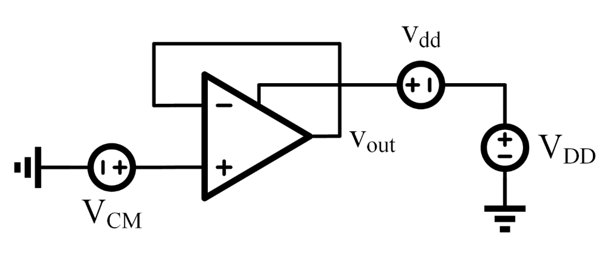
对于这个结构，有：$$v_{out}=A_{v,diff}\cdot(0-v_{out})+A_{v,vdd}\cdot v_{dd} \rightarrow \frac{v_{out}}{v_{dd}}=\frac{A_{v,dd}}{1+A_{v,diff}}\approx PSRR$$

和我们在Ahuja文章中推导的结果一致，不同的是那里在开环下计算的$A_{v,dd}$，而在这里因为$A_{v,diff}$比较复杂（三个极点一个零点），我们跳过分开的计算，直接在闭环下计算PSRR，PSRR的这个值是越小越好的

小信号模型如下图所示：
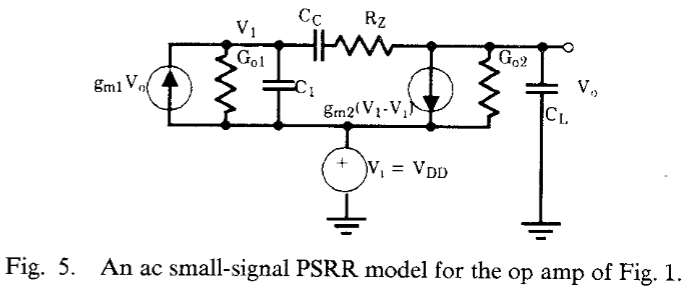
在这个小信号模型中，因为仅关注$V_{DD}$的小信号波动对输出的影响，假设尾电流源是足够稳健的，那么尾电流源的部分均可以理解为开路，即可以认为$$G_{o1}=\frac{1}{r_{o4}},G_{o2}=\frac{1}{r_{o6}}$$
通过解小信号方程：
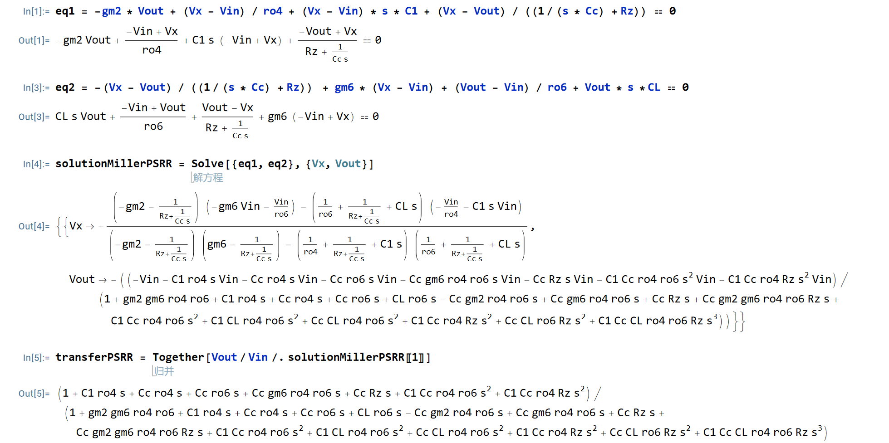
经过非常多的化简，得到：$$\mathrm{PSRR}\approx\frac{(s+\omega_{p1})}{(s+GBW)}$$

由于该零点是一个低频零点，所以PSRR会在较低频时就产生衰减
由于第二级PMOS和补偿电容之间相对于是二极管连接，当频率较高时，PMOS等效于二极管连接。而电路的电流是由下方的NMOS决定，也就是说$M_6$的栅极电压和源极电压倾向于同步变化（从而抑制流过的电流的变化），这样会导致电源的波动直接耦合到输出，从而影响PSRR。所以需要解耦补偿电容与M6栅极的连接

## Cascode补偿

Fig3的小信号模型建立如下：
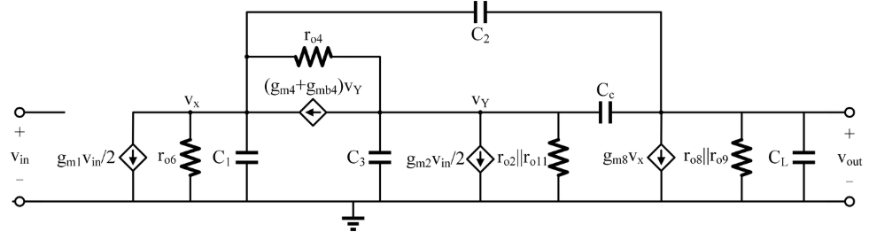
等同于
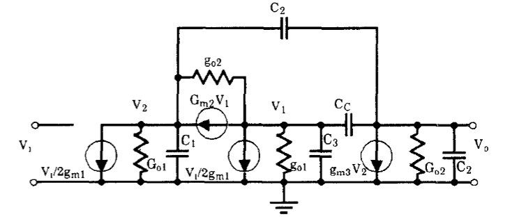
这里是假设差分输入对的两端一端输入$\frac{v_{in}}{2}$，一端输入$-\frac{v_{in}}{2}$,Vx和Vy间接着$M_4$，C1主要是Cgs8和结电容；C2主要是Cgd8；C3主要是Cgs4和相应的结电容

注意：
+ $M_2$管的输入可以直接影响到Cc从而影响输出，而$M_1$的影响较为间接，需要通过电流镜$M_5,M_6$，这里也会有电容存在（镜像极点问题），一般情况下可忽略，也可以将这种影响统一到电容C1中
+ **忽略$g_{o1},g_{o2}$**：通过计算可以得出Vx和Vy处的阻抗分别为$r_{o6}$和$\frac{1}{g_{m4}+g_{mb4}}$，与$g_{o1},g_{o2}$的关系不大，因此可忽略
+ **忽略C3**：相比于Cc来说非常小

### 主极点求解

主极点在Vy处，根据Miller Compensation有：
$$\begin{cases}
    Z_Y=\frac{1+r_{o6}/r_{o4}}{1/r_{o4}+(g_{m4}+g_{mb4})}\approx\frac{1+r_{o6}/r_{o4}}{(g_{m4}+g_{mb4})}\\
\frac{v_{out}}{v_Y}\approx (g_{m4}+g_{mb4})\cdot(r_{o6}\parallel r_{o4})\cdot[-g_{m8}(r_{o8}\parallel r_{o9})]
\end{cases}$$
因此可以得到主极点的时间常数为：
$$\begin{cases}
    \tau_{Y}=Z_{Y}\cdot C_{Y}\approx\frac{1+r_{o6}/r_{o4}}{g_{m4}+g_{mb4}}\cdot g_{m8}\frac{g_{m4}+g_{mb4}}{1+r_{o6}/r_{o4}}r_{o6}(r_{o8}\parallel r_{o9})C_{c}\\ \quad \ =g_{m8}r_{o6}(r_{o8}\parallel r_{o9})C_{c}
\end{cases}$$

即主极点为：
$$\omega_{p1}=1/\tau_Y\approx\frac{1}{g_{m8}r_{o6}(r_{o8}\parallel r_{o9})C_c}$$
该主极点频率与使用Miller Compensation结构的主极点频率几乎一样
而直流增益，可以通过详细计算（忽略$g_{o1},g_{o2}$）得到：
$$A_{v,DC}=g_{m1,2}g_{m8}r_{o6}(r_{o8}\parallel r_{o9})$$
增益相较于Miller Compensation结构略有上升，GBW与Miller Compensation结构完全相同：
$$GBW = \frac{g_{m1,2}}{C_c}$$
完全求解出Vout/Vin为：
$$\begin{cases}
    \frac{V_{out}}{V_{in}}(s)=\frac{-\frac{g_{m1,2}(C_1+2C_2)}{2C_L(C_1+C_2)}\left[s-\frac{g_{m8}}{(C_1+2C_2)}(1+\delta_2)\right]\left[s+2\frac{g_{m4}^{^{\prime}}}{C_C}\frac{1}{(1+\delta_2)}\right]}{\left[s+\frac{1}{g_{m8}r_{o6}(r_{o8}\|r_{o6})C_C}\right]\left\{s^2+s\left[\frac{g_{m4}^{^{\prime}}[C_L(C_1+C_2)+C_CC_1]+g_{m8}C_LC_2}{C_LC_C(C_1+C_2)}\right]+\frac{g_{m4}^{^{\prime}}g_{m8}}{C_L(C_1+C_2)}\right\}}\\
    g_{m4}^{\prime}=g_{m4}+g_{mb4}\\
    \delta_1=8\frac{g_{m4}^{\prime}}{g_{m8}}\left(\frac{C_1}{C_C}+2C_2\right)\\
    \delta_2=\frac{(1+\delta_1)^{1/2}-1}{2}
\end{cases}$$
从中可以看出，Cascode补偿中依旧存在右半平面零点，但相较于Miller补偿这个零点的频率较高，不会对我们的设计造成太多影响

分母中存在一个二项式：
$$D_p(s)=s^2+s\left[\frac{g_{m4}{^{\prime}}[C_L(C_1+C_2)+C_CC_1]+g_{m3}C_LC_2}{C_LC_C(C_1+C_2)}\right]+\frac{g_{m4}{^{\prime}}g_{m8}}{C_L(C_1+C_2)}$$
典型二阶系统的开环传递函数为：
$$G\left(s\right)=\frac{\omega_{n}^{2}}{s\left(s+2\zeta\omega_{n}\right)}$$
其闭环传递函数为：
$$\phi\left(s\right)=\frac{\omega_{n}^{2}}{s^{2}+2\zeta\omega_{n}s+\omega_{n}^{2}}$$
品质因数$Q=1/2\zeta$，$\zeta$为阻尼比，这个值越小，频响的尖峰越高，即我们要求品质因数Q应该小些好
在该电路中：
$$\begin{cases}
\omega_n\approx\left[\frac{g_{m4}^{\prime}g_{m8}}{C_LC_1}\right]^{1/2} \\
Q_p\approx\left[\frac{g_{m8}C_L}{g_{m4}^{\prime}C_1}\right]^{1/2}\cdot\frac{C_C}{C_L+C_C} &
\end{cases}$$
若品质因数Q太大，则很有可能在单位增益带宽GBW之外产生peaking，从而导致系统的不稳定

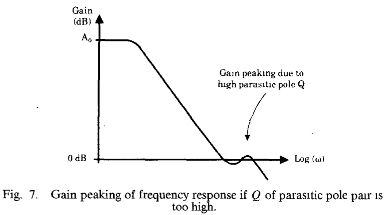

为了避免这种情况的发生，我们需要减小品质因数Q，一个可行的方案是增加共栅管$M_3,M_4$的跨导，让他能够与$M_8$的跨导相比
此外还需要考虑的是补偿电容$C_c$对$Q_p$的影响：
$$S_{C_c}^{Q_p}=\frac{g_{m4}{}^{\prime}C_L(C_1+C_2)+g_{m8}C_LC_2}{g_{m4}{}^{\prime}[C_L(C_1+C_2)+C_CC_1]+g_{m8}C_LC_2}\approx\frac{C_L}{C_L+C_C}$$
当CL比Cc大很多时，这个比例接近于1，这是非常不好的，意味着Cc变化多少，Q就会跟着变多少，所以我们需要增加Cc，同样为了保持GBW不变，我们需要同步增加输入对管的gm
或者还可以通过增加电容C1的值来减小品质因数，为实现这一点我们需要增加输入管$M_1,M_2$的面积，一般是增大L，这会导致gm下降，但这种下降是可以接受的

只有当品质因数Q确实过大从而影响到稳定性的时候才有必要采取上述的改进措施，在此我们设$\zeta=1$，从而$Q_p=1/2$，这会导致两个相同的左半平面极点：
$$\omega_{p2,3}=\omega_n\approx\left[\frac{g_{m4}{^{\prime}}g_{m8}}{C_LC_1}\right]^{1/2}$$
这时候分子中的左半平面零点和这个极点会非常接近，从而导致抵消，这时候传递函数符合：
$$\frac{V_{out}}{V_{in}}(s)\propto\frac{(s-\omega_{zl})}{(s+\omega_{p1})(s+\omega_n)}$$
这个右半平面零点不同于Miller Compensation中的右半平面零点，因为他位于更高的频率处，所以对稳定性的影响很小

### PSRR
如图所示：
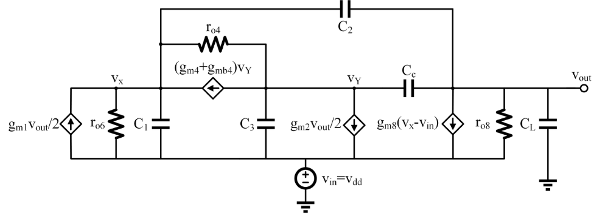
注意：
+ 输出电阻只需要参考$r_{o8}$，忽略$r_{o9}$，因为只考虑$V_{DD}$到输出的耦合
+ 忽略$r_{o2},r_{o11}$，因为对于$V_{DD}$引入的共模变化不会对差分对和$M_{11},M_{12}$起作用，相当于开路

通过详细的推导可以得到：
$$\mathrm{PSRR}_{Cascode}(s)\approx\frac{C_2}{C_C(1+\delta_3)}\frac{s+\omega_{p1}}{s+\frac{\omega_u}{1+\delta_3}}=\frac{C_2}{C_C(1+\delta_3)}\frac{s+\frac{1}{g_{m8}r_{o6}(r_{o8}\|r_{o9})C_2}}{s+\frac{g_{m1,2}/C_C}{1+\delta_3}}$$
而Miller Compensation的结果为：
$$PSRR_{Miller}(s)\approx\frac{s+{\omega_{p1}}^{\prime}}{s+\omega_u}=\frac{s+\frac{1}{g_{m6}(r_{o2}\|r_{o4})(r_{o6}\|r_{o7})C_c}}{s+\frac{g_{m1,2}}{C_c}}$$
可以看到零点的$C_c$变为了$C_2$，而$C_2$为M8管的Cgd，所以说影响到PSRR的前馈路径还是那一条，但是由于改变了$C_c$的位置，这条前馈路径现在的电容变得很小，所以零点被推向了更高频，PSRR性能更好，而极点则和原本的Miller Compensation位于同一数量级

## 仿真验证
仿真结果很好地表明了PSRR性能比传统的两级Miller Compensation结构更好
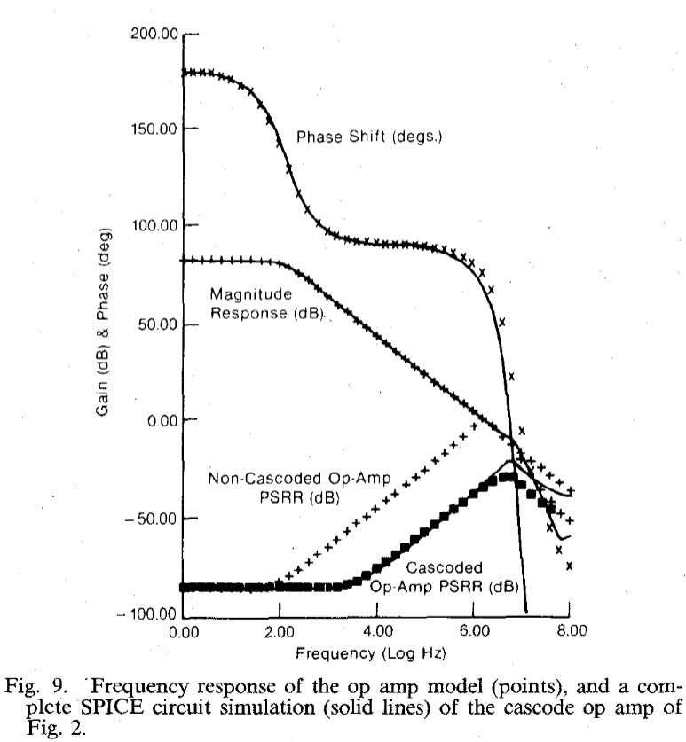
