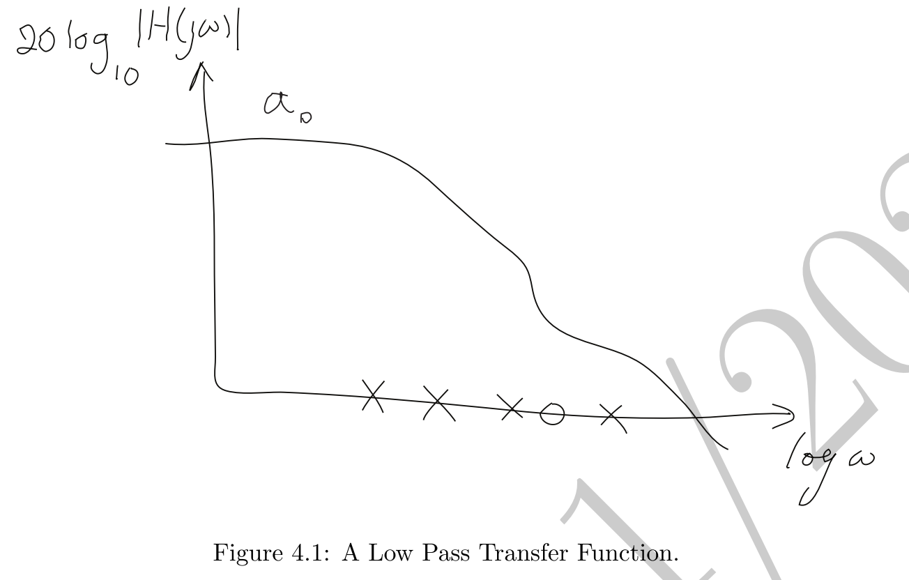
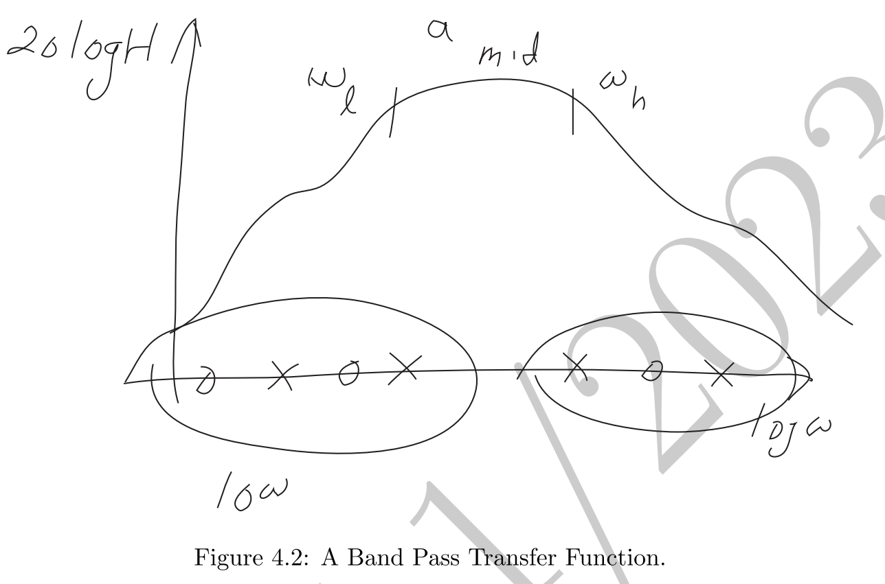
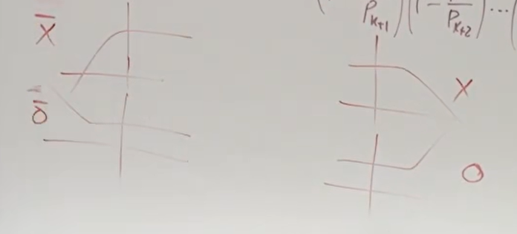
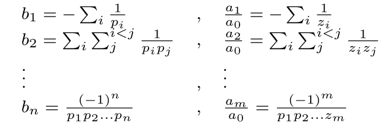
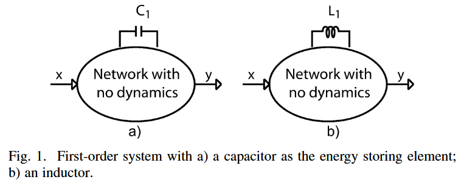
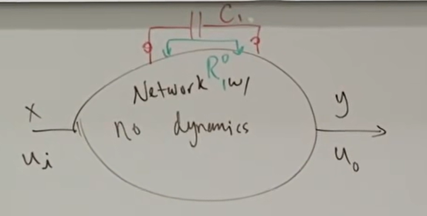

# Time and Transfer Constant(TTC) Theory

方法提出者：

## 1.简单介绍

在一般情况下，针对复杂的电路图，如果要用传递函数去分析他的幅频特性，KCL/KVL是分析的首选，但是如果电路过于复杂，计算量十分庞大，不仅要保证计算的过程中不出错（不老眼昏花），还要保证手算的结果化简、合并起来显得合理（这种分析只能到最后再去近似，而不能中途近似，否则结果可能会出现巨大偏差）。很多时候这需要靠Mathematica软件去进行符号运算，在传统的教材书中，也有很多例如开路时间常数（OCT）、短路时间常数（SCT）法进行化简的方法，但是并不普适，并没有将电感也包含进来（尽管大多数电路中只会有电容）。哪怕最终结果的代数表达式已经求出，也很难从中洞察出最需改进的点，

基于此，伟大的哈基米提出了一种Time and Transfer Constant（TTC）的方法，下文是我的一些总结。

## 2. 传递函数的基本性质

对于单输入单输出的线性时不变网络来说，传递函数可以被定义为电路的任意两个电压/电流之比（V/V, V/I(阻抗Z), I/V(导纳Y), I/I）。

若输入输出均为电压，则传递函数可以表示为：$H(s)\equiv v_o(s)/v_i(s)$
代表了电压的增益

若是电流源驱动，同时在电流源一侧测电压，则传递函数表示为$Z(s)\equiv v_o(s)/i_i(s)$
代表了从电流源一侧看进去的电路阻抗

若输入是电压源驱动，测从电压源流出的电流，则传递函数是$Y(s)\equiv i_o(s)/v_i(s)$

值得注意的是$Y(s)=1/Z(s)$，所以在放置测试源的时候我们需要注意到底想要的是导纳还是阻抗，二者之间的零极点相反。

传递函数的一般表达式如下所示：
$$\begin{equation}
H(s)=\frac{a_0+a_1s+a_2s^2+\ldots+a_ms^m}{1+b_1s+b_2s^2+\ldots+b_ns^n}
\end{equation}$$

系数$a_{i},b_{j}$都是实数，$s$代表复频率$jw$，$a_0$是电路的DC传递函数，很多时候代表了电路的直流增益

根据基本代数原理，可以将式(1)改写为：

$$
\begin{equation}
H(s)=a_0\cdot\frac{\left(1-\frac{s}{z_1}\right)\left(1-\frac{s}{z_2}\right)\cdots\left(1-\frac{s}{z_m}\right)}{\left(1-\frac{s}{p_1}\right)\left(1-\frac{s}{p_2}\right)\cdots\left(1-\frac{s}{p_n}\right)}
\end{equation}$$

$a_0$代表直流增益，$p_i$代表极点(pole)，$z_j$代表零点(zero)，并且极点和零点总是以实数或者共轭复数形式出现

这里可以注意一下的是，我们所熟知的时间常数都是实数，而极点却是可以以共轭复数的形式出现的，这就告诉我们，==极点和时间常数并不是一一对应的关系==，只有当储能器件之间不存在耦合关系的时候才会一一对应。

分母的阶数，*n*，取决于电路中**独立**的储能器件数量

传递函数的极点是电路的内在固有属性，并不取决于输入和输出的类型选择；而传递函数的零点取决于输入输出的选择。因此我们可以在分析电路的一开始就确定电路的极点，而零点则会根据人为选择的输入输出不同而改变。

### 注：
1、式（1）和式（2）最适合用来描述低通系统，如下图所示：

但如果遇到带通系统或者高通系统的话这么描述就不合理了。
针对带通系统来说，可以改写为下式：

$$
\begin{equation}
H(s)=\frac{\left(1-\frac{z_1}{s}\right)\ldots\left(1-\frac{z_k}{s}\right)}{\left(1-\frac{p_1}{s}\right)\ldots\left(1-\frac{p_k}{s}\right)}\cdot a_{mid}\cdot\frac{\left(1-\frac{s}{z_{k+1}}\right)\ldots\left(1-\frac{s}{z_m}\right)}{\left(1-\frac{s}{p_{k+1}}\right)\ldots\left(1-\frac{s}{p_n}\right).}
\end{equation}$$

$a_{mid}$代表了带通传递函数的中频增益，$a_{mid}$的左半部分的极点和零点数一定要相等，不然中频段的增益不会是平的，左边的极点和零点分别称为反极点*inverse pole*和反零点*inverse zero*

2、根据式（1）和式（2）可以将分子和分母的系数($a_i,b_j$）均用极点和零点表示出来：

## 3. 一阶系统

### 3.1 一阶系统引入

如下图所示，先从一阶系统开始考虑。一阶系统可以抽象为一个电容或电感与内部的与频率无关的器件（如电阻和受控源）组成的电路结构，*x*是输入，*y*是输出

一个储能元件对系统的影响是可能同时引入一个零点和极点（是否真的存在还需要具体电路具体分析），一阶系统的传递函数可以表示为：
$$\begin{equation}
H(s)=\frac{a_0+a_1s}{1+b_1s}
\end{equation}$$

式（4）中$a_0$代表低频传递函数，极点$p=-\frac{1}{b_1}$，将$b_1$称为极点时间常数(pole time constant)，$\tau\equiv b_{1}$，零点$z=-\frac{a_0}{a_1}$

若电路中不存在零点，则也可以说零点在无穷远处。

### 3.2 定义符号

我们将符号的上下标全部利用进来，比如$H_a^b$，下标代表所对应的电容C或电感L的值为0（对于电容就是开路，对于电感就是短路）；上标代表所对应的电容C或电感L的值为$\infty$（电容短路，电感开路）

### 3.3 一阶系统公式推导

对于一阶系统来说，系统内只有一个电容或电感，在低频下电容开路电感短路，而$H^0$则代表电路中没有储能元件的值是无穷大的，值全部为0，对应于电容和电感刚好就是开路和短路，因此可以得到：
$$a_0=H^0$$

对于带有电容的一阶系统($C_1$)来说，唯一一个时间传递函数就是$\tau_1$，这个值等于$R_1^0C_1$，$R_1^0$的下标1代表了电容$C_1$，上标0代表没有储能元件的值是$\infty$，$R_1^0$这个值就代表了从电容端看进去的阻抗（内部所有独立源，电压源短路，电流源开路）

于是我们可以得到：
$$\tau_1\equiv R_1^0C_1=b_1$$
对于电感来说，
$$\tau_1\equiv\frac{L_1}{R_1^0}$$

由于电容总是与*s*同时出现，所以传递函数的形式可以再次改写为以下形式：
$$\begin{equation}
H(s)=\frac{a_{0}+\alpha_{1}C_{1}s}{1+\beta_{1}C_{1}s}
\end{equation}$$
其中$\beta_1=R_1^0$，当*s*趋于无穷时，有：
$$\begin{equation}
H^1\equiv H|_{C_1\to\infty}=\frac{\alpha_1}{\beta_1}
\end{equation}$$
$H^1$的上标1代表了电容$C_1$的值趋于无穷，在电路中表现为短路，联立式（4）（5）（6）可以得到：
$$a_1=\alpha_1C_1=R_1^0C_1H^1=\tau_1H^1$$

因此我们最终将传递函数式子改写为了：
$$\begin{equation}
H(s)=\frac{H^{0}+\tau_{1}H^{1}s}{1+\tau_{1}s}
\end{equation}$$

因此仅通过三种低频计算求解出$H^0,H^1,R_1^0$，即可得到精确的一阶系统传递函数表达式

## 一些在写的过程中突然想到，并且可以用到正文中的：
1、传递函数的频率如果刚好在极点处，会带来3dB的功率下降（$10log10(P_o/P_i)$），并且有45°的相移。在10倍极点频率处的话会有90°相移和20dB的增益下降。如果在1/10频率处的话，也会有3~5度的相移影响。
