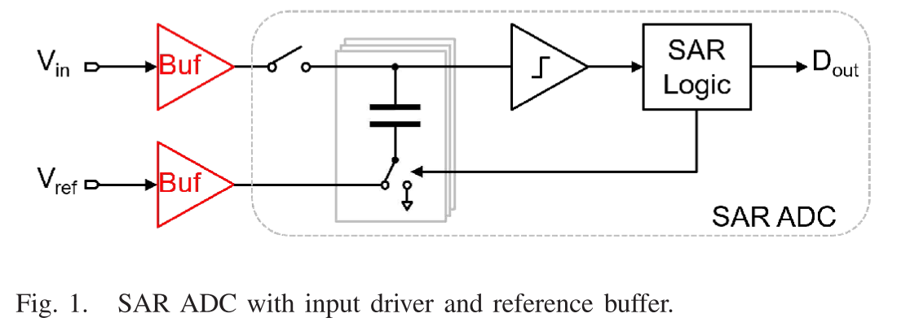

# A 13-bit 0.005-mm2 40-MS/s SAR ADC With kT/C Noise Cancellation

!!! cite 文献
    J. Liu, X. Tang, W. Zhao, L. Shen and N. Sun, "A 13-bit 0.005-mm2 40-MS/s SAR ADC With kT/C Noise Cancellation," in IEEE Journal of Solid-State Circuits, vol. 55, no. 12, pp. 3260-3270, Dec. 2020, doi: 10.1109/JSSC.2020.3016656.

## 摘要（Abstract）

本文针对SAR ADC 前端采样保持电路的 **$kT/C$ 采样噪声瓶颈** 提出一种 **$kT/C$ 噪声抵消** 技术。该方法通过在比较器前置放大器（preamp）与锁存器之间引入电容 $C_2$ 以及相位控制 $\phi_2$，实现对 $C_1$ 上采样噪声的抵消，并将 $C_2$ 的噪声按前置放大器增益 $A$ 衰减，使得在保持高分辨率的同时显著缩小输入电容规模。芯片采用 40 nm CMOS 工艺，输入电容仅 240 fF，面积 0.005 mm$^2$，在 40 MS/s 下实现 69 dB 以上的 SNDR（覆盖整个奈奎斯特带宽）。
**核心贡献是：在不牺牲 SNR 的前提下，显著减小输入电容，从而降低输入驱动和参考缓冲的系统级成本。**

## 引言（Introduction）

SAR ADC 以结构简单、数字化程度高和能效优势著称，其结构如下图所示

电容阵列既可用于采样保持，也可用于DAC转换
然而，任何带前端 S/H 的 ADC 都面临采样 $kT/C$ 噪声的基础限制：要达到高 SNR，传统做法是增大输入电容 $C$，例如在 $V_{peak-to-peak}=2.2V$ 下达到 80 dB 的 SNR 要求，总的差分输入电容需超过 2.6 pF，且每提升 1 bit 分辨率需约 4 倍电容。由此导致输入驱动器与参考缓冲功耗/面积成为系统瓶颈。

!!!  example 计算
    信号功率：$$P_{sig}=(\frac{2.2}{2\sqrt{2}})^2=0.605$$
    总热噪声（全差分）：$$P_{noise}=\frac{2kT}{C}$$
    SNR要求：$$SNR=10log_{10}(\frac{P_{sig}}{P_{noise}})>80dB$$
    解得单侧电容$$C>1.3pF$$
    总差分电容需要$$C_{total}>2.6pF$$

已有方法如环内缓冲（loop-embedded buffer）和连续时间（CT）SAR 可降低输入端负载，但仍需要较大内部采样电容（Loop buffer）和较大的静态功耗（Loop buffer）或面临直流输入（CT-SAR）与带宽限制（CT-SAR）。

本文提出的 $kT/C$ 噪声抵消技术相比于以上两种，同时 **支持直流输入、扩大带宽、降低输入电容规模**，并缓解了对于Input Buffer和Reference Buffer的需求，是对上述缺陷的系统化解决方案。

## 原理（Principle）
### 结构对比与直观解释
[图2] 给出了传统底板采样 SAR ADC 与本文提出的结构对比。核心差异是：在 preamp 与锁存器之间增加 $C_2$ 和控制相位 $\phi_2$。该结构利用 **采样噪声在采样结束后“冻结为常量”的特性**，将其视作等效直流偏置并进行输出串联抵消（output series offset cancellation）。

### 公式（1）：采样 $kT/C$ 噪声的推导
电容在热平衡下满足能量均分定理：
$$
\frac{1}{2} C_1 \overline{v_{ns1}^2} = \frac{1}{2} kT
$$
因此得到
$$
\overline{v_{ns1}^2} = \frac{kT}{C_1} \tag{1}
$$
这表明当 $C_1$ 缩小时，噪声功率按 $1/C_1$ 增大，直接恶化 SNR。

### $\phi_1$ 与 $\phi_2$ 的时序抵消逻辑（[图2], [图3]）
相位控制的核心逻辑如下：
1. $\phi_1$ 高电平时，$V_{in}$ 在 $C_1$ 上跟踪；preamp 输出偏置 $v_{os}$ 被采样到 $C_2$。
2. $\phi_1$ 下降后，$C_1$ 上信号与 $kT/C_1$ 噪声被冻结；此噪声成为 preamp 输入端的“等效常量偏置”。
3. 在 $\phi_1$ 已低、$\phi_2$ 仍高的窗口内，preamp 对该“偏置”进行放大并写入 $C_2$，相当于把 $kT/C_1$ 噪声搬移到 $C_2$ 右端。
4. $\phi_2$ 下降时，$C_2$ 引入自身的 $kT/C_2$ 噪声，但由于其位于 preamp 之后，其输入等效噪声被增益 $A$ 衰减。

**关键结论是：$\phi_2$ 必须晚于 $\phi_1$，这样 $C_2$ 能“存储”由 $v_{ns1}$ 放大的反相信号并完成串联抵消。**

### 公式（2）到（5）：理想抵消下的噪声分析
理想情况下（忽略非理想），在 $\phi_2$ 下降后，仅剩 $C_2$ 的噪声并被 $A$ 抑制：
$$
\\overline{v_{ns}^2} = \\frac{\\overline{v_{ns2}^2}}{A^2} = \\frac{kT}{A^2 C_2} \\tag{2}
$$
详细操作流程见 [图3]，分为 $C_1$ 采样、$C_2$ 采样、SAR 转换三个阶段。$C_1$ 采样结束后：
$$
V_{C1} = V_{in}(t_1) + v_{ns1} \\tag{3}
$$
在 $t_1$ 至 $t_2$ 的 $C_2$ 采样窗口内，preamp 输入为 $V_{in}(t_2) - V_{in}(t_1) - v_{ns1} - v_{os}$，因此
$$
V_{C2} = A\\left[V_{in}(t_2) - V_{in}(t_1) - v_{ns1} - v_{os}\\right] + v_{ns2} \\tag{4}
$$
SAR 逻辑通过 DAC 使 $C_2$ 右端归零，对应数字输出为
$$
D_{out} = V_{in}(t_2) + \\frac{v_{ns2}}{A} \\tag{5}
$$
**由此可见：$v_{ns1}$ 被完全抵消，且 $v_{ns2}$ 被增益 $A$ 抑制。** 这解释了为何可以显著减小 $C_1$ 与 $C_2$ 而不导致 $kT/C$ 噪声主导。

### 为什么小电容下 $kT/C$ 噪声成为 SAR ADC 的主要瓶颈
在 SAR ADC 中，采样噪声直接叠加在输入上，且不会被后续量化或比较器增益“消除”。当 $C_1$ 缩小时，$\\overline{v_{ns1}^2}=kT/C_1$ 急剧上升，可能接近或超过 1 LSB 的等效电压，使得 SNR 被采样噪声而非量化噪声或比较器噪声主导。为满足高分辨率（例如 13 bit 对应约 80 dB SNR）的要求，传统方案只能增加 $C_1$，但这会显著提升驱动器与参考缓冲的功耗与面积。**因此在小电容设计中，$kT/C$ 噪声成为系统级主要瓶颈。**

## 实际考虑（Practical Considerations）
### 不完全抵消导致的残余噪声（公式 6 与 7）
实际 preamp 带宽有限，$C_2$ 采样阶段内无法完全建立。假设 preamp 为单极点系统，时间常数为 $\\tau$，$v_{ns1}$ 在输入端等效为阶跃信号，则在 $\\Delta t = t_2 - t_1$ 的采样窗口内，输出响应为
$$
v_{ns1,C2} = -A\\,v_{ns1}\\left(1-e^{-\\Delta t/\\tau}\\right) \\tag{6}
$$
将其折算回输入端，理想应完全抵消 $v_{ns1}$，但由于未完全建立，残余为
$$
v_{ns1,res} = v_{ns1}\\,e^{-\\Delta t/\\tau}
$$
因此噪声功率为
$$
\\overline{v_{ns1,res}^2} = \\overline{v_{ns1}^2}\\,e^{-2\\Delta t/\\tau} = \\frac{kT}{C_1}e^{-2\\Delta t/\\tau} \\tag{7}
$$
[图4] 展示了该不完全抵消的机理。**这揭示了 $\\Delta t$ 与 $\\tau$ 的关键权衡：增大 $\\Delta t$ 可改善抵消，但会增加 preamp 输出摆幅和对速度的要求。**

### $C_2$ 采样阶段的噪声来源
文中指出 $C_2$ 采样阶段噪声主要由 preamp 限制，[图5] 给出噪声模型。[图7] 的噪声预算进一步表明：在引入 $kT/C$ 抵消后，传统 SAR 中占比最高的 $kT/C_1$ 噪声显著下降，preamp 噪声转为主导项。这是抵消机制的代价之一，但总体噪声仍显著降低。

## 电路实现（Implementation）
[图10] 给出电路实现。采用全差分结构以抑制共模误差（开关电荷注入、锁存回冲等）。与单端结构相比，$\phi_1$ 使 preamp 输入连接至输出，实现 **输入端直接偏置抵消**，降低输出摆幅。关键实现要点如下：
1. 主时钟 800 MHz，对应 40 MS/s 采样率；$C_2$ 采样相位约 0.6 ns。
2. 单端 $C_1$ 仅 120 fF，采用桥式电容阵列保证单位电容 0.85 fF；加入 3 个冗余电容并进行前景校准以应对失配。
3. preamp 为单级共源结构，CMOS 输入对提升电流效率；电阻分压实现 CMFB；后仿真增益约 6，-3 dB 带宽约 525 MHz，功耗 280 μW。
4. 比较器采用 StrongARM 锁存器。
[图11] 显示芯片照片，面积仅 0.005 mm$^2$。

## 测试结果（Results）
芯片采用 40 nm CMOS 工艺，输入电容 240 fF，采样率 40 MS/s，电源 1.1 V，总功耗 591 μW。功耗分布为：DAC 28 μW、preamp 280 μW、锁存器与其他模拟电路 75 μW、数字电路 208 μW。

[图12] 显示频谱测量结果：1.01 MHz 输入时 SNDR=70.8 dB、SFDR=86.5 dB；19.1 MHz 输入时 SNDR=69 dB、SFDR=79.2 dB。  
[图13] 表明在整个奈奎斯特频带内 SNDR ≥ 69 dB、SFDR ≥ 79.2 dB；动态范围 72 dB，对应输入等效噪声 194 μV$_{rms}$。

[表1] 与已有工作对比显示：与 CT SAR 噪声降低方案相比，本文支持直流输入且带宽扩大 20 倍；与环内缓冲 SAR 相比，内部采样电容缩小 23 倍；在 $\\ge 11$ bit ENOB 的奈奎斯特 ADC 中面积最小。**关键结论是：本文在保持高分辨率与高带宽的同时，显著降低输入电容与系统级功耗负担。**

## 结论要点
1. **$kT/C$ 噪声抵消使得 $C_1$ 可显著缩小，同时避免传统 $1/C$ 噪声惩罚。**
2. **残余噪声主要受 $\\Delta t/\\tau$ 影响，实际设计需在 preamp 带宽与相位窗口之间权衡。**
3. **在 40 MS/s、1.1 V 下实现 69 dB 以上 SNDR 与 0.005 mm$^2$ 面积，验证了该技术的系统级优势。**
