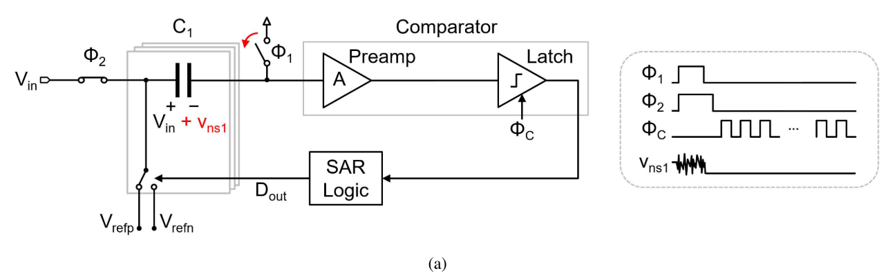
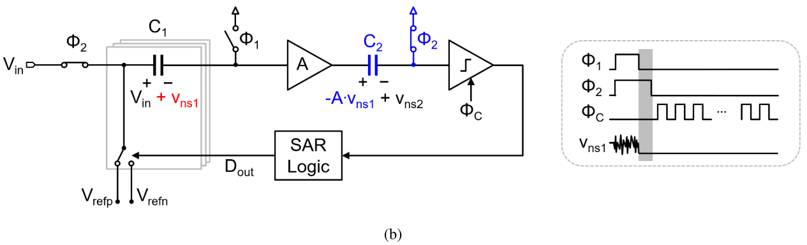
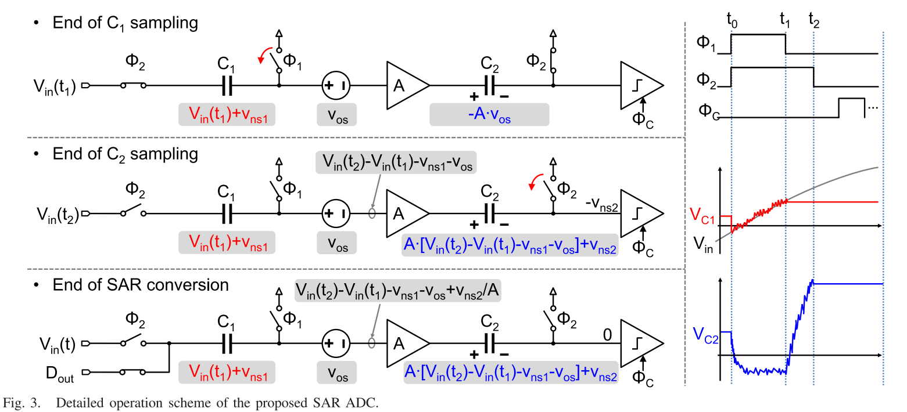
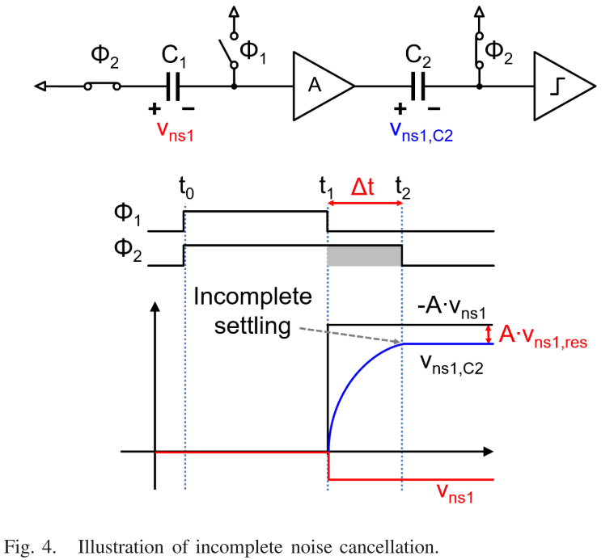
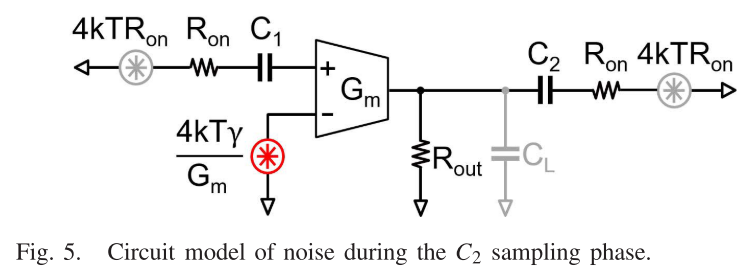
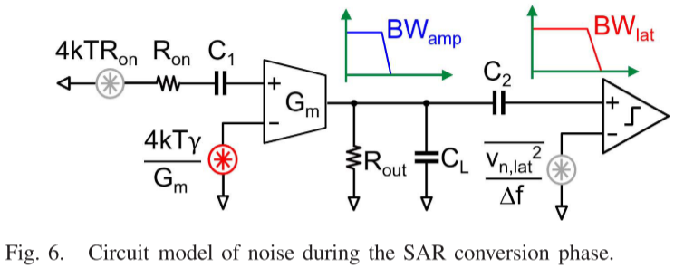
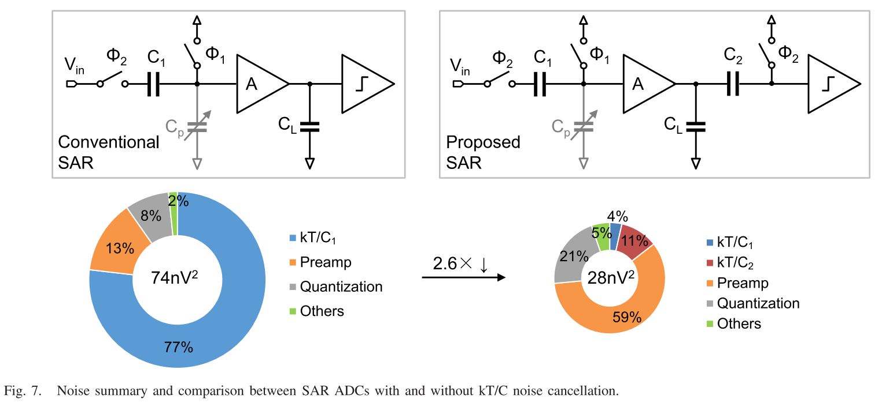
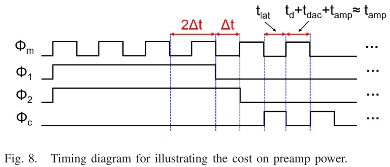
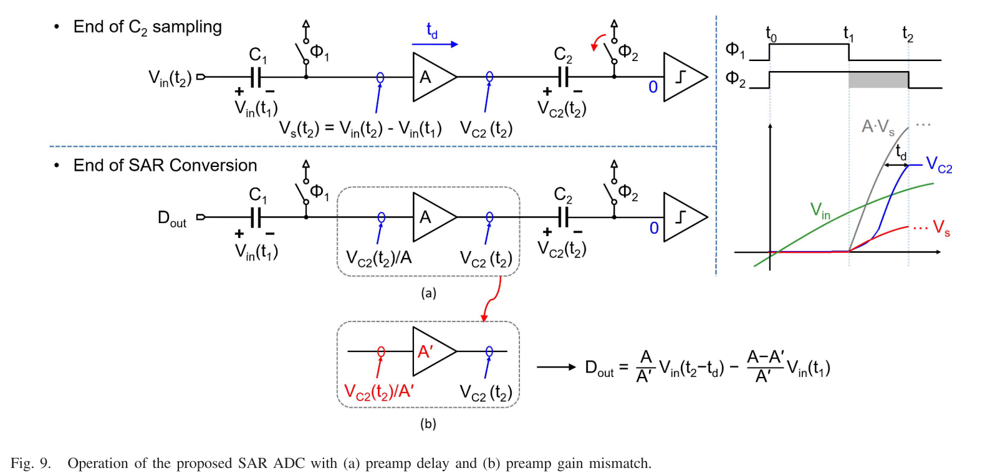

# A 13-bit 0.005-mm2 40-MS/s SAR ADC With kT/C Noise Cancellation

!!! cite 文献
    J. Liu, X. Tang, W. Zhao, L. Shen and N. Sun, "A 13-bit 0.005-mm2 40-MS/s SAR ADC With kT/C Noise Cancellation," in IEEE Journal of Solid-State Circuits, vol. 55, no. 12, pp. 3260-3270, Dec. 2020, doi: 10.1109/JSSC.2020.3016656.

## 摘要（Abstract）

本文针对SAR ADC 前端采样保持电路的 **$kT/C$ 采样噪声瓶颈** 提出一种 **$kT/C$ 噪声抵消** 技术。该方法通过在比较器前置放大器（preamp）与锁存器之间引入电容 $C_2$ 以及相位控制 $\phi_2$，实现对 $C_1$ 上采样噪声的抵消，并将 $C_2$ 的噪声按前置放大器增益 $A$ 衰减，使得在保持高分辨率的同时显著缩小输入电容规模。芯片采用 40 nm CMOS 工艺，输入电容仅 240 fF，面积 0.005 mm$^2$，在 40 MS/s 下实现 69 dB 以上的 SNDR（覆盖整个奈奎斯特带宽）。
**核心贡献是：在不牺牲 SNR 的前提下，显著减小输入电容，从而降低输入驱动和参考缓冲的系统级成本。**

## 引言（Introduction）

SAR ADC 以结构简单、数字化程度高和能效优势著称，其结构如下图所示

电容阵列既可用于采样保持，也可用于DAC转换
然而，任何带前端 S/H 的 ADC 都面临采样 $kT/C$ 噪声的基础限制：要达到高 SNR，传统做法是增大输入电容 $C$，例如在 $V_{peak-to-peak}=2.2V$ 下达到 80 dB 的 SNR 要求，总的差分输入电容需超过 2.6 pF，且每提升 1 bit 分辨率需约 4 倍电容。由此导致输入驱动器与参考缓冲功耗/面积成为系统瓶颈。

!!!  example 计算
    信号功率：$$P_{sig}=(\frac{2.2}{2\sqrt{2}})^2=0.605$$
    总热噪声（全差分）：$$P_{noise}=\frac{2kT}{C}$$
    SNR要求：$$SNR=10log_{10}(\frac{P_{sig}}{P_{noise}})>80dB$$
    解得单侧电容$$C>1.3pF$$
    总差分电容需要$$C_{total}>2.6pF$$

已有方法如环内缓冲（loop-embedded buffer）和连续时间（CT）SAR 可降低输入端负载，但仍需要较大内部采样电容（Loop buffer）和较大的静态功耗（Loop buffer）或面临直流输入（CT-SAR）与带宽限制（CT-SAR）。

本文提出的 $kT/C$ 噪声抵消技术相比于以上两种，同时 **支持直流输入、扩大带宽、降低输入电容规模**，并缓解了对于Input Buffer和Reference Buffer的需求，是对上述缺陷的系统化解决方案。

## 原理（Principle）

### 结构对比与直观解释

上图(a)是传统的底板采样 SAR ADC。通过时序控制，在采样时$\phi_1$先关断，减小沟道电荷注入，从而有助于提高采样的线性度，Preamp的作用是抑制比较器的噪声（主要是kickback noise）。当$\phi_1$下降时，上极板开关断开，噪声也就在这时候注入到了电容$C_1$上，且接下来保持不变，因为电荷守恒，这个时候已经没有上极板的放电通路了，我们将被“冻住”的噪声记为$v_{ns1}$，这个噪声大小由于此时已经固定了下来，因此可以等效的看作是一个失调，我们可以利用处理失调的方法来对这个噪声进行改善

改进的方法是：在 preamp 与锁存器之间增加 $C_2$ 和控制相位 $\phi_2$。该结构利用 **采样噪声在采样结束后“冻结为常量”的特性**，将其视作等效直流偏置并进行输出串联抵消（output series offset cancellation）。
工作机理是：

+ $v_{ns1}$在$\phi_1$下降后被“冻结”，变成了“固定的失调”
+ 电容$C_2$在$\phi_1$下降到$\phi_2$下降之间的间隙内将$v_{ns1}$通过preamp放大A倍保存到$C_2$的左极板
+ SAR转换时，通过“输出串联抵消的方式”会将$kT/C_1$噪声抵消掉，只留下$v_{ns2}$
+ $v_{ns2}$又会被preamp衰减A倍，从而大大缓解了电容$C_1,C_2$的尺寸设计要求，将CDAC尺寸与ADC的性能解耦了出来

### 理想抵消下的噪声分析

理想情况下，在 $\phi_2$ 下降后，仅剩 $C_2$ 的噪声并被 $A$ 抑制：
$$
\overline{v_{ns}^2} = \frac{\overline{v_{ns2}^2}}{A^2} = \frac{kT}{A^2 C_2}
$$

详细操作流程分为 $C_1$ 采样($t_0\sim t_1$)、$C_2$ 采样($t_1\sim t_2$)、SAR 转换($t_2 \sim \text{end}$)三个阶段。

$C_1$ 采样结束后，kT/C1的时变噪声被冻结，电容C1上的电荷不再变化，C1之后就相当于两端电压恒定差了$V_{in}(t_1)+v_{ns1}$的电池：
$$
V_{C1} = V_{in}(t_1) + v_{ns1}
$$

在 $t_1$ 至 $t_2$ 的 $C_2$ 采样窗口内，承担采样作用的电容是$C_2$，preamp 输入为 $V_{in}(t_2) - V_{in}(t_1) - v_{ns1} - v_{os}$，因此电容$C_2$两端的电压是
$$
V_{C2} = A\left[V_{in}(t_2) - V_{in}(t_1) - v_{ns1} - v_{os}\right] + v_{ns2} 
$$

之后采样阶段结束，开始进入SAR逻辑的转换阶段
SAR 逻辑的最终目的是要通过 DAC 使得 $C_2$ 右端（真正的比较器的输入端）归零，而其他地方因为电荷守恒不发生变化，所以最终对应数字输出为
$$
D_{out} = V_{in}(t_2) + \frac{v_{ns2}}{A} 
$$
由此可见：**$v_{ns1}$ 和preamp的offset被完全抵消，且 $v_{ns2}$ 被增益 $A$ 抑制。** 这解释了为何可以显著减小 $C_1$ 与 $C_2$ 而不导致 $kT/C$ 噪声主导。

在这种技术中，真正采样的信号是$t_2$时刻的信号，且是由$C_2$来采样的，$C_1$的作用仅仅是在前置放大器输入端保持较小的信号摆幅，以确保前置放大器在$C_2$采样阶段不会饱和

## 实际考虑（Practical Considerations）

### $kT/C_1$噪声不完全抵消导致的残余噪声

实际 preamp 带宽有限，$C_2$ 在采样阶段内有可能无法完全建立。
假设 preamp 为单极点系统，时间常数为 $\tau$，$v_{ns1}$ 在输入端等效为小阶跃信号，则在 $\Delta t = t_2 - t_1$ 的采样窗口内，输出响应为：
$$
v_{ns1,C2} = -A\cdot v_{ns1}\left(1-e^{-\Delta t/\tau}\right) 
$$

将其折算回输入端，理想应完全抵消 $v_{ns1}$，但由于未完全建立，残余为
$$
v_{ns1,res} = v_{ns1}\,e^{-\Delta t/\tau}
$$

因此噪声功率为
$$
\overline{v_{ns1,res}^2} = \overline{v_{ns1}^2}\,e^{-2\Delta t/\tau} = \frac{kT}{C_1}e^{-2\Delta t/\tau} 
$$

在不增加$C_1$尺寸的前提下，我们需要做$\Delta t$ 与 $\tau$ 的关键权衡：增大 $\Delta t$ 可改善抵消，但会增加 preamp 输出摆幅和对速度的要求，因为放大器要放大$V_{in}(t_2)-V_{in}(t_1)$，如果这个时间太长，放大器可能进入饱和，损失线性度；另一方面，如果减小$\tau$，会增大preamp的功耗，因此在本设计中，$\Delta t/\tau=2$以做较好的trade-off

### $C_2$ 采样阶段的噪声来源

$C_2$ 采样阶段噪声主要来自于$C_1$左侧的开关，$C_2$右侧的开关和preamp自身

运放自身噪声贡献是：$\frac{4kT\gamma}{G_m}$
由于在高能效的设计中，限制带宽的是preamp（因为带宽越大功耗越大），而不是开关，所以有：$$R_{on}\ll 1/G_m \ll R_{out}$$

因为我们之前假设preamp是单极点系统，所以他的噪声带宽是3dB带宽的$\frac{\pi}{2}$倍，因此可以求得：(不加$C_L$)
$$\overline{v_{\mathrm{ns}2,amp}^{2}}\simeq\frac{kT\gamma}{G_{m}R_{\mathrm{out}}C_{2}}=\frac{kT\gamma}{AC_{2}}$$

而原本等效到输入端的$C_2$带来的噪声值是$\frac{kT}{A^2C_2}$，因此preamp的噪声要比$C_2$所引入的kT/C噪声大A倍

要降低这个噪声有两种办法：

1. 增加preamp的增益A，但这有可能让preamp进入饱和
2. 增大$C_2$，但会使得建立时间增加，$kT/C_1$的效果反而变差

在文中作者使用的办法是：

1. 设置A=6，并且让其在PVT变化下保持良好的稳定性
2. 添加一个额外的负载电容$C_L$，而不是直接增大$C_2$，这不仅可以压低preamp在$C_2$采样阶段的噪声，也可以减小在SAR转换时候的preamp的噪声

最终的噪声式子变成：
$$\overline{v_{\mathrm{ns}2,amp}^{2}}\simeq\frac{kT\gamma}{A(C_{2}+C_L)}$$

加入$C_L$之后，$C_2$右侧开关引入的kT/C noise会发生变化，折合到输入端，$C_2$两端等效输入噪声为：
$$\overline{v_{\mathrm{ns}2,kT/C2}^2}\simeq\frac{kTC_L}{A^2C_2(C_2+C_L)}$$

### SAR转换阶段的噪声

在SAR转换阶段，也存在三种噪声源：DAC开关噪声、锁存器噪声和前置放大器噪声。与前置放大器噪声相比，DAC开关噪声可忽略不计，因为它与前置放大器噪声具有相同的带宽，但功率谱密度小得多。锁存器噪声被前置放大器增益抑制，因此也可忽略不计。SAR转换阶段的主要噪声源是前置放大器噪声。

preamp噪声的带宽限制可能来自于preamp自身，或者是latch的限制，但由于我们要保证足够的比较速度，$BW_{lat}$要做的够大，所以我们选择让preamp自身带宽成为限制，但这样可能会导致在转换过程中setting error增大，解决方法是加冗余位，$C_L$的作用在这里用来调整preamp的带宽，减小噪声

$$\overline{v_{\mathrm{nc,amp}}^2}=\frac{kT\gamma}{\mathrm{AC}_L}$$

### 噪声总结与对比

噪声预算进一步表明：在引入 $kT/C$ 抵消后，传统 SAR 中占比最高的 $kT/C_1$ 噪声显著下降，preamp 噪声转为主导项。这是抵消机制的代价之一，但总体噪声仍显著降低

### 功耗对比

除了在$C_2$采样阶段引入更多的preamp噪声外，所提出的SAR中的preamp会比传统SAR中的preamp消耗更多功率：因为preamp需要在$C_2$采样相时迅速建立

假设相位$\phi_1,\phi_2,\phi_c$均由主时钟$\phi_m$生成，留给$C_2$采样的时间只有半个时钟周期，即$\Delta t$，后续转换过程中，Latch regeneration的时间和Logic Delay + DAC Setting + Preamp Setting的时间一致，均为$\Delta t$，由于$t_d,t_{Dac}\ll t_{amp}$，在这我们认为：$t_{amp}\approx \Delta t$
在传统的架构中，preamp的输出负载是$C_L=100fF$，而在$C_2$采样期间，kTC Cancellation架构中的输出负载是$C_L+C_2=150fF$，假设建立时间不变，$\tau$不变，带宽不变，当电容增大50%时，功耗自然会增大50%

### Preamp的其他非线性因素

#### preamp输入寄生电容

输入寄生电容会与CDAC阵列进行电荷重分配，进而衰减了输入信号幅度，在本设计中，$20fF$的寄生电容和$120fF$的CDAC阵列组合会让SNR下降1.3dB

此外，preamp的非线性电容可能会导致非线性失真，但是在本设计中，preamp输入的swing只有$80mV$，因此非线性失真的影响可忽略

#### preamp delay

在之前的解释中，preamp会把在$C_2$期间采样的信号$V_{in}(t_2)-V_{in}(t_1)$立即放大A倍然后传输到$C_2$左侧，但实际上preamp也是有delay的，最终存储在$C_2$左侧的只是一部分的$V_{in}(t_2)-V_{in}(t_1)$
因此最终$C_2$电容左侧存储的电压值为：
$$V_{C2}(t_2)\approx A[V_{\mathrm{in}}(t_2-t_d)-V_{\mathrm{in}}(t_1)]$$

$t_d$就是preamp的delay时间，根据文章附录的数学推导，有：$t_d\approx \tau$

最终输出的数字码就变成了：$$D_{\mathrm{out}}=V_{\mathrm{in}}(t_2-t_d)$$

#### preamp gain mismatch

因为只要在$C_2$采样相和后续转换相时的preamp增益相同，preamp的增益非线性就会被消除，但是这在实际的电路中做不到。
举个例子：我们在$C_2$时刻采样的是一个20MHz的输入信号，但是在转换结束后，preamp的前级只是一个dc信号，在这两种情况下，很难保证preamp的增益一致（除非带宽无限大）
因此最终转换出来的数字码就变成了：
$$D_{\mathrm{out}}=\frac{A}{A^{\prime}}V_{\mathrm{in}}(t_2-t_d)-\frac{A-A^{\prime}}{A^{\prime}}V_{\mathrm{in}}(t_1)$$

其中$A$是在$C_2$采样相的preamp增益，$A^{\prime}$是在转换结束后的preamp增益

在实际情况下$A$与$A^{\prime}$的匹配性还是很好的，因为preamp的带宽可以说是远大于输入信号的带宽，其次在$C_2$采样结束点和转换结束点，$C_2$两侧工作的状态是类似的，两种状态下preamp输出电压相同，输入电压只会很接近，不会差很多。

如果要想实现高线性度我们可以:
1.增加前置放大器带宽以进一步减小整个信号频段内的增益变化，代价是烧功耗
2.缩短$C_2$采样阶段的持续时间以降低前置放大器输入和输出端的信号摆幅，代价是kT/C cancellation效果下降
改名测试
## 电路实现（Implementation）
[图10] 给出电路实现。采用全差分结构以抑制共模误差（开关电荷注入、锁存回冲等）。与单端结构相比，$\phi_1$ 使 preamp 输入连接至输出，实现 **输入端直接偏置抵消**，降低输出摆幅。关键实现要点如下：
1. 主时钟 800 MHz，对应 40 MS/s 采样率；$C_2$ 采样相位约 0.6 ns。
2. 单端 $C_1$ 仅 120 fF，采用桥式电容阵列保证单位电容 0.85 fF；加入 3 个冗余电容并进行前景校准以应对失配。
3. preamp 为单级共源结构，CMOS 输入对提升电流效率；电阻分压实现 CMFB；后仿真增益约 6，-3 dB 带宽约 525 MHz，功耗 280 μW。
4. 比较器采用 StrongARM 锁存器。
[图11] 显示芯片照片，面积仅 0.005 mm$^2$。

## 测试结果（Results）
芯片采用 40 nm CMOS 工艺，输入电容 240 fF，采样率 40 MS/s，电源 1.1 V，总功耗 591 μW。功耗分布为：DAC 28 μW、preamp 280 μW、锁存器与其他模拟电路 75 μW、数字电路 208 μW。

[图12] 显示频谱测量结果：1.01 MHz 输入时 SNDR=70.8 dB、SFDR=86.5 dB；19.1 MHz 输入时 SNDR=69 dB、SFDR=79.2 dB。  
[图13] 表明在整个奈奎斯特频带内 SNDR ≥ 69 dB、SFDR ≥ 79.2 dB；动态范围 72 dB，对应输入等效噪声 194 μV$_{rms}$。

[表1] 与已有工作对比显示：与 CT SAR 噪声降低方案相比，本文支持直流输入且带宽扩大 20 倍；与环内缓冲 SAR 相比，内部采样电容缩小 23 倍；在 $\\ge 11$ bit ENOB 的奈奎斯特 ADC 中面积最小。**关键结论是：本文在保持高分辨率与高带宽的同时，显著降低输入电容与系统级功耗负担。**

## 结论要点
1. **$kT/C$ 噪声抵消使得 $C_1$ 可显著缩小，同时避免传统 $1/C$ 噪声惩罚。**
2. **残余噪声主要受 $\\Delta t/\\tau$ 影响，实际设计需在 preamp 带宽与相位窗口之间权衡。**
3. **在 40 MS/s、1.1 V 下实现 69 dB 以上 SNDR 与 0.005 mm$^2$ 面积，验证了该技术的系统级优势。**
