# A 90-MS/s 11-MHz-Bandwidth 62-dB SNDR Noise-Shaping SAR ADC

!!! cite 文献
    J. A. Fredenburg and M. P. Flynn, "A 90-MS/s 11-MHz-Bandwidth 62-dB SNDR Noise-Shaping SAR ADC," in IEEE Journal of Solid-State Circuits, vol. 47, no. 12, pp. 2898-2904, Dec. 2012, doi: 10.1109/JSSC.2012.2217874.

## 摘要

本文指出：虽然电荷再分配式SAR ADC在中等分辨率时具有很高效率，但比较器噪声等因素限制其在超过10 bit ENOB时的能效。作者提出一种低OSR(4)的噪声整形SAR架构，用8 bit电容DAC实现10 bit ENOB。噪声整形同时作用于量化噪声与比较器噪声，从而==将比较器精度（等效输入噪声）与ADC整体分辨率解耦==。环路滤波器采用“两抽头电荷域FIR + 积分器(IIR)”级联，在低质量积分器条件下仍获得良好整形。65 nm原型芯片面积0.03 mm^2，90 MS/s下功耗806 μW。

## 引言

近年来SAR ADC以结构简单、功耗低在中等带宽与分辨率下表现突出，但当分辨率提高时，比较器噪声、DAC不匹配、采样噪声以及开关与寄生效应会显著降低效率。对高分辨率SAR而言，DAC步进电压变小，比较器输入噪声变得不可忽视，常需功耗较高的前置放大器来压低等效输入噪声（常见的是等效输入噪声要小于$\frac{1}{2}LSB$）。

作者提出的核心思想是通过低OSR的噪声整形，把比较器噪声与量化噪声一并高通化（噪声整形），从而使比较器不必达到ADC整体分辨率要求，进而提升能效。该方法以较低分辨率DAC和较低精度电路换取更高有效分辨率。

## SAR ADC回顾与残余获取

SAR ADC先将输入采样到电容阵列（通过自举开关减小signal-dependent resistance of the input switch的影响），再通过逐次逼近完成二进制搜索。本工作采用符号-幅度编码并使用双极参考电压。采样后，各电容底板先置于共模电压，比较器首先判符号，随后逐位决定MSB到LSB。在传统SAR中，最后一位判决完成后不会再切换一次DAC，因此最终残余并不等于完整量化误差。以8 bit为例，残余是输入与7 bit估计的差。若在最后一位判决后再做一次DAC切换，残余才等于完整量化误差，同时最后一次比较器噪声也会留在残余中。

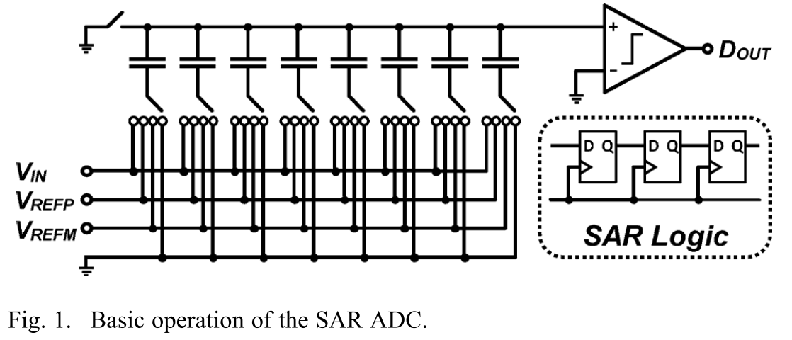

## 残差生成

高效的量化误差捕捉对于实现高效的噪声整形至关重要

量化误差定义：
$$D_{OUT}=V_{IN}+Q$$

由于最后一次比较完不再需要去切换DAC底板，因此8次比较只需要切7次，最后在上极板的残差与最终实际的残差不同，即：$$V_{RES}\neq D_{OUT}-V_{IN}$$
因此我们需要最后再切换一次：
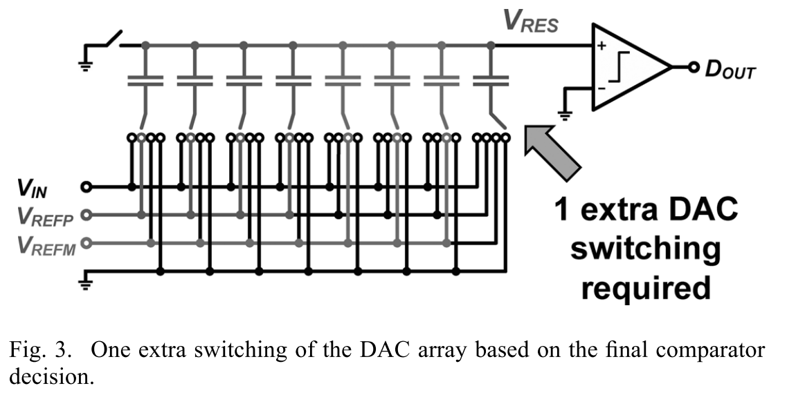
加入“最后一次切换”后：
$$V_{RES} = D_{OUT}-V_{IN}$$
不止如此，残差的捕捉还包含了最后一次比较时比较器的等效输入噪声：
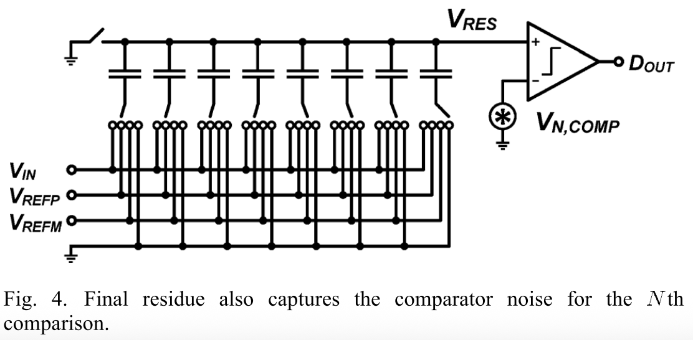
即残差包含比较器噪声：
$$V_{RES} = D_{OUT}-V_{IN}+V_{N,COMP}$$

## SAR中的噪声整形

作者依次给出三种结构：简单噪声整形、加入积分器的改进结构，以及可实现的FIR+IIR级联结构。核心演化思路是从“直接使用残余反馈”逐步过渡到“带有可控滤波特性的环路”。

### 简单噪声整形

将上一次转换的残余$V_{RES}(k-1)$加到当前转换的比较器输入负端，使当前量化过程的输入为$V_{RES}(k)$与上一拍残余之差，形成一阶延迟反馈结构。其噪声传递函数为高通，但低频衰减仅约6dB，整形强度不足。
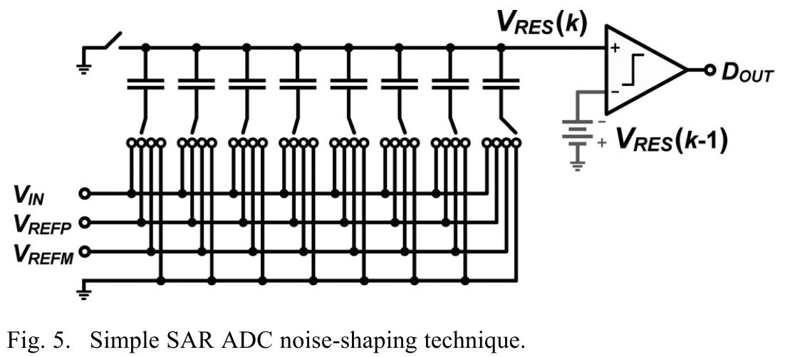

第k拍的输出为:$$D_{OUT}(k)=V_{IN}(k)+Q(k)+V_{N,COMP}(k)-V_{RES}(k-1)$$
简单理解就是输出码$D_{OUT}(k)$是这一次输入$V_{IN}(k)$加上这一次比较器的噪声影响$V_{N,COMP}(k)$，再加上量化的误差$Q(k)$与上一次输出的残差做差形成

因为（这里忽略了比较器等效输入噪声）$$V_{RES}(k)=D_{OUT}(k)-V_{IN}(k)$$
所以进一步可以用z域表示为：$$D_{OUT}(z)=V_{IN}(z)+\frac{1}{1+z^{-1}}[Q(z)+V_{N,COMP}(z)]$$
可以看到$STF=1,NTF=\frac{1}{1+z^{-1}}$，噪声、量化误差被抑制（NTF是高通），STF是全通

比较器负端的残差电压生成可以通过电容$C_{COMP}$来实现。当最后一次DAC开关变化，顶板电压建立结束后，$C_{COMP}$左边的开关闭合，由于电荷共享，$C_{COMP}$上极板就可以成功采样到这一次转换的残差电压
**需要$C_{COMP}$的值远小于DAC阵列的电容值才能保证精度**
新加入的电容带来的KT/C噪声可以和量化误差、比较器噪声一同被整形，因此影响不大

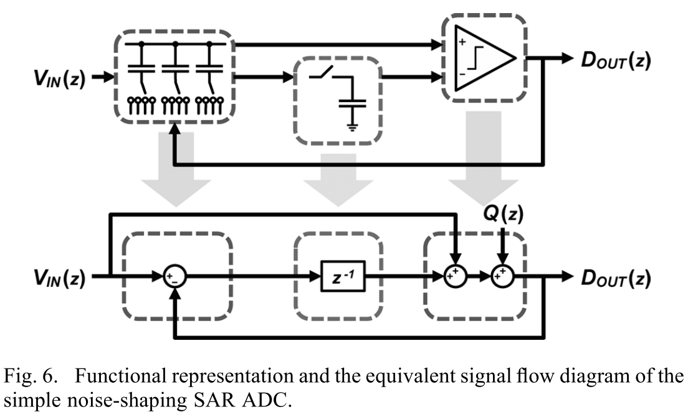

信号流图反应了这个过程：残差电压是上一轮转换结束（延迟一拍）后的剩余值，被加入到这一次的量化单元（比较器）中，输入信号有直接前馈路径（FF）

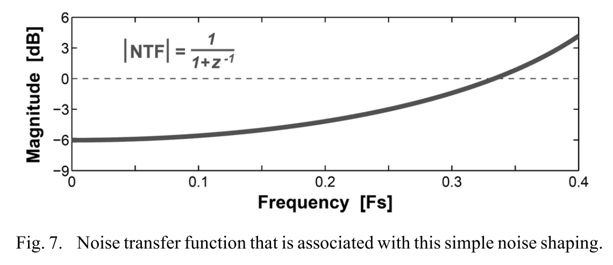
最终可以以带宽为代价，实现精度的上升。但就这种方案而言，最终只能实现6dB的噪声抑制，并不是一个很好的带宽-精度权衡方案

### 改进噪声整形：加入积分器

在残余采样后加入积分器，使系统等效为一阶ΣΔ结构。理想情况下$NTF=1 - z^{-1}$，低频噪声衰减显著。但积分器实现需要电容采样与运放，采样电容上的KT/C噪声不再被整形，电容不能过小，否则噪声成为瓶颈

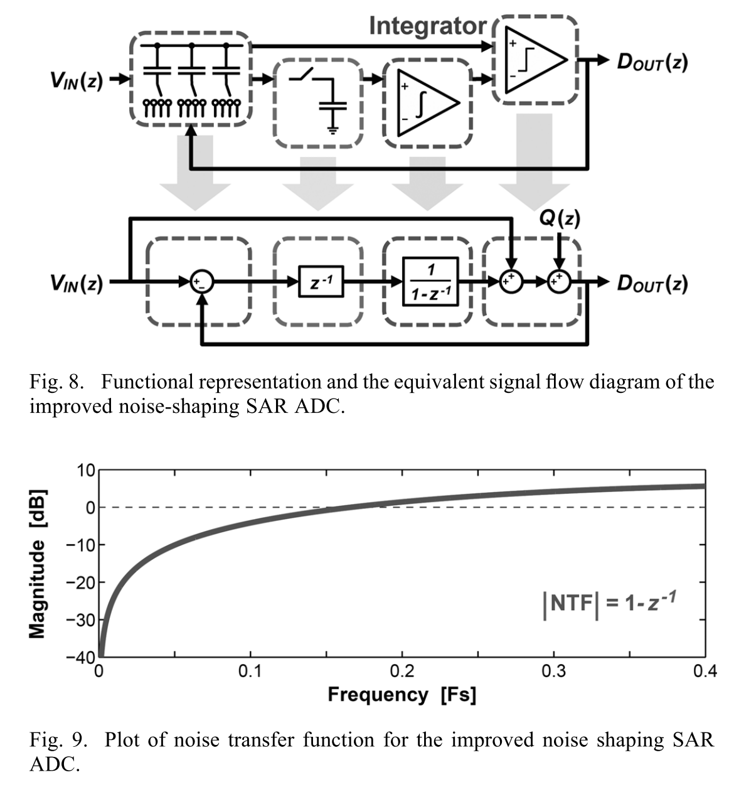

$$D_{OUT}(z)=V_{IN}(z)+(1-z^{-1})Q(z)$$
在这里将比较器等效输入噪声、量化误差、DAC建立误差全部等效为$Q(z)$

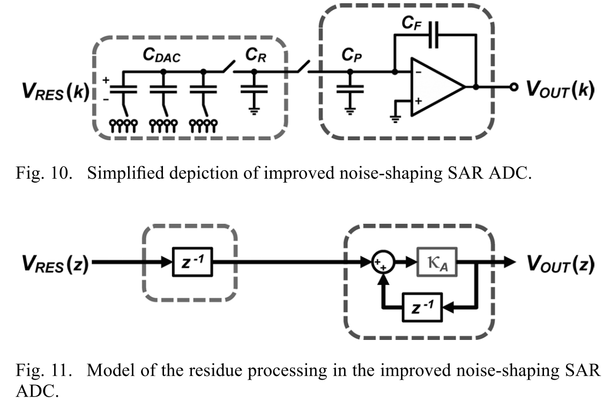

结构如上图所示，$C_R$是采样残差电压的电容，在简单Noise Shaping中可以忽略他的kT/C噪声，但是在这里因为有积分器切断了Noise Shaping路径，所以不能忽略，需要取值稍大一些，但又不能取的太大导致可以和CDAC相比，这样的话电荷共享就会很明显，因此需要仔细设计。$C_P$是开关、输入管等的寄生电容，$C_F$是积分器的反馈电容

当积分器不是无穷大增益，并且有寄生电容进行电荷共享时，为了评估影响，可以将积分器用框图的形式表现出来，其中$\kappa_A=1$时，代表了一个理想积分器，当$\kappa_A<1$时，就引入了现实因素的影响

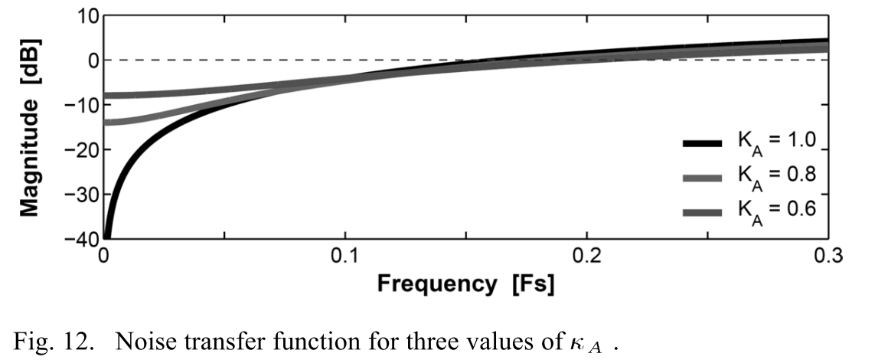
可以看到，即使在$\kappa_A=0.6$这样条件很差的情况下，噪声整形的效果依旧是存在的

### 实用噪声整形：FIR + IIR级联

为在低质量积分器条件下获得更强整形，作者在积分器前加入两抽头FIR。FIR在电荷域实现，用两组电容交错采样残余，形成两抽头滤波后再送入IIR积分器。

主要的变动是使用额外的开关电容FIR来代替无源的采样残差电压模块，最终实现的传递函数为：
$$D_{OUT}(z)=V_{IN}(z)+\frac{1-\kappa_A z^{-1}}{1-\kappa_A(\alpha_1-1)z^{-1}+\kappa_A\alpha_2 z^{-2}}Q(z)$$

选择$\alpha_1=3,\alpha_2=1,\kappa_A=0.64$，级联结构如下所示：

FIR是双抽头的，分别记录延迟一拍和两拍的残差电压信号，每个抽头由两个电容$C_A,C_B$组成，抽头系数由$C_A,C_B$电容尺寸决定
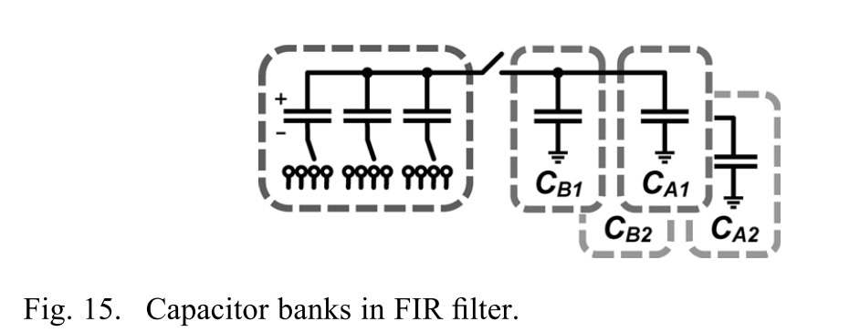

#### FIR具体操作时序

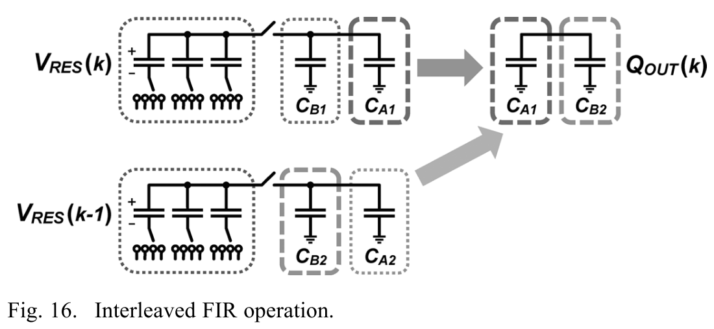
由于要延迟两拍，所以双抽头是必须需要的，那么还需要使用两个电容$C_A,C_B$的目的是什么呢？

如上图所示，假设$V_{RES}(k-1)$被存储在了$C_{B2},C_{A2}$上，$V_{RES}(k)$被存储在了$C_{B1},C_{A1}$上，当我们在进行第$k+1$次转换的时候，需要用到第$k$次和$k-1$次时的残差电压

+ 首先，将$C_{B2},C_{A1}$连接到一起，电荷重分配之后，上极板的电荷总量为$Q_{OUT}(k)=V_{RES}(k)C_{A1}+V_{RES}(k-1)C_{B2}$
+ 当第$k+1$次转换完成后，生成了残差电压$V_{RES}(k+1)$
+ 然后将$C_{A2},C_{B2}$重新采样第$k+1$次的残差电压$V_{RES}(k+1)$
+ 之后将$C_{B1},C_{A2}$连接到一起，电荷重分配之后，上极板的电荷总量为$Q_{OUT}(k+1)=V_{RES}(k)C_{B1}+V_{RES}(k+1)C_{A2}$

因为后面紧接着跟了一个积分器（IIR），当信号位于采样相时，积分器开始积分，通过电荷守恒，可以得到输出电压的关系式为：$$V_{\mathrm{OUT}}\left(z\right)=\left[\frac{C_A}{C_F}z^{-1}+\frac{C_B}{C_F}z^{-2}\right]\frac{\kappa_A}{1-\kappa_Az^{-1}}V_{\mathrm{RES}}(z)$$

在$\kappa_A=0.6$时，下图比较了仅有IIR和FIR & IIR级联的NTF幅频曲线，可以看即使IIR做的再差，加上FIR后效果也会很好

在低OSR条件下，FIR & IIR级联结构的NTF特性可以与3阶DSM相媲美
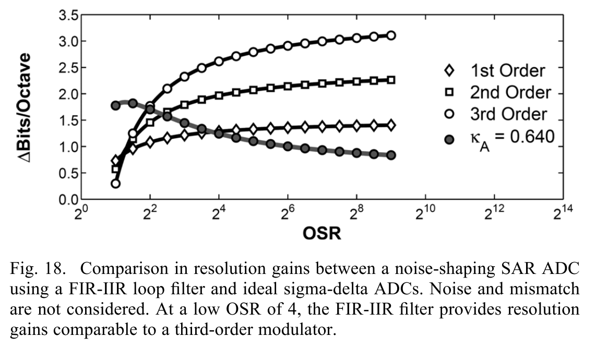
**当OSR过高时，噪声整形效果反而会下降，这可能是因为FIR前端的kT/C噪声以及其他未被整形的噪声逐渐开始占主导。最后随着OSR继续增大，噪声整形会逐渐退化为普通的过采样（带来0.5Bit/Octave）**

## 电路实现与时序

整体采用全差分结构。比较器为双尾锁存式双差分结构。两抽头FIR由两组交错电容阵列实现，每个残余用于生成两个连续的FIR输出，需交错采样避免电荷被破坏。时序采用异步生成方式：90 MHz主时钟只定义采样时刻，内部用单一延迟单元循环产生DAC稳定时间，保证各bit延迟一致而无需校准。
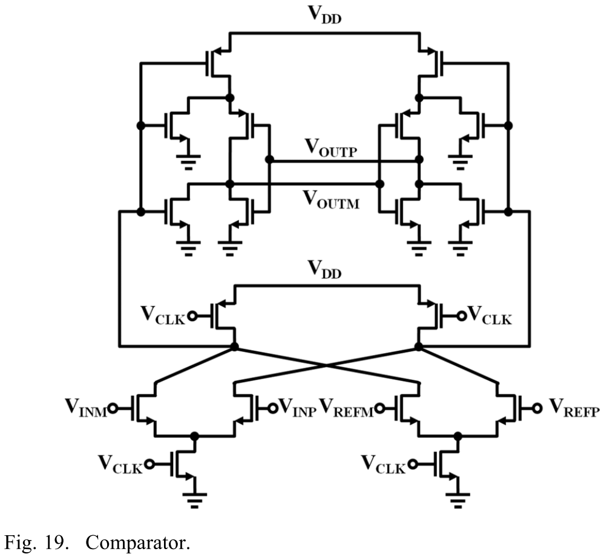
这里用四输入动态比较器原理是只有当这一次转换过程中的残差差分信号大于经过Filter Loop处理后的残差信号，输出才为高

## 原型与测量结果

65 nm工艺，核心面积0.03 mm^2，DAC为8 b二进制电容阵列。90 MS/s、OSR=4下带宽11 MHz，SNDR 62 dB，ENOB 10.0 b。功耗806 μW（数字608 μW，模拟198 μW），FOM 35.8 fJ/conv-step。频谱显示噪声底被整形推向高频，SNDR随输入频率与幅度变化保持合理一致性。

## 总结

本文提出的噪声整形SAR架构在低OSR条件下实现10 b ENOB，核心在于“残余提取 + FIR/IIR整形”，并将比较器噪声与量化噪声同时高通化。该方案保持SAR核心结构，仅增加少量电容与低增益放大器，适合工艺缩放，在带宽与分辨率之间取得高效折中。
