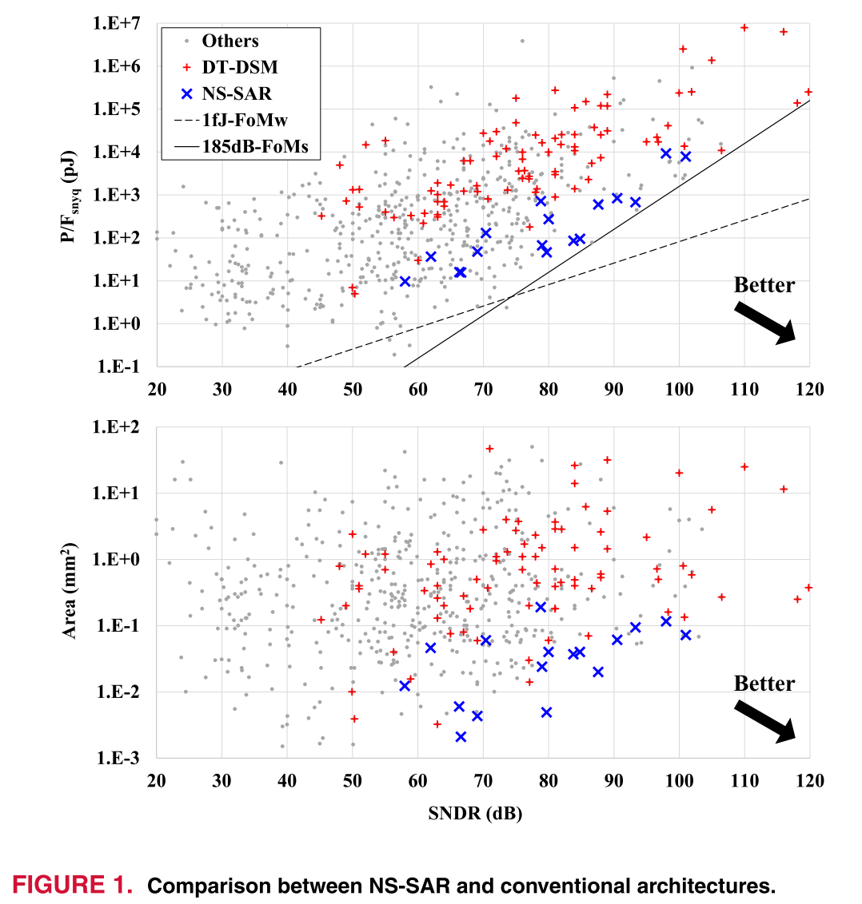
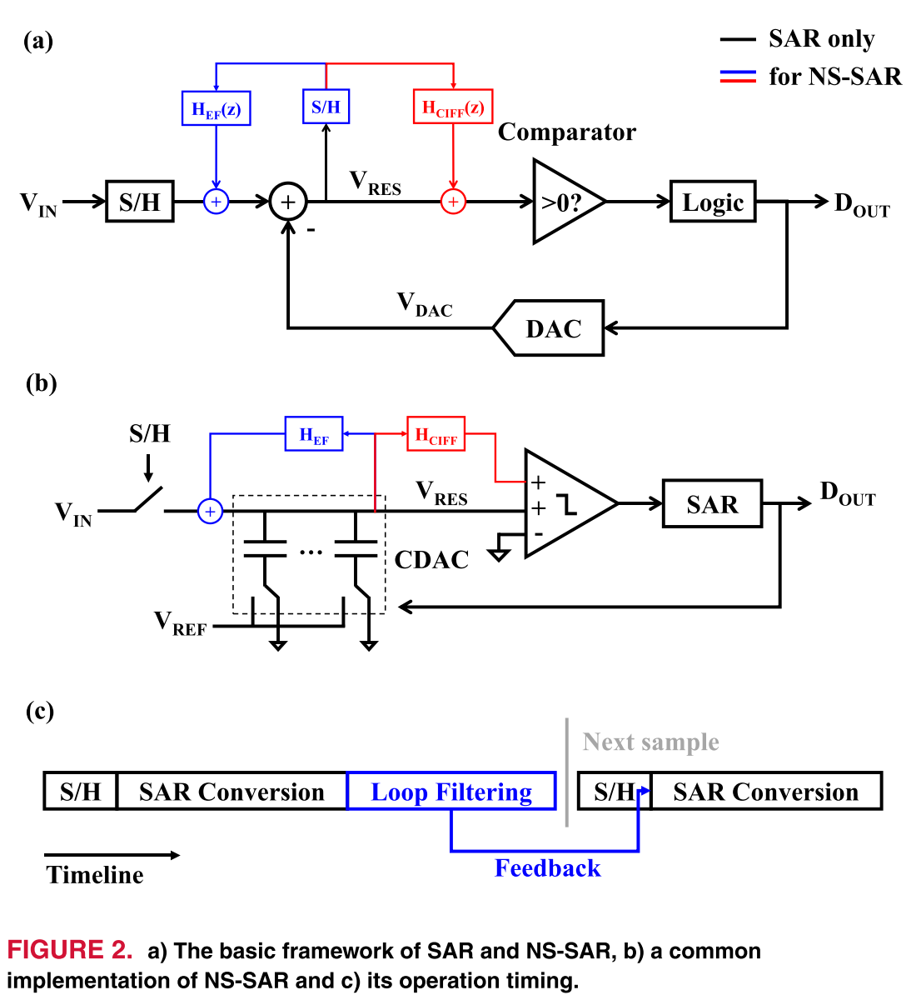
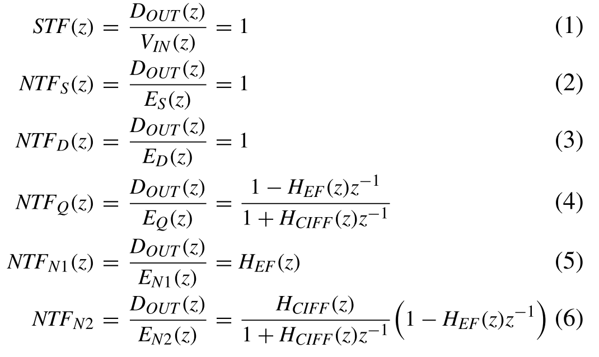
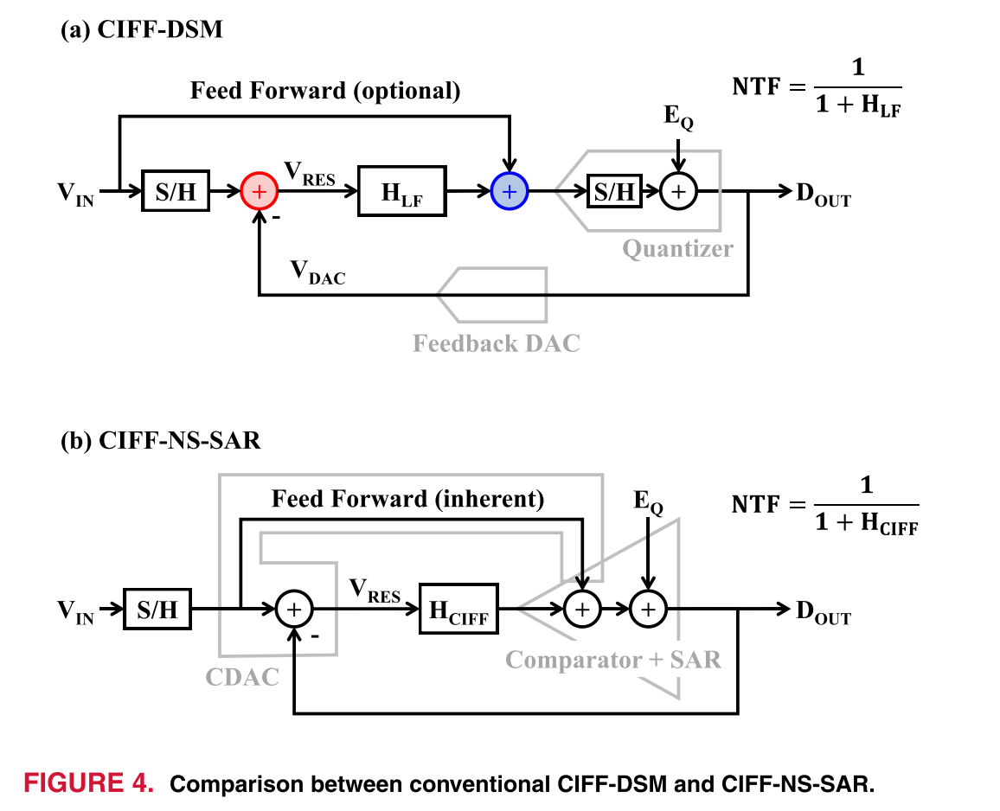
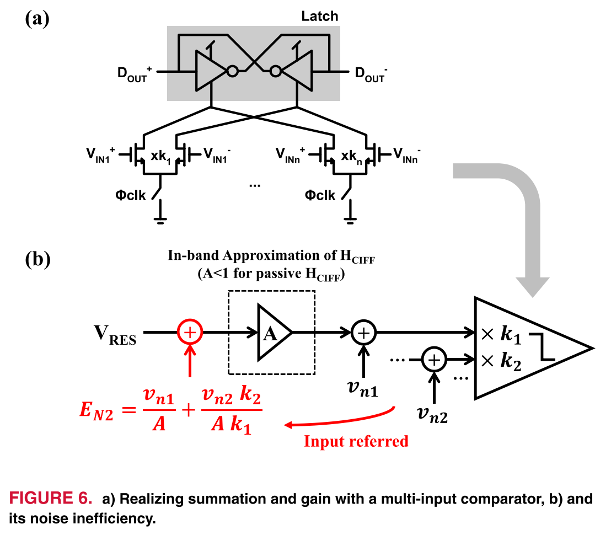
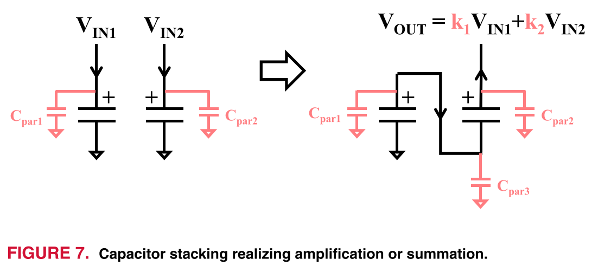
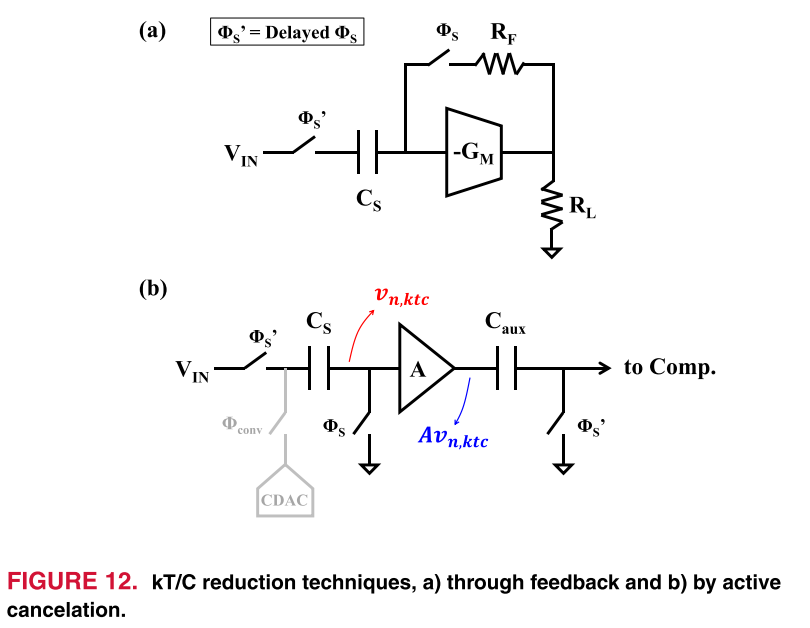
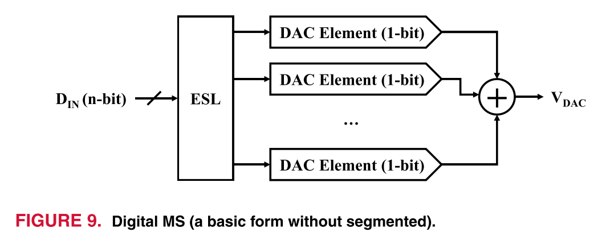

# An Overview of Noise-Shaping SAR ADC: From Fundamentals to the Frontier

!!! cite 文献
    L. Jie et al., "An Overview of Noise-Shaping SAR ADC: From Fundamentals to the Frontier," in IEEE Open Journal of the Solid-State Circuits Society, vol. 1, pp. 149-161, 2021, doi: 10.1109/OJSSCS.2021.3119910.

## 摘要

NS-SAR把SAR的残差当成可利用的“误差信号”并进行噪声整形，从而在保持SAR高能效、低成本和可缩放性的同时，获得接近DSM的SNR。本文系统回顾了NS-SAR发展历史，统一了EF与CIFF结构的系统模型，并围绕环路滤波、DAC失配、带宽拓展与kT/C噪声等瓶颈给出主流解法与工程权衡。最后通过文献统计总结趋势并预测未来方向。

## 文章脉络

1. 引言：ADC指标持续上升，传统架构难以兼顾高带宽/高动态范围/低功耗，推动混合架构发展。
2. 历史回顾：从SAR作为DSM量化器到利用SAR残差进行整形，2012年提出“NS-SAR”并逐步发展出无源滤波、动态放大、失配整形、级联与时间交织等关键技术里程碑。
3. 系统视角：建立NS-SAR统一模型，解释EF与CIFF两类结构、残差路径、误差源及其NTF塑形机制，说明NS-SAR为何可替代DT-DSM。
4. 挑战与方案：
   - 环路滤波器的能效与鲁棒性折中，无源与有源策略并存，级联结构用于高阶整形与容差提升。
   - DAC失配限制SNDR，数字MS与模拟MES是主流手段。
   - 过采样与多周期SAR导致带宽受限，时间交织是关键增速路径。
   - kT/C噪声与输入驱动负担依旧突出，可用反馈降噪与主动抵消方案。
5. 设计对比：统计近年NS-SAR数据，归纳结构与工艺对FoM/BW/SNDR的影响与经验规律。
6. 未来趋势：更高速度、更高分辨率、参考电压稳定性与进一步架构混合化。

## 核心概念梳理

- NS-SAR核心：利用SAR量化残差做噪声整形，提高带内SNR。
- EF结构：残差经环路滤波后反馈到DAC端，等效误差反馈。
- CIFF结构：残差经滤波后在比较器端相加，等效在量化器前叠加。
- NTF：对量化误差、DAC误差、滤波器噪声等进行整形，STF通常近似全通。
- 过采样：降低带内噪声与kT/C，但牺牲带宽与速度，需要TI或更快SAR环节。

## 图解

### 图1 NS-SAR与传统架构（主要是DT-DSM）的功耗/面积对比

图示用SNDR和FoM、面积来比较不同ADC架构，显示NS-SAR在能效（P/F）与成本（Area）上相比DT-DSM更具优势。其含义是：在相同SNDR与带宽目标下，NS-SAR可以以更低功耗和更小面积实现接近DT-DSM的性能。

!!! Note FoM极限的推导
      在ADC中，功耗来自于放大器、比较器、数字电路等模块，其中数字电路的功耗占绝大多数，为了推导性能的极限值，我们假设==功耗完全来自于数字模块==
      
      其中$V_s$是RMS值
      那么可以根据$E=\frac{1}{2}CV^2$和$V_{peak-to-peak}=2\sqrt{2}V_s$
      得到：$P_{min}=2\cdot \frac{1}{2}CV_{peak-to-peak}^2\cdot BW=8\cdot BW\cdot CV_s^2$
      假设电路热噪声占主导，那么有$SNR=\frac{V_s^2}{kT/C}$
      由此可导出公式：$P_{min}=8kT\cdot BW \cdot SNR$
      **注：其中SNR不是dB表达形式**
      **$Scheier\ FoM$**
      表达式为:$FoM_S=SNDR[dB]+10\cdot log_{10}(\frac{BW}{P})$
      假设电路无失真（SNDR=SNR）
      那么可以解得：==$FoM_S=-10\cdot log_{10}(8kT)=195dB$==
      这是电路的极限，再考虑到其他模块的噪声贡献以及Distortion，$FoM_S$被限制在：$$FoM_S\le185dB$$
      **$Walden\ FoM$**
      表达式为$FoM_W=\frac{P}{2^{ENOB}\cdot 2BW}$
      $Walden\ FoM$ 和 $Scheier\ FoM$ 的转化为：$$FoM_W=\frac{1}{2^{ENOB+1}}\cdot10^{-(FoM_S-SNDR)/10}$$
      当$ENOB=12$的时候，$SNDR=6.02*12-1.76=70.48dB$
      取$FoM_S=185dB$，则$FoM_W$的极限值为$$FoM_W\approx 1fJ$$
      $FoM_W$表征的是每次转化的能量，和ADC的位数呈指数关系，在NS-SAR中不如Scheier FoM常用（或者说压根用不了），位数越小，这个$FoM_W$会越小

### 图2 SAR与NS-SAR的基本框架与时序

(a) 展示传统SAR的采样与逐次逼近流程。NS-SAR在此基础上加入残差反馈路径。 
SAR ADC在每次比较输出数字码后，会通过DAC反馈生成一个新的$V_{DAC}$，随着比较的进行，$V_{DAC}$会逐渐朝着$V_{IN}$收敛，最终$V_{DAC}$和$V_{IN}$的差即为残差电压$V_{RES}$，也可以叫做是量化误差。而NS-SAR的本质就是利用在这里的残差电压（量化误差）$V_{RES}$
因此一个NS-SAR ADC具有三个部分：

+ SAR ADC：完成最初的ADC转化部分，留下量化误差交给后面处理
+ 滤波器($H_{EF},H_{CIFF}$)：用来处理残差电压（量化误差）
+ 信号求和：将滤波后的残差电压重新送进SAR ADC

(b) 给出常见实现：CDAC、比较器与环路滤波器协同工作，残差经滤波后在比较器或DAC端相加。
(c) 时序图强调采样、SAR转换、环路滤波与反馈的时分关系，指出NS-SAR的多相操作特性。

### 图3 NS-SAR的广义系统模型

+ $E_S(z)$：采样过程中的误差和噪声(kT/C)建模
+ $E_Q(z)$：SAR ADC过程中的量化误差、比较器噪声、DAC建立误差统一建模
+ $E_D(z)$：DAC的非线性、失配导致的误差建模
+ $E_{N1}(z)$：$H_{EF}(z)$滤波器的等效输入噪声建模
+ $E_{N2}(z)$：$H_{CIFF}(z)$滤波器的等效输入噪声建模
+ $z^{-1}$：延迟一拍
  
用信号流图将输入、量化误差、DAC误差、滤波器噪声统一建模，分别通过STF与NTF映射到输出，解释EF/CIFF路径差异与噪声整形机制。该图是理解后续误差来源与滤波策略的核心。

通过求解这个信号流图，可以得到STF(z)和NTF(z)如下所示：

从中可以看到，$E_S(z),E_D(z)$没有被噪声整形，$E_Q(z)$量化误差被整形，这需要$H_{EF}\rightarrow 1$或者$H_{CIFF}\rightarrow \infty$，这使得$E_{N1}(z)$也没有被噪声整形，而$E_{N2}(z)$可以被EF环路噪声整形

**需求**：
+ $H_{EF}\rightarrow 1$：电路上很容易实现，一个简单的FIR即可，但是要实现带内精确的增益为1比较困难
+ $H_{CIFF}\rightarrow \infty$：增益需要做的特别大（积分器或者IIR），但是没那么敏感（只要增益始终够大）

### 图4 CIFF-DSM与CIFF-NS-SAR对比

NS-SAR的信号模型本质上与传统DSM的信号模型相似，但存在三个关键差异：

+ 环路滤波器只处理小的残差信号，不处理大信号，在DSM中，哪怕是CIFF结构，在蓝色求和节点处依旧要处理大信号。CIFF-NS—SAR可以借助这个优势只利用无源加法器，保证线性度
+ 能够精确提取残差，因为CDAC承担了生成残差和反馈DAC量化的作用，在传统的EF-DSM中，量化和DAC反馈生成反馈信号二者是利用不同的DAC模块去实现的，这其中可能存在Mismatch
+ 相较于传统DSM使用Flash ADC进行多位量化（至多6 bit），SAR ADC可以很轻松的实现8 bit以上的量化。量化位数越多，对于环路滤波器的要求越松，放宽了对于增益、线性度和摆幅的要求，环路也更容易稳定。事实上，即使是4阶的Noise Shaping，NS-SAR的环路通常也是无条件稳定的

强调CIFF-NS-SAR在结构上“复用”SAR残差路径而非额外多位量化器与DAC，说明其在硬件复杂度与能效方面的优势。

### 图5 EF-DSM与EF-NS-SAR对比

展示EF结构在DSM与NS-SAR中的对应关系，NS-SAR可用SAR完成量化与残差生成，不需要DSM中额外的多位量化器和反馈DAC，结构更简洁，也避免了DAC之间的Mismatch。

### 图6 多输入比较器实现无源求和/增益与噪声代价

(a) 通过多输入对实现求和与增益，等效“隐式放大”。(b) 由于比较器置于无源滤波之后，滤波器kT/C噪声未被放大抑制，噪声效率偏低。该图提示多输入比较器并非高SNR的理想选择。

### 图7 电容堆叠实现增益或求和

展示电容堆叠的无源增益原理：充电后串联叠加电压实现整数倍增益或求和。优点是线性好、能效高，但驱动能力有限且对寄生电容敏感。

### 图8 级联NS-SAR结构与实现

(a) 给出级联噪声整形的系统框架，多级NS-SAR逐级整形噪声以实现高阶NTF。 (b) 提供基于电容堆叠的具体实现示意，说明级联结构如何在实际电路中落地。

### 图9 数字失配整形（DEM/DWA）

展示元素级控制的DAC结构与元素选择逻辑（ESL），通过动态选择元件将失配误差噪声整形到带外。逻辑复杂度随分辨率提升而急剧增加。

### 图10 模拟失配整形（MES）

给出利用CDAC预置与残差反馈捕获失配误差的结构示意。优势是电路简单、无需元素级控制，但会占用输入范围，需要预测/补偿来恢复满量程。

### 图11 时间交织NS-ADC结构与挑战

(a) 说明TI的核心问题是反馈延迟与跨通道因果性。 (b) 传统TI-DSM的跨通道噪声耦合复杂。 (c) EF型TI-NS-SAR通过共享残差信号实现跨通道反馈，但模拟加法器实现困难。 (d) CIFF型共享全局积分器，结构更简洁、能效更好。

### 图12 kT/C噪声降低技术

(a) 通过反馈网络降低等效噪声带宽，从而降低kT/C。 (b) 通过额外采样与放大器“捕获并抵消”噪声，可显著降低所需采样电容，但对带宽与放大器噪声有权衡。

### 图13 文献统计散点图

对FoM、带宽、工艺节点、结构类型、滤波策略与失配处理方法进行散点统计，支持文中结论，例如先进工艺的面积优势、电容堆叠带来的高FoM等。

## 设计启示

- 环路滤波器决定能效上限，无源堆叠与闭环动态放大器是当前关键路线。
- 高SNDR的主要瓶颈仍在DAC失配，MS或校准是必须项。
- TI在提升带宽上效果明显，但实现复杂度与反馈机制需重点把控。
- 级联结构是实现高阶整形且容差更好的可行路径。

## 个人理解与关注点

- NS-SAR的“残差再利用”是结构创新的关键，本质是把SAR的量化误差变成可塑形的资源。
- 未来高性能NS-SAR可能是“无源为主、少量有源补偿”的混合环路滤波架构。
- 参考电压稳定性在NS-SAR中被低估，可能成为高带宽场景的瓶颈。

## 待深入的问题

1. NS SAR建模

## 挑战及解决方案

### 环路滤波器

环路滤波器主要有三个作用：

1. 提供残差滤波，本质上是一个线性时不变系统
2. 提供环路增益
3. 输出求和，送回SAR ADC

其中第一个功能主要通过开关电容放大器来实现，包括FIR和IIR两种形式；后两个功能实现方式多样

#### 无源策略

无源信号处理（即滤波和求和）在近年来的NS-SAR设计中很受欢迎，它只需要无源元件，例如开关和电容器。它简单、线性、对PVT鲁棒，且易于扩展。无源滤波器本质上也是动态的。因此，它们通常比消耗静态功率的有源滤波器更节能。无源滤波的最大挑战在于其增益不足。由于能量守恒，无源滤波器没有功率增益，因此无法实现高增益，或者高增益根本没有驱动能力。目前，在NS-SAR中部署无源滤波器有两种策略：

1. 使用隐式有源放大器和加法器
2. 使用电容堆叠。

第一种主要用在多输入比较器中：多个不同对的比较器输入，每个输入具有不同的尺寸。同时对这些输入对的输出电流求和，可在比较器输入级实现信号放大和求和。缺点是比较器位于无源滤波器之后。因此，无源滤波器的kT/C噪声不会被比较器增益抑制，并且无源滤波器中的任何损耗都会增加环路滤波器的输入参考噪声

另一种方式是使用电容堆叠：

好处是能实现真正的无源滤波，实现增益放大和求和，但缺点是随着堆叠电容数量的增加，其对寄生参数的敏感性迅速上升，这使得高堆叠数量（即高增益）变得不切实际。因此，NS-SAR所报道的最高电容堆叠数量仅为2，可提供约4的无源增益（差分）

#### 有源策略

与无源策略相比，有源环路滤波更加灵活且发展更为成熟。这是因为有源放大器为有源滤波器提供增益。如果有足够的功率和面积，该增益可以很高。本质上，有源放大器为环路滤波器设计引入了一个额外的自由度。因此，有源NS-SAR可以覆盖更广泛的规格范围。有源策略的主要问题是额外的功耗。但通过适当的设计，有源方法仍然可以实现高效率。

使用传统的opamp——绝佳的鲁棒性，但功耗大
使用开环动态放大器———绝佳的能效，但PVT敏感，对时序要求高

需要在上述两个极端放大器的情况下找到平衡

从表中可以看到，使用闭环动态放大器（DA）是比较好的选择，因为它具有大闭环增益，可实现高鲁棒性。除了具备动态特性以实现高偏置效率外，闭环动态放大器因其自然的建立行为而对时序不敏感。此外，与环形放大器类似，其带宽在建立过程中会收缩，从而提高了噪声效率。最后，尽管闭环动态放大器的可实现增益略低于运算放大器，但这可以通过级联更多级来弥补

#### 级联Noise Shaping

NS-SAR中的放大器通常会为了效率和工艺缩放考虑而牺牲增益精度。这会导致环路滤波器中的系数变化，并使高阶滤波器的实现具有挑战性

级联NS-SAR解决了这一问题：

级联NS-SAR中存在多个解耦的反馈级，每个级都会接收前一级整形后的噪声，对噪声进行新一轮整形，然后将其传递给下一级。通过这种方式，自然形成了级联NTF

### DAC Mismatch

#### 传统解决方案

+ 前台校准——Trimming
+ 后台校准——在NS-SAR中很少见，因为收敛慢、结构复杂
+ 无脑增大电容面积，面积每增大4倍，DAC元件的归一化标准偏差小2倍

#### 数字失配整形(Digital Mismatch-Shaping)

又叫做Dynamic Element Matching (DEM)

通过对DAC的随机选取来降低失配误差对DAC代码的依赖性，让DAC的输出与输入的关联性减弱，这样在带内就不会出现谐波，而是被当成噪声均摊到了带内，之后通过Noise Shaping进行处理

缺点是逻辑复杂+延时长，在分辨率很高的时候，由于DAC是逐元素操作的，所需要的逻辑会非常复杂，因此为了降低复杂度，通常在NS-SAR中会针对几个高位MSBs设置元素选择逻辑（ESL）

#### 模拟失配整形(Analog Mismatch-Shaping)

又叫做Mismatch Error Shaping(MES)

不同于DEM，MES主要在于对LSBs进行处理

基本思路是捕获模拟形式的失配误差并将其反馈以进行噪声整形，也是让失配进入环路

### 带宽限制与交织

过采样ADC（包括NS-SAR）有个通病就是带宽受限。为了解决这个问题，时间交织是个好方案，但是对于NS-SAR直接使用时间交织会有问题。如图（a）所示，首先就是NTF的系数从$z$变成了$z^N$，其次是通道间的反馈在物理上不可实现（因为上一通道的Filter过程还没开始，下一通道就开始Conversion了）

在传统的TI-DSM中，经常采用(b)中的方式，即在量化开始前，将上一通道的反馈信息输入进下一通道，这个缺点是走线复杂，大多数只做2通道交织，在效率和面积上大打折扣。

在NS-SAR中，(c)是基于EF的TI-NS-SAR，(d)是基于CIFF的TI-NS-SAR

(c)中将一个通道的残差馈入其他通道，每个通道都需要模拟加法器（这个实现具有挑战性），通道间用单根线共享就行；而CIFF类型的TI-NS-SAR的实现只需要全局的Loop Filter就行，环路滤波器并没有交织，通常用无源的就能实现

### Input Driver和kT/C噪声

输入采样的电容是CDAC的总电容，一般这个电容值会比较大，给信号源带来了负担，所以在输入插入一个Buffer可以很好的缓解这个问题，但是Buffer的功耗有时候甚至会比ADC core还大

在NS-SAR中，因为过采样，kT/C噪声功率缩小了OSR倍，在相同信噪比的条件下，可以将电容值缩小OSR倍来减轻输入负载的负担。但是随着采样频率的上升，Buffer的负担并没有被完全减轻

文章中提了两种可以用来减小kT/C噪声的方法
与使用Buffer相比，这里的放大器均工作在小信号条件下，因此放宽了设计
