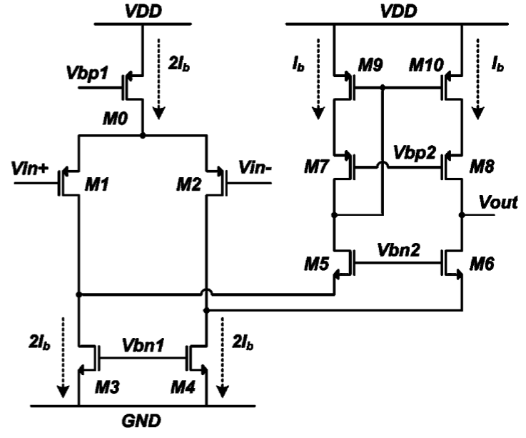
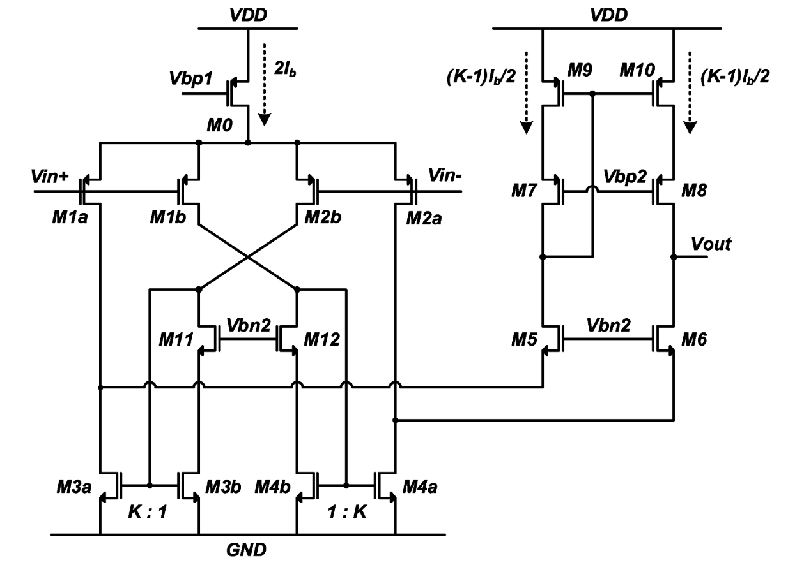
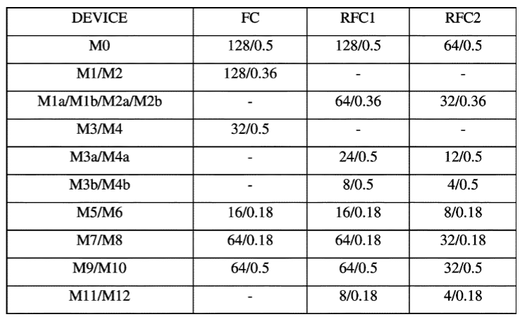
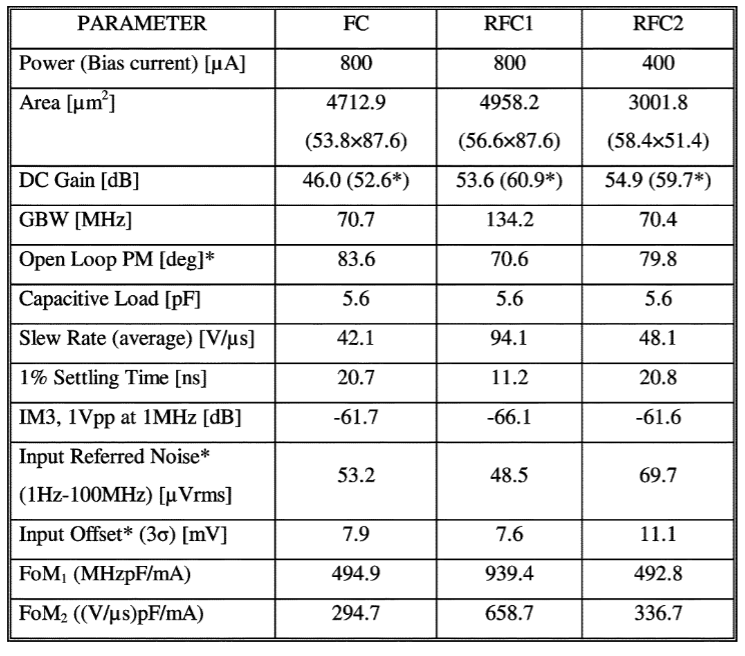

# The Recycling Folded Cascode: A General Enhancement of the Folded Cascode Amplifier

## 文献

!!! cite
     R. S. Assaad and J. Silva-Martinez, "The Recycling Folded Cascode: A General Enhancement of the Folded Cascode Amplifier," in IEEE Journal of Solid-State Circuits, vol. 44, no. 9, pp. 2535-2542, Sept. 2009

## Introduction

这篇文章提出了一种改进式的Folded Cascode结构放大器，可以在相同的功耗水平下，将运放的增益、GBW、SR提高，所基于的理念是将原本Folded Cascode中只充当电流源的电流利用起来，从而起到放大作用，所以是Reuse / Recycle （重复利用）了（负载）电流。

基本的Folded Cascode放大器结构如上所示，$M_3,M_4$充当了电流源的作用，承载了很大的电流，假设他们和$M_1,M_2$具有一样的$gmid$，则$M_3,M_4$的跨导甚至会大过负载管，但是他们却不承担放大的作用，等效跨导还是$G_m=g_{m1,2}$

!!! tip
    运放的输入管很多时候都用PMOS，这是有原因的
    + 首先：PMOS作为输入，负载管$M_3,M_4$是NMOS，这样在相同的电流水平下，$M_3,M_4$的尺寸可以做得比PMOS是负载管的时候更小，这样在折叠点处的非主极点可以移向更高的频率
    + 其次：闪烁噪声更低，闪烁噪声主要由栅氧化层界面的界面态引起，PMOS通常是埋沟器件，受界面态的影响比NMOS更小
    + 最后：输入共模电平可以更好地和开关电容电路匹配。PMOS作为输入管，输入共模电平可以很低，这样在开关电路中，仅仅一个NMOS开关管就足够传递信号了

## Recycling Folded Cascode Amplifier

### 结构介绍

Recycling Folded Cascode(RFC)结构如上图所示，和Folded Cascode(FC)结构不同的就是下面的电流负载管$M_3,M_4$，这里被拆成了$M_{3a},M_{3b},M_{4a},M_{4b}$
有一个交叉耦合，这个作用是让留到输出的电流同相。上面的四个输入管尺寸完全一样，那么每个输入管流过的电流就会是$g_{ma}v_{in}/2$，最终流向输出$V_{out}$的电流总的为:$$I_{out}=(K+1)g_{m1a}\frac{v_{in}}{2}\cdot 2=(K+1)g_{m1a}v_{in}$$
最上面的尾电流源依旧流过$2I_b$，每个输入管流过$\frac{1}{2}I_b$，下面的$M_{3a},M_{4a}$流过$K\frac{I_b}{2}$，那么$M_9,M_{10}$就会流过$(K-1)\frac{I_b}{2}$
$M_{11},M_{12}$的尺寸应该和$M_5,M_6$相同，这是为了保证$M_{3b},M_{4b}$的环境和$M_{3a},M_{4a}$一致，从而让下面的电流镜更好的匹配
这种结构改进的本质是：**把原本一点都不贡献跨导，却又可能是整个电路中跨导最大存在的电流负载管改进成电流镜结构，负载电流通过折叠节点流到输出节点，从而合理利用了大部分负载电流（Recycling）**
这种结构的特点是：==在相同的功耗下，几乎不付出任何代价就可以将增益、GBW、SR提高，但是应用在全差分放大器中需要格外小心地设计共模反馈（GBW的要求更高）==

### 结构参数推导

为了和FC结构相比较，二者的功耗需要保证一致，因此取$K=3$

#### 小信号跨导（等效跨导）

通过短路输出电流来看：
$$\begin{equation}
    \begin{cases}
        G_{mRFC} = g_{m1a}(K+1) \\
        G_{mFC} = g_{m1}
    \end{cases}
\end{equation}
$$
因为$K=3,g_{m1a}=\frac{g_{m1}}{2}$，所以我们有：$$\begin{equation}
    G_{mRFC} = 2G_{mFC}
\end{equation}$$

RFC的跨导是FC的两倍，因此GBW也是两倍（假设负载电容一样），所以速度也是两倍

#### 低频增益

推导输出阻抗：
$$\begin{equation}
    \begin{cases}
        R_{ORFC} \cong g_{m6}r_{ds6}(r_{ds2a}||r_{ds4a})||g_{m8}r_{ds8}r_{ds10} \\
        R_{OFC} \cong g_{m6}r_{ds6}(r_{ds2}||r_{ds4})||g_{m8}r_{ds8}r_{ds10}
    \end{cases}
\end{equation}
$$
由于$r_{ds}$和电流的关系为：$r_{ds}\cong \frac{1}{\lambda I_d}$
当$I_d$越小的时候，$r_{ds}$越大，所以$(r_{ds2a}||r_{ds4a})>(r_{ds2}||r_{ds4})$，所以有：$$R_{ORFC}>R_{OFC}$$
由于$$G_{mRFC} = 2G_{mFC}$$
所以低频增益RFC结构会比FC结构整体大8-10dB

#### PSRR

由于运放都是工作在闭环状态，假设这里是单位负反馈，可以画出程序框图如下：
<img src="data:image/png;base64,iVBORw0KGgoAAAANSUhEUgAAAc0AAAFTCAYAAABbKVcuAAAjHHRFWHRteGZpbGUAJTNDbXhmaWxlJTNFJTBBJTIwJTIwJTNDZGlhZ3JhbSUyMGlkJTNEJTIydm8tdTlxbHRvdHMxX2tvOWkwdEUlMjIlMjBuYW1lJTNEJTIyJUU3JUFDJUFDJTIwMSUyMCVFOSVBMSVCNSUyMiUzRSUwQSUyMCUyMCUyMCUyMCUzQ214R3JhcGhNb2RlbCUyMGR4JTNEJTIyNzA4JTIyJTIwZHklM0QlMjI5NDklMjIlMjBncmlkJTNEJTIyMSUyMiUyMGdyaWRTaXplJTNEJTIyMTAlMjIlMjBndWlkZXMlM0QlMjIxJTIyJTIwdG9vbHRpcHMlM0QlMjIxJTIyJTIwY29ubmVjdCUzRCUyMjElMjIlMjBhcnJvd3MlM0QlMjIxJTIyJTIwZm9sZCUzRCUyMjElMjIlMjBwYWdlJTNEJTIyMSUyMiUyMHBhZ2VTY2FsZSUzRCUyMjElMjIlMjBwYWdlV2lkdGglM0QlMjI4MjclMjIlMjBwYWdlSGVpZ2h0JTNEJTIyMTE2OSUyMiUyMG1hdGglM0QlMjIwJTIyJTIwc2hhZG93JTNEJTIyMCUyMiUzRSUwQSUyMCUyMCUyMCUyMCUyMCUyMCUzQ3Jvb3QlM0UlMEElMjAlMjAlMjAlMjAlMjAlMjAlMjAlMjAlM0NteENlbGwlMjBpZCUzRCUyMjAlMjIlMjAlMkYlM0UlMEElMjAlMjAlMjAlMjAlMjAlMjAlMjAlMjAlM0NteENlbGwlMjBpZCUzRCUyMjElMjIlMjBwYXJlbnQlM0QlMjIwJTIyJTIwJTJGJTNFJTBBJTIwJTIwJTIwJTIwJTIwJTIwJTIwJTIwJTNDbXhDZWxsJTIwaWQlM0QlMjIxOCUyMiUyMHN0eWxlJTNEJTIyZWRnZVN0eWxlJTNEbm9uZSUzQmh0bWwlM0QxJTNCZXhpdFglM0QxJTNCZXhpdFklM0QwLjUlM0JleGl0RHglM0QwJTNCZXhpdER5JTNEMCUzQmV4aXRQZXJpbWV0ZXIlM0QwJTNCJTIyJTIwcGFyZW50JTNEJTIyMSUyMiUyMHNvdXJjZSUzRCUyMjIlMjIlMjB0YXJnZXQlM0QlMjI1JTIyJTIwZWRnZSUzRCUyMjElMjIlM0UlMEElMjAlMjAlMjAlMjAlMjAlMjAlMjAlMjAlMjAlMjAlM0NteEdlb21ldHJ5JTIwcmVsYXRpdmUlM0QlMjIxJTIyJTIwYXMlM0QlMjJnZW9tZXRyeSUyMiUyMCUyRiUzRSUwQSUyMCUyMCUyMCUyMCUyMCUyMCUyMCUyMCUzQyUyRm14Q2VsbCUzRSUwQSUyMCUyMCUyMCUyMCUyMCUyMCUyMCUyMCUzQ214Q2VsbCUyMGlkJTNEJTIyMiUyMiUyMHZhbHVlJTNEJTIyJTIyJTIwc3R5bGUlM0QlMjJ2ZXJ0aWNhbExhYmVsUG9zaXRpb24lM0Rib3R0b20lM0JzaGFkb3clM0QwJTNCZGFzaGVkJTNEMCUzQmFsaWduJTNEY2VudGVyJTNCaHRtbCUzRDElM0J2ZXJ0aWNhbEFsaWduJTNEdG9wJTNCc2hhcGUlM0RteGdyYXBoLmVsZWN0cmljYWwuYWJzdHJhY3Quc3VtJTNCJTIyJTIwcGFyZW50JTNEJTIyMSUyMiUyMHZlcnRleCUzRCUyMjElMjIlM0UlMEElMjAlMjAlMjAlMjAlMjAlMjAlMjAlMjAlMjAlMjAlM0NteEdlb21ldHJ5JTIweCUzRCUyMjIxMCUyMiUyMHklM0QlMjI0OTAlMjIlMjB3aWR0aCUzRCUyMjUwJTIyJTIwaGVpZ2h0JTNEJTIyNTAlMjIlMjBhcyUzRCUyMmdlb21ldHJ5JTIyJTIwJTJGJTNFJTBBJTIwJTIwJTIwJTIwJTIwJTIwJTIwJTIwJTNDJTJGbXhDZWxsJTNFJTBBJTIwJTIwJTIwJTIwJTIwJTIwJTIwJTIwJTNDbXhDZWxsJTIwaWQlM0QlMjIzJTIyJTIwdmFsdWUlM0QlMjIlMjIlMjBzdHlsZSUzRCUyMnN3aW1sYW5lJTNCc3RhcnRTaXplJTNEMCUzQiUyMiUyMHBhcmVudCUzRCUyMjElMjIlMjB2ZXJ0ZXglM0QlMjIxJTIyJTNFJTBBJTIwJTIwJTIwJTIwJTIwJTIwJTIwJTIwJTIwJTIwJTNDbXhHZW9tZXRyeSUyMHglM0QlMjIzNDAlMjIlMjB5JTNEJTIyNDc1JTIyJTIwd2lkdGglM0QlMjI4MCUyMiUyMGhlaWdodCUzRCUyMjgwJTIyJTIwYXMlM0QlMjJnZW9tZXRyeSUyMiUzRSUwQSUyMCUyMCUyMCUyMCUyMCUyMCUyMCUyMCUyMCUyMCUyMCUyMCUzQ214UmVjdGFuZ2xlJTIweCUzRCUyMjUwMCUyMiUyMHklM0QlMjI1NjAlMjIlMjB3aWR0aCUzRCUyMjUwJTIyJTIwaGVpZ2h0JTNEJTIyNDAlMjIlMjBhcyUzRCUyMmFsdGVybmF0ZUJvdW5kcyUyMiUyMCUyRiUzRSUwQSUyMCUyMCUyMCUyMCUyMCUyMCUyMCUyMCUyMCUyMCUzQyUyRm14R2VvbWV0cnklM0UlMEElMjAlMjAlMjAlMjAlMjAlMjAlMjAlMjAlM0MlMkZteENlbGwlM0UlMEElMjAlMjAlMjAlMjAlMjAlMjAlMjAlMjAlM0NteENlbGwlMjBpZCUzRCUyMjUlMjIlMjB2YWx1ZSUzRCUyMiUyNmx0JTNCZm9udCUyNmd0JTNCQV9vcGVuJTI2bHQlM0IlMkZmb250JTI2Z3QlM0IlMjIlMjBzdHlsZSUzRCUyMnRleHQlM0JodG1sJTNEMSUzQmFsaWduJTNEY2VudGVyJTNCdmVydGljYWxBbGlnbiUzRG1pZGRsZSUzQnJlc2l6YWJsZSUzRDAlM0Jwb2ludHMlM0QlNUIlNUQlM0JhdXRvc2l6ZSUzRDElM0JzdHJva2VDb2xvciUzRG5vbmUlM0JmaWxsQ29sb3IlM0Rub25lJTNCZm9udFNpemUlM0QxOSUzQiUyMiUyMHBhcmVudCUzRCUyMjMlMjIlMjB2ZXJ0ZXglM0QlMjIxJTIyJTNFJTBBJTIwJTIwJTIwJTIwJTIwJTIwJTIwJTIwJTIwJTIwJTNDbXhHZW9tZXRyeSUyMHglM0QlMjItNSUyMiUyMHklM0QlMjIyMCUyMiUyMHdpZHRoJTNEJTIyOTAlMjIlMjBoZWlnaHQlM0QlMjI0MCUyMiUyMGFzJTNEJTIyZ2VvbWV0cnklMjIlMjAlMkYlM0UlMEElMjAlMjAlMjAlMjAlMjAlMjAlMjAlMjAlM0MlMkZteENlbGwlM0UlMEElMjAlMjAlMjAlMjAlMjAlMjAlMjAlMjAlM0NteENlbGwlMjBpZCUzRCUyMjglMjIlMjB2YWx1ZSUzRCUyMiUyMiUyMHN0eWxlJTNEJTIydmVydGljYWxMYWJlbFBvc2l0aW9uJTNEYm90dG9tJTNCc2hhZG93JTNEMCUzQmRhc2hlZCUzRDAlM0JhbGlnbiUzRGNlbnRlciUzQmh0bWwlM0QxJTNCdmVydGljYWxBbGlnbiUzRHRvcCUzQnNoYXBlJTNEbXhncmFwaC5lbGVjdHJpY2FsLmFic3RyYWN0LnN1bSUzQiUyMiUyMHBhcmVudCUzRCUyMjElMjIlMjB2ZXJ0ZXglM0QlMjIxJTIyJTNFJTBBJTIwJTIwJTIwJTIwJTIwJTIwJTIwJTIwJTIwJTIwJTNDbXhHZW9tZXRyeSUyMHglM0QlMjI0ODAlMjIlMjB5JTNEJTIyNDkwJTIyJTIwd2lkdGglM0QlMjI1MCUyMiUyMGhlaWdodCUzRCUyMjUwJTIyJTIwYXMlM0QlMjJnZW9tZXRyeSUyMiUyMCUyRiUzRSUwQSUyMCUyMCUyMCUyMCUyMCUyMCUyMCUyMCUzQyUyRm14Q2VsbCUzRSUwQSUyMCUyMCUyMCUyMCUyMCUyMCUyMCUyMCUzQ214Q2VsbCUyMGlkJTNEJTIyMjElMjIlMjB2YWx1ZSUzRCUyMiUyMiUyMHN0eWxlJTNEJTIyZWRnZVN0eWxlJTNEbm9uZSUzQmh0bWwlM0QxJTNCZW50cnlYJTNEMC41JTNCZW50cnlZJTNEMCUzQmVudHJ5RHglM0QwJTNCZW50cnlEeSUzRDAlM0IlMjIlMjBwYXJlbnQlM0QlMjIxJTIyJTIwc291cmNlJTNEJTIyMTElMjIlMjB0YXJnZXQlM0QlMjIxNiUyMiUyMGVkZ2UlM0QlMjIxJTIyJTNFJTBBJTIwJTIwJTIwJTIwJTIwJTIwJTIwJTIwJTIwJTIwJTNDbXhHZW9tZXRyeSUyMHJlbGF0aXZlJTNEJTIyMSUyMiUyMGFzJTNEJTIyZ2VvbWV0cnklMjIlMjAlMkYlM0UlMEElMjAlMjAlMjAlMjAlMjAlMjAlMjAlMjAlM0MlMkZteENlbGwlM0UlMEElMjAlMjAlMjAlMjAlMjAlMjAlMjAlMjAlM0NteENlbGwlMjBpZCUzRCUyMjExJTIyJTIwdmFsdWUlM0QlMjIlMjZsdCUzQmZvbnQlMjBzdHlsZSUzRCUyNnF1b3QlM0Jmb250LXNpemUlM0ElMjAxNnB4JTNCJTI2cXVvdCUzQiUyNmd0JTNCVmlfUFNSUiUyNmx0JTNCJTJGZm9udCUyNmd0JTNCJTIyJTIwc3R5bGUlM0QlMjJ0ZXh0JTNCaHRtbCUzRDElM0JhbGlnbiUzRGNlbnRlciUzQnZlcnRpY2FsQWxpZ24lM0RtaWRkbGUlM0JyZXNpemFibGUlM0QwJTNCcG9pbnRzJTNEJTVCJTVEJTNCYXV0b3NpemUlM0QxJTNCc3Ryb2tlQ29sb3IlM0Rub25lJTNCZmlsbENvbG9yJTNEbm9uZSUzQiUyMiUyMHBhcmVudCUzRCUyMjElMjIlMjB2ZXJ0ZXglM0QlMjIxJTIyJTNFJTBBJTIwJTIwJTIwJTIwJTIwJTIwJTIwJTIwJTIwJTIwJTNDbXhHZW9tZXRyeSUyMHglM0QlMjI0NjAlMjIlMjB5JTNEJTIyMjkwJTIyJTIwd2lkdGglM0QlMjI5MCUyMiUyMGhlaWdodCUzRCUyMjMwJTIyJTIwYXMlM0QlMjJnZW9tZXRyeSUyMiUyMCUyRiUzRSUwQSUyMCUyMCUyMCUyMCUyMCUyMCUyMCUyMCUzQyUyRm14Q2VsbCUzRSUwQSUyMCUyMCUyMCUyMCUyMCUyMCUyMCUyMCUzQ214Q2VsbCUyMGlkJTNEJTIyMTIlMjIlMjB2YWx1ZSUzRCUyMiUyMiUyMHN0eWxlJTNEJTIyZW5kQXJyb3clM0RjbGFzc2ljJTNCaHRtbCUzRDElM0JleGl0WCUzRDElM0JleGl0WSUzRDAuNSUzQmV4aXREeCUzRDAlM0JleGl0RHklM0QwJTNCZXhpdFBlcmltZXRlciUzRDAlM0IlMjIlMjBwYXJlbnQlM0QlMjIxJTIyJTIwc291cmNlJTNEJTIyOCUyMiUyMGVkZ2UlM0QlMjIxJTIyJTNFJTBBJTIwJTIwJTIwJTIwJTIwJTIwJTIwJTIwJTIwJTIwJTNDbXhHZW9tZXRyeSUyMHdpZHRoJTNEJTIyNTAlMjIlMjBoZWlnaHQlM0QlMjI1MCUyMiUyMHJlbGF0aXZlJTNEJTIyMSUyMiUyMGFzJTNEJTIyZ2VvbWV0cnklMjIlM0UlMEElMjAlMjAlMjAlMjAlMjAlMjAlMjAlMjAlMjAlMjAlMjAlMjAlM0NteFBvaW50JTIweCUzRCUyMjY4MCUyMiUyMHklM0QlMjI1NTAlMjIlMjBhcyUzRCUyMnNvdXJjZVBvaW50JTIyJTIwJTJGJTNFJTBBJTIwJTIwJTIwJTIwJTIwJTIwJTIwJTIwJTIwJTIwJTIwJTIwJTNDbXhQb2ludCUyMHglM0QlMjI2MTAlMjIlMjB5JTNEJTIyNTE1JTIyJTIwYXMlM0QlMjJ0YXJnZXRQb2ludCUyMiUyMCUyRiUzRSUwQSUyMCUyMCUyMCUyMCUyMCUyMCUyMCUyMCUyMCUyMCUzQyUyRm14R2VvbWV0cnklM0UlMEElMjAlMjAlMjAlMjAlMjAlMjAlMjAlMjAlM0MlMkZteENlbGwlM0UlMEElMjAlMjAlMjAlMjAlMjAlMjAlMjAlMjAlM0NteENlbGwlMjBpZCUzRCUyMjEzJTIyJTIwdmFsdWUlM0QlMjIlMjZsdCUzQmZvbnQlMjBzdHlsZSUzRCUyNnF1b3QlM0Jmb250LXNpemUlM0ElMjAxNnB4JTNCJTI2cXVvdCUzQiUyNmd0JTNCVm9fUFNSUiUyNmx0JTNCJTJGZm9udCUyNmd0JTNCJTIyJTIwc3R5bGUlM0QlMjJ0ZXh0JTNCaHRtbCUzRDElM0JhbGlnbiUzRGNlbnRlciUzQnZlcnRpY2FsQWxpZ24lM0RtaWRkbGUlM0JyZXNpemFibGUlM0QwJTNCcG9pbnRzJTNEJTVCJTVEJTNCYXV0b3NpemUlM0QxJTNCc3Ryb2tlQ29sb3IlM0Rub25lJTNCZmlsbENvbG9yJTNEbm9uZSUzQiUyMiUyMHBhcmVudCUzRCUyMjElMjIlMjB2ZXJ0ZXglM0QlMjIxJTIyJTNFJTBBJTIwJTIwJTIwJTIwJTIwJTIwJTIwJTIwJTIwJTIwJTNDbXhHZW9tZXRyeSUyMHglM0QlMjI1NjAlMjIlMjB5JTNEJTIyNDg1JTIyJTIwd2lkdGglM0QlMjIxMDAlMjIlMjBoZWlnaHQlM0QlMjIzMCUyMiUyMGFzJTNEJTIyZ2VvbWV0cnklMjIlMjAlMkYlM0UlMEElMjAlMjAlMjAlMjAlMjAlMjAlMjAlMjAlM0MlMkZteENlbGwlM0UlMEElMjAlMjAlMjAlMjAlMjAlMjAlMjAlMjAlM0NteENlbGwlMjBpZCUzRCUyMjE0JTIyJTIwdmFsdWUlM0QlMjIlMjIlMjBzdHlsZSUzRCUyMmVuZEFycm93JTNEY2xhc3NpYyUzQmh0bWwlM0QxJTNCZW50cnlYJTNEMC41JTNCZW50cnlZJTNEMSUzQmVudHJ5RHglM0QwJTNCZW50cnlEeSUzRDAlM0JlbnRyeVBlcmltZXRlciUzRDAlM0IlMjIlMjBwYXJlbnQlM0QlMjIxJTIyJTIwZWRnZSUzRCUyMjElMjIlM0UlMEElMjAlMjAlMjAlMjAlMjAlMjAlMjAlMjAlMjAlMjAlM0NteEdlb21ldHJ5JTIwd2lkdGglM0QlMjI1MCUyMiUyMGhlaWdodCUzRCUyMjUwJTIyJTIwcmVsYXRpdmUlM0QlMjIxJTIyJTIwYXMlM0QlMjJnZW9tZXRyeSUyMiUzRSUwQSUyMCUyMCUyMCUyMCUyMCUyMCUyMCUyMCUyMCUyMCUyMCUyMCUzQ214UG9pbnQlMjB4JTNEJTIyNTYwJTIyJTIweSUzRCUyMjUxNSUyMiUyMGFzJTNEJTIyc291cmNlUG9pbnQlMjIlMjAlMkYlM0UlMEElMjAlMjAlMjAlMjAlMjAlMjAlMjAlMjAlMjAlMjAlMjAlMjAlM0NteFBvaW50JTIweCUzRCUyMjIzNS44MyUyMiUyMHklM0QlMjI1NDAlMjIlMjBhcyUzRCUyMnRhcmdldFBvaW50JTIyJTIwJTJGJTNFJTBBJTIwJTIwJTIwJTIwJTIwJTIwJTIwJTIwJTIwJTIwJTIwJTIwJTNDQXJyYXklMjBhcyUzRCUyMnBvaW50cyUyMiUzRSUwQSUyMCUyMCUyMCUyMCUyMCUyMCUyMCUyMCUyMCUyMCUyMCUyMCUyMCUyMCUzQ214UG9pbnQlMjB4JTNEJTIyNTYwJTIyJTIweSUzRCUyMjYxMCUyMiUyMCUyRiUzRSUwQSUyMCUyMCUyMCUyMCUyMCUyMCUyMCUyMCUyMCUyMCUyMCUyMCUyMCUyMCUzQ214UG9pbnQlMjB4JTNEJTIyNDAwJTIyJTIweSUzRCUyMjYxMCUyMiUyMCUyRiUzRSUwQSUyMCUyMCUyMCUyMCUyMCUyMCUyMCUyMCUyMCUyMCUyMCUyMCUyMCUyMCUzQ214UG9pbnQlMjB4JTNEJTIyMzEwJTIyJTIweSUzRCUyMjYxMCUyMiUyMCUyRiUzRSUwQSUyMCUyMCUyMCUyMCUyMCUyMCUyMCUyMCUyMCUyMCUyMCUyMCUyMCUyMCUzQ214UG9pbnQlMjB4JTNEJTIyMjM2JTIyJTIweSUzRCUyMjYxMCUyMiUyMCUyRiUzRSUwQSUyMCUyMCUyMCUyMCUyMCUyMCUyMCUyMCUyMCUyMCUyMCUyMCUzQyUyRkFycmF5JTNFJTBBJTIwJTIwJTIwJTIwJTIwJTIwJTIwJTIwJTIwJTIwJTNDJTJGbXhHZW9tZXRyeSUzRSUwQSUyMCUyMCUyMCUyMCUyMCUyMCUyMCUyMCUzQyUyRm14Q2VsbCUzRSUwQSUyMCUyMCUyMCUyMCUyMCUyMCUyMCUyMCUzQ214Q2VsbCUyMGlkJTNEJTIyMTUlMjIlMjB2YWx1ZSUzRCUyMiUyNmx0JTNCZm9udCUyMHN0eWxlJTNEJTI2cXVvdCUzQmZvbnQtc2l6ZSUzQSUyMDI2cHglM0IlMjZxdW90JTNCJTI2Z3QlM0ItJTI2bHQlM0IlMkZmb250JTI2Z3QlM0IlMjIlMjBzdHlsZSUzRCUyMnRleHQlM0JodG1sJTNEMSUzQmFsaWduJTNEY2VudGVyJTNCdmVydGljYWxBbGlnbiUzRG1pZGRsZSUzQnJlc2l6YWJsZSUzRDAlM0Jwb2ludHMlM0QlNUIlNUQlM0JhdXRvc2l6ZSUzRDElM0JzdHJva2VDb2xvciUzRG5vbmUlM0JmaWxsQ29sb3IlM0Rub25lJTNCJTIyJTIwcGFyZW50JTNEJTIyMSUyMiUyMHZlcnRleCUzRCUyMjElMjIlM0UlMEElMjAlMjAlMjAlMjAlMjAlMjAlMjAlMjAlMjAlMjAlM0NteEdlb21ldHJ5JTIweCUzRCUyMjIxMCUyMiUyMHklM0QlMjI1MzAlMjIlMjB3aWR0aCUzRCUyMjMwJTIyJTIwaGVpZ2h0JTNEJTIyNDAlMjIlMjBhcyUzRCUyMmdlb21ldHJ5JTIyJTIwJTJGJTNFJTBBJTIwJTIwJTIwJTIwJTIwJTIwJTIwJTIwJTNDJTJGbXhDZWxsJTNFJTBBJTIwJTIwJTIwJTIwJTIwJTIwJTIwJTIwJTNDbXhDZWxsJTIwaWQlM0QlMjIxNiUyMiUyMHZhbHVlJTNEJTIyJTIyJTIwc3R5bGUlM0QlMjJzd2ltbGFuZSUzQnN0YXJ0U2l6ZSUzRDAlM0IlMjIlMjBwYXJlbnQlM0QlMjIxJTIyJTIwdmVydGV4JTNEJTIyMSUyMiUzRSUwQSUyMCUyMCUyMCUyMCUyMCUyMCUyMCUyMCUyMCUyMCUzQ214R2VvbWV0cnklMjB4JTNEJTIyNDY1JTIyJTIweSUzRCUyMjM2MCUyMiUyMHdpZHRoJTNEJTIyODAlMjIlMjBoZWlnaHQlM0QlMjI4MCUyMiUyMGFzJTNEJTIyZ2VvbWV0cnklMjIlM0UlMEElMjAlMjAlMjAlMjAlMjAlMjAlMjAlMjAlMjAlMjAlMjAlMjAlM0NteFJlY3RhbmdsZSUyMHglM0QlMjI1MDAlMjIlMjB5JTNEJTIyNTYwJTIyJTIwd2lkdGglM0QlMjI1MCUyMiUyMGhlaWdodCUzRCUyMjQwJTIyJTIwYXMlM0QlMjJhbHRlcm5hdGVCb3VuZHMlMjIlMjAlMkYlM0UlMEElMjAlMjAlMjAlMjAlMjAlMjAlMjAlMjAlMjAlMjAlM0MlMkZteEdlb21ldHJ5JTNFJTBBJTIwJTIwJTIwJTIwJTIwJTIwJTIwJTIwJTNDJTJGbXhDZWxsJTNFJTBBJTIwJTIwJTIwJTIwJTIwJTIwJTIwJTIwJTNDbXhDZWxsJTIwaWQlM0QlMjIxNyUyMiUyMHZhbHVlJTNEJTIyJTI2bHQlM0Jmb250JTI2Z3QlM0JBX1BTUlIlMjZsdCUzQiUyRmZvbnQlMjZndCUzQiUyMiUyMHN0eWxlJTNEJTIydGV4dCUzQmh0bWwlM0QxJTNCYWxpZ24lM0RjZW50ZXIlM0J2ZXJ0aWNhbEFsaWduJTNEbWlkZGxlJTNCcmVzaXphYmxlJTNEMCUzQnBvaW50cyUzRCU1QiU1RCUzQmF1dG9zaXplJTNEMSUzQnN0cm9rZUNvbG9yJTNEbm9uZSUzQmZpbGxDb2xvciUzRG5vbmUlM0Jmb250U2l6ZSUzRDE5JTNCJTIyJTIwcGFyZW50JTNEJTIyMTYlMjIlMjB2ZXJ0ZXglM0QlMjIxJTIyJTNFJTBBJTIwJTIwJTIwJTIwJTIwJTIwJTIwJTIwJTIwJTIwJTNDbXhHZW9tZXRyeSUyMHglM0QlMjItMTAlMjIlMjB5JTNEJTIyMjAlMjIlMjB3aWR0aCUzRCUyMjEwMCUyMiUyMGhlaWdodCUzRCUyMjQwJTIyJTIwYXMlM0QlMjJnZW9tZXRyeSUyMiUyMCUyRiUzRSUwQSUyMCUyMCUyMCUyMCUyMCUyMCUyMCUyMCUzQyUyRm14Q2VsbCUzRSUwQSUyMCUyMCUyMCUyMCUyMCUyMCUyMCUyMCUzQ214Q2VsbCUyMGlkJTNEJTIyMTklMjIlMjB2YWx1ZSUzRCUyMiUyMiUyMHN0eWxlJTNEJTIyZWRnZVN0eWxlJTNEbm9uZSUzQmh0bWwlM0QxJTNCJTIyJTIwcGFyZW50JTNEJTIyMSUyMiUyMHNvdXJjZSUzRCUyMjUlMjIlMjB0YXJnZXQlM0QlMjI4JTIyJTIwZWRnZSUzRCUyMjElMjIlM0UlMEElMjAlMjAlMjAlMjAlMjAlMjAlMjAlMjAlMjAlMjAlM0NteEdlb21ldHJ5JTIwcmVsYXRpdmUlM0QlMjIxJTIyJTIwYXMlM0QlMjJnZW9tZXRyeSUyMiUyMCUyRiUzRSUwQSUyMCUyMCUyMCUyMCUyMCUyMCUyMCUyMCUzQyUyRm14Q2VsbCUzRSUwQSUyMCUyMCUyMCUyMCUyMCUyMCUyMCUyMCUzQ214Q2VsbCUyMGlkJTNEJTIyMjYlMjIlMjBzdHlsZSUzRCUyMmVkZ2VTdHlsZSUzRG5vbmUlM0JodG1sJTNEMSUzQmV4aXRYJTNEMC41JTNCZXhpdFklM0QxJTNCZXhpdER4JTNEMCUzQmV4aXREeSUzRDAlM0JlbnRyeVglM0QwLjUlM0JlbnRyeVklM0QwJTNCZW50cnlEeCUzRDAlM0JlbnRyeUR5JTNEMCUzQmVudHJ5UGVyaW1ldGVyJTNEMCUzQiUyMiUyMHBhcmVudCUzRCUyMjElMjIlMjBzb3VyY2UlM0QlMjIxNiUyMiUyMHRhcmdldCUzRCUyMjglMjIlMjBlZGdlJTNEJTIyMSUyMiUzRSUwQSUyMCUyMCUyMCUyMCUyMCUyMCUyMCUyMCUyMCUyMCUzQ214R2VvbWV0cnklMjByZWxhdGl2ZSUzRCUyMjElMjIlMjBhcyUzRCUyMmdlb21ldHJ5JTIyJTIwJTJGJTNFJTBBJTIwJTIwJTIwJTIwJTIwJTIwJTIwJTIwJTNDJTJGbXhDZWxsJTNFJTBBJTIwJTIwJTIwJTIwJTIwJTIwJTNDJTJGcm9vdCUzRSUwQSUyMCUyMCUyMCUyMCUzQyUyRm14R3JhcGhNb2RlbCUzRSUwQSUyMCUyMCUzQyUyRmRpYWdyYW0lM0UlMEElM0MlMkZteGZpbGUlM0UlMEEcT3QsAAAQAElEQVR4AeydC7xdVX3n94XwCAklQCQJAUJ4jC0zDsUkPC0kYKc++pBOGBUYHq0WKwRwVEDQJlAHA/giUTvQFpQCWsmo1artFExiS1ESpHaqrQXMQ0IiJiZ8yJuQ29/vevflZOe8z977rL33937W/679WI//+q5z9++stdfed5+IHwhAAAIQgAAE2iKAaLaFiUQQgAAEIACBKEI0Q/wU4BMEIAABCARJANEMsltwCgIQgAAEQiSAaIbYK/gUIgF8ggAEIMD0LJ8BCEAAAhCAQLsEGGm2S4p0EIBAeATwCAI5E0A0cwZOdRCAAAQgUFwCiGZx+w7PIQABCIRIoNQ+IZql7l4aBwEIQAACaRJANNOkSVkQgAAEIFBqAoUVzVL3Co2DAAQgAIEgCSCaQXYLTkEAAhCAQIgEEM0Qe6WwPuE4BCAAgXITQDTL3b+0DgJpEfgtFTQou17WKEzTiS0yp7Et0fZYWTvB6ZzeddQz119bTr30rts+1Kb7nHbqledjrs/lKMlQcF6X4XP1LOnDUCZ+VYsAolmt/qa1FSSQUpMXq5ylsnfLJsnqhauHDz6s+DbZTNlmWSfhPiUeSNhva/+rsli0XP8PtL9KVpv2bdpfLovTaXMo2O+DtVWb9kjtT5V9WpYMrq82rbdvUKIvyCysighVJYBoVrXnaTcEOiNg8fumshwjmy5LBguZRXKRTjwhSzN8TYVZTGcrdojrt5B5P7Y43Xt1oHYEqd29wloduUrmMtsRQovrMqWPvxhok1BFAohmFXudNkOgOwIWrtXKaqFRtEewkFlQLZo+0en0rPO0silKYDE8SXGjcKlOWLwt8tpsGp4bPutR5/Bmw8jleWQb+9AwYXsnSFVUAohmUXsOvyGQPwGPznwf0KLkkWWtBxZST4N6Grf2eBrbFkqLlUXL4uXp3/Eq2KKXnIrV4bZDLJYup1WmpA+t0nO+pAQQzZJ2LM2CQEYEFqhcC5ZHltocChZQC6mnby1qQwdT/HWlyjpHFo9iPf17tva3ynyvM160Y0G3uOlwy2CfP6VULtPlabNpsA8zlMLtV0QoI4F22oRotkOJNBCAQEzgR9rwvb3a+4aX6JiDp28d92IuKxbBOP4jFWiR9j1LbQ4FC90YbcWLdLQZWVhf1IanhhWNhPh4XJ5jjy4tsp7OHUk4vFErxE5rsw8Watc7nIyoigQQzSr2Om2GQPcEPJL8mLJ71PVqxR7ZvVGxBcjTt9rsKVh4LYS1ZnFsJlZeqev0XiHrKeLkCl8f87naNL43m1xIFDteu3rW2z5+i34180GnCVUggGjm3cvUB4HiE/BjHevVjNfLLJwWUE9zarevIRZ0Tx/H9yuTDjnN24cPfl6xRV9Rw+DRrcV1vlL0cv9U2QllIIBolqEXaQME8iXgEeVnVKVHmOcr9nRtFguAVPRewSLnUa1fWrDXyeEDFnRPvw7v7hXZfz9u4mlb36vcK0HigB838WjV90B9LzRxmt0qEUA0q9TbtLURAY53TsArWD3CvElZs1oApKL3Ch4penrY9z6T9y4tqL7XakG3MO6VueaAR5CeCva9ylbPabpOl+sRrEecNcWwWTUCiGbVepz2QiAdAr6/5ylZ3xu0+KRTanulWPA8/ep7l16kE9tPld3i5nuc2mwZPO3qUemXlLLVCNLt9X3NemKt7ISqEEA0q9LTtBMC6RPwylM/P1lvVGfh8mMoHqW1U7PTOb3L/EX65r9dp+v24p7Y6i0Ycnku1+UnS4zLcDnetjC6DItyMq333SbX5dj7WAUJIJoV7HSaDAEIQAAC3RFANLvjRi4IQKA9Al5xGk+fNor9pp9W06Pt1UaqrAlUvnxEs/IfAQBAIFMCnur0lGYzi6dHM3WEwiGQBgFEMw2KlAEBCEAAApUgEKRoVoI8jYQABCAAgcIRQDQL12U4DAEIQAAC/SKAaPaLfOHqxWEIQAACEEA0+QxAAAIQgAAE2iSAaLYJimQQCJFABX2aW8E20+SACCCaAXUGrkAAAi0JzGuZggQQyJAAopkhXIqGAASqSIA2l5kAolnm3qVtEIAABCCQKgFEM1WcFAYBCEAAAiESSMsnRDMtkpQDAQhAAAKlJ4Bolr6LaSAEIAABCKRFANFMi6TLwSAAAQhAoNQEEM1Sdy+NgwAEIACBNAkgmmnSpKwQCeATBCAAgdQIIJqpoaQgCEAAAhAoOwFEs+w9TPsgECIBfIJAQQkgmgXtONyGAAQgAIH8CSCa+TOnRghAAAIhEsCnNgggmm1AIgkEIAABCEDABBBNU8AgAAEIQAACbRDIXTTb8IkkEIAABCAAgSAJIJpBdgtOQQACEIBAiAQQzRB7JXefqBACEIAABNohgGi2Q4k0EIAABCAAARFANAWBAIEQCeATBCAQHgFEM7w+wSMIQAACEAiUAKIZaMfgFgQgECIBfKo6AUSz6p8A2g8BCEAAAm0TQDTbRkVCCEAAAhAIkUCePiGaedKmLghAAAIQKDQBRLPQ3YfzEIAABCCQJwFEs13apIMABCAAgcoTQDQr/xEAAAQgAAEItEsA0WyXFOlCJIBPEIAABHIlgGjmipvKIAABCECgyAQQzSL3Hr5DIEQC6fo0t0Vxrc63yM5pCHRGANHsjBepIQCBfAmsUnU/kyXF0fuDOk6AQK4EEM1ccVMZBCDQIYElSj9edoNso8zBYvlBb8hulhFaEyBFSgQQzZRAUgwEIJAJgZUq9f2yXbJxsjiM0sY8GQECuRJANHPFTWUQgEAXBBYpz3ZZMjDKTBJhP3MCqYpm5t5SAQQgUEUCHm3epoZvlsWBUWZMgjhXAohmrripDAIQ6JJAcrTJKLNLkGTrjQCi2Ru/AuTGRQiUgkA82nRjGGWaAtYXAohmX7BTKQQg0AUBjzadjVGmKWB9IYBo9gU7lVadQMDtXyzf/EhHiLZCvjmE6Fvsk/nZR6ykBBDNknYszYJAlwRmKt8AFnXLwPyEj1BWAohmWXuWdkEAAh0SIDkEWhNANFszIgUEIAABCEBgiACiOYSBXxCAAAQgECKB0HxCNEPrEfyBAAQgAIFgCSCawXYNjkEAAhCAQGgEEE33CAYBCEAAAhBogwCi2QYkkkAAAhCAAARMANE0BSxEAvgEAQhAIDgCiGZwXYJDEIAABCAQKgFEM9SewS8IhEgAnyBQcQKIZsU/ADQfAhCAAATaJ4Bots+KlBCAAARCJIBPORJANHOETVUQgAAEIFBsAohmsfsP7yEAAQhAIEcCbYtmjj5RFQQgAAEIQCBIAohmkN2CUxCAAAQgECIBRDPEXmnbJxJCAAIQgECeBBDNPGlTFwQgAAEIFJoAolno7sP5EAngEwQgUF4CiGZ5+5aWQQACEIBAygQQzZSBUhwEIBAiAXyCQDoEEM10OFIKBCAAAQhUgACiWYFOpokQgAAEQiRQRJ8QzSL2Gj5DAAIQgEBfCCCafcFOpRCAAAQgUEQC5RfNIvYKPkMAAhCAQJAEEM0guwWnIAABCEAgRAKIZoi9Un6faCEEIACBQhJANAvZbTgNAQhAAAL9IIBo9oM6dUIgRAL4BAEItCSAaLZERAIIQGCYwFWKB2XfkR0i6zV8TgW4vHr2U527TfZLsmQ4SQe+INssi/P+i7bfLRstqw3XaydOUy9eo/PzZWNktaGZby7naSU2j/0UEypEANGsUGfTVAj0QMAiebHyb5T9V5mFS1HPwQL0FZXypzV2j7ZflF0n+5LMdSsaCr+r3/8ku0D2uMz5vqh4suzTsq/JatNrdyjcrt/OU2tX6pjbY2H9hLaTArhLx26Q1ebx9k065rQLFb9HNiDLKlBuYAQQzcA6BHcgECgBi+Qp8u1O2c9lF8nSEIttKufDsj+osd/X9q/IPis7T/ZGmYPF0EL6E+38suxcmfO9VfERMguf0/9PbSfDP+jAooR9Rvtnyf5e5vb4y4A2R8JObT0sS+a7VcfOkf1Y5tHtkYoJFSGAaFako2kmBHogYHG0qFgsP69yLDJvUXysLKvwkgp+QOaR6OsVO7g+i7cF8CkfqDGn/5T218lOk+0raye8oERflx0k60T8Viq9/XiV4okyQkUIDIlmRdpKMyEAge4IeBTnEdwSZffoyvf7LDBv1n6WwVOnHol6KtT1rNcvC/dUxR51Ktoj2LdJOuKR5suK2wn+QnC0ElqcXZc22wq+dzpBKbfLtsoIFSGAaFako2kmBHogMEt5Xy3zKNP3+ZZr+19lvymzeCjKJLxGpXoE+EPFDs/pl+9//ppijzS9UOhUbR8o6yZYeH3P8g+V2dOwXuCkzZbBYvkxpfoNme+n2hdtEqpAANEMtpdxDAJBEBglL35H9iPZd2UOHvE9pA2L6a8qTjt4ZOn7mHeoYNf114odPBp8vzbeJxsr8/1N++QR4r9p/72yeqttdTj6qn45f61t0jHfn/y/ii+ReTWuopFgwfYXhNo83vYU8BVK5fu79sVfJLRLqAIBRLMKvUwbIdA9AS+4eYOyexWrHwPR5lD426HfUeR7nZ7iHN7tOKonTF6A8w2V5JGgV6f+QNtx8L1Lj/J8boYOWvQs6B4Jf1T7z8imy5KhdvXsXJ30lOpqxRb9/6HYQqhoj2Ax9EjUK2Ztvme6WykelXmK+FrFW2SEChFANCvU2TS1dwIVLGGm2jxOdqPMo6zY/lH7+8t6XRDk8jzl6kdHYvOjHBYy35+8X3XUCxZPjwL9+IeF3SNP+3iYElvcLKraHAletBOvgr1FRz1K9qjUI+Yp2q8XLN6eto3zzVEi+3WGYj8Wk6xDhwllJ4Bolr2HaR8EuidgUfCzmR7peUTp0VatefTm5yPP7L6KyFOryUdOrlZ5FrMNimuDR5JeCHRy7cHhbY/4/JKC+7T/GtkJsmbBz3i63hOVyGJt0dVmy/BXSnG3zAujXJ+nr7VLqAoBRLMqPU07IdA5AT/e4WczPdJ6UNkd19pdOuZpTa9WzXJBkKoZCl5wc6i2vBBIURxGYo9a/VIEr5z11OrIiQYb9v/vdO7XZf5yoKhlcLn/W6l8D9XPiHrEql1CVQggmlXpadoJgc4JvH04S3z/cnh3JPI9QT+GYuHwvcGRExlt+D6nX1/3xyrfK1eT91I94rWAf0/nfW9TUdPghT8uy9OwXkTkR0+aZhg++axiC6evn54ebneUqmyEohNwpxe9DfgPAQikT8CPVXgE9qSKjh/50OYewaMuT1f63qanb5MitkfiFHb8JiAvvnF9f6PyLF5+ZvTPte2Rnxfo2CevaLUg6nDL8JhS/IXM07kWznbb4PuwS5XPbwZqd5Sq5NUJZW0polnWnqVdEOiNgEePXmDziIrxW3MU1Q1+5MMvPe91QVDdwusc9Nt7vFLWr8Dz/UQ/KvJ7Sudp248r9qvwvEBIm20Fi6zvTa5V6nfK/NynopbBovwhpfIo1Y/B+G1F2iWUnQCiWfYepn0Q6I6A/4uIR12efmxW8CwMBgAAEABJREFUwgqdPGrYvK3NtsOlSun/LvKE4k6CR5h+2bpHw/bR5m2PFC1+tWX5BQg+7xe51x6v3faUr99wZF/8JcDn2vHNrxM8QImPl/m1eooIZSdQbNEse+/QPghAAAIQCIoAohlUd+AMBCAAAQiETADRDLl3iukbXleTgF9EsEpN92MfrczPVE5TWgIECkcA0Sxcl+EwBIIk8Ly88mvtfG+wlR2ntP8sI0CgcAQQzcJ1GQ5DoAsC2WfxCwUsnF6I08r8Dlu/Bi97r6gBAikTQDRTBkpxEIAABCBQXgKIZnn7lpZBAAJhE8C7AhJANAvYabgMAQhAAAL9IYBo9oc7tUIAAhCAQIgEWviEaLYAxGkIQAACEIBATADRjEkQQwACEIAABFoQQDRbAMrmNKVCAAIQgEARCSCaRew1fIYABCAAgb4QQDT7gp1KQySATxCAAARaEUA0WxHiPAQgAAEIQGCYAKI5DIIIAhAIkQA+QSAsAohmWP2BNxCAAAQgEDABRDPgzsE1CEAAAiESqLJPiGaVe5+2QwACEIBARwQQzY5wkRgCEIAABKpMIFzRrHKv0HYIQAACEAiSAKIZZLfgFAQgAAEIhEgA0QyxV8L1Cc8gAAEIVJoAolnp7qfxEIAABCDQCQFEsxNapIVAiATwCQIQyI0AopkbaiqCAAQgAIGiE0A0i96D+A8BCIRIAJ9KSgDRLGnH0iwIQAACEEifAKKZPlNKhAAEIACBEAmk4BOimQJEioAABCAAgWoQQDSr0c+0EgIQgAAEUiCAaKYAcc8i2IMABCAAgbISQDTL2rO0CwIQgAAEUieAaKaOlAJDJIBPHREYVGosirphIHSEMhNANMvcu7QNAp0TGFCWkE3uRSH7Z9/sI1ZSAohmSTuWZkEgfAJ4CIHiEUA0i9dneAwBCEAAAn0igGj2CTzVQgACEAiRAD41J4BoNufDWQhAAAIQgMAIAURzBAUbEIAABCAAgeYE+iOazX3iLAQgAAEIQCBIAohmkN2CUxCAAAQgECIBRDPEXumPT9QKAQhAAAItCCCaLQBxGgIQgAAEIBATQDRjEsQQCJEAPkEAAkERQDSD6g6cgQAEIACBkAkgmiH3Dr5BAAIhEsCnChNANCvc+TQdAhCAAAQ6I4BodsaL1BCAAAQgECKBnHxCNHMCTTUQgAAEIFB8Aohm8fuQFkAAAhCAQE4EEM2OQJMYAhCAAASqTADRrHLv03YIQAACEOiIAKLZES4Sh0gAnyAAAQjkRQDRzIs09UAAAhCAQOEJIJqF70IaAIEQCeATBMpJANEsZ7/SKghAAAIQyIAAopkBVIqEAAQgECIBfOqdAKLZO0NKgAAEIACBihBANCvS0TQTAhCAAAR6J5C+aPbuEyVAAAIQgAAEgiSAaAbZLTgFAQhAAAIhEkA0Q+yV9H2iRAhAAAIQSIEAopkCRIqAAAQgAIFqEEA0q9HPtDJEAvgEAQgUjgCiWbguw2EIQAACEOgXAUSzX+SpFwIQCJEAPkGgKQFEsykeTkIAAhCAAAReIYBovsKCrb0JLNahQSzqloH5CR8BAhDoiUBAmRHNgDojQFdmyqcBLOqWgfkJHwECECgLAUSzLD1JOyAAAQhAIHMCiOYIYjYgAAEIQAACzQkgms35cBYCEIAABCAwQgDRHEHBRogE8AkCEIBASAQQzZB6A18gAIEkgbnJA4n9VucTydmFQG8EEM3e+JEbAhUkkGuTV6m2n8mS4uh9PwqkUwQI5EcA0cyPNTVBAAKdE1iiLONlN8g2yhwslh/0huxmGQECuRFANHNDTUUQgEAXBFYqz/tlu2TjZHEYpY15MsIwAaJ8CCCa+XCmFghAoHsCi5R1uywZGGUmibCfOQFEM3PEVAABCPRIwKPN21TGZlkcGGXGJIhzJdCZaObqGpVBAAIQGCGQHG0yyhxBw0aeBBDNPGlTFwQg0C2BeLTp/IwyTQHrC4F+iqZfgt2XRpesUpoDgaoQ8GjTbWWUaQpYXwhkLZpj1Ko3TZgw4eMTJ05ccthhh60ePXr05n322edlHX/ZsfcPPfTQVZMmTVo6fvz4j+r4m2TOp4gAAQhUkID//utdN54Ri0GuG6JA6BuBLERz4KCDDvq9I4888rGBgYHNM2bM+IvLLrvsioULF57zrW996+jVq1eP2bFjxz6Dg4MDjr2/ePHiYxYsWHD2O97xjiunT59+n/NNnjz5O/vuu++lIsOIVBAIBSOAu50S4LrRKTHS94VAmqI5burUqZ/SyPHFadOmzb/jjjtO37x5c/T4448fNn/+/INmz54dnXzyyZFGk9GoUX7EKhqKve/jPv+Rj3zkwGXLlh3ufLfffvtpZ5111kdd3pQpUxaKTu0zWtolQAACJSDAdaMEnVilJuyTRmOPOeaYm/fff/+1Z5555tuWL18+5tvf/varLrzwwkgjzq6Kdz7nX7p06XiX97rXve7tLv+oo45iAUBXRMkEgfAI9OG6ER4EPCocgV5F87W6F/mvGgn+oUaUB95///2Hn3TSSalCcHku1+VrJPtu16cKXisjQAACxSTAdSPdfvucitsimyZrFK7XiVZplKTt4Dr9OsN65rqSBf2WDiTTugwdHgn23z4m08X7LmMksTacPz6XjP36xbFKk3roWjQnTJgwR/cen7jxxhuP9cjSU6ype1dToMt3PR/4wAemuF6NOq+pOc0mBCBQAAJcNzLppAXDpV49HCejSTrwbtky2Y9kaYWlKuhgmdedxDZd+38kqxVOb39Bx3wuTud8U3RsSRRFSXH7bR2P08Wx3z3sMiysOj0S6vlwpM5OlX1alnroSjRPPPHEP9lvv/1u0egvuuqqqw5M3asmBc6ZM2e061WSeccdd1wmUFQ2AQIQSJkA142Ugb5SnIXQgjhThyyQivYIFqtjdORjstq3Kmk39fCESrxF9kaZxdDmbR/zOR0eCvbjvdqaIZslaxV8rXcbG30xqM2/VjtXyWbLkiKrQ72FjkVTU6SfHT169Ownn3xy3PTp7oveHOgmt+t1/WPHjn3r8ccf7yF6N8WQBwIQyIkA141MQVuALIgWxnoXZYvHanmwXOZgIamdBs1iKtMjPY8mbd52vUmziPrxoq8lT9TZdxv9b+I8OrUQ10myx6Hnhvc86hzeTCfqSDT9TfHggw9+82OPPTZeP+l40GUprl9+HD5mzJg3tR5xdlkJ2SAAgZ4JcN3oGWE7BVgQLYwWyNr0Hnl6BPoZHfQIzPcFndYjP099WtR0Kvpr/WpHjJSsZfDClhVK9aLMdVqU52vbcbd1OJ8F08JpAVVxTUMslrF4Nk3cycm2RdP3IrZt2/a2Rx55ZLxXt3ZSSVZp7Yf92blz54Xc48yKMuVCoHsCXDe6Z9dhTouThdECaaGMs3vk6f9H+rAOWHg8JXqftv0CfEWRBcjH2p0mdZ5mZlG+RAm+KXPZiqJL9ct1nqPYQhov2nFaHWorXKlU9jG+f6vdhsHt/5TO+g1SHs1qM73Qrmi+9vnnn1/w5S9/eZxHeOlV33tJ9sd+rVmz5pMqjVW1glCUgJ+lJ8B1I98utjBaIC1arjkWyVg8PKr0VOkPfbLG4nuiyVFqTZK6m0kRtBh+VSm9kCcWZe0OBQunR7YeAXpE7INO65GjRc77sfm4y6o1Ly46WwmSIljPB48uPap1ncqSbmhLNCdNmvTAggULtvteYrrVp1Oa/brzzju3TZw48f50SqQUCECgVwJcN3ol2HF+C4oF0gtvLJivVgkenfmYNkdCUjRHTnS4UW/lqoWx2T1Kj4g9zep0Flffh41FPq7ex33e5m0f93Sy2+ftWqv1wV8KvG9R9mrb2nSpbbcUTT+AfMIJJxye9yrZTlvoVbW6dzJ+6tSpf9xpXtJDAAIxgXRirhvpcOyiFAukhdKC+XrlXy/zPUxFI8H3HEd2ajbSEtOaIptuLtZZi1wjf3Q6sgBbAH1PtNV0rqeD3+5Mss/L/MVBUbqhlWiOW7du3XULFy58VbrVZlOa/dQ07ftUOq/cEwQCBPpEgOtGn8CrWguRH804X9secfo+p0d32o18P9ELdJIiZYG10GYhmhY6r9T1il37UM9a1evHTSyuvk+ZnMpNlue2+nETT9v6PmjyfM/7TUVTo7YPX3DBBVv8YoGea8qhAPs5e/bszVOmTGG0mQNvqoBAPQJcN+pR6e1YB7k92vIinJuUx0Lo+5zaHAo+50dTPB3qFw74oEdjPmahteD6WJrmMl32l1RoUvD8fKbvsXqRkE43DPbbi5V8v9YjzoYJh094dOoyfR+0mVgPJ+8saiaaAxplXnbjjTce3lmRv0i9cuXKaGBgoCubN2/eLwrp4vdNN900/vnnn79cWQdkBAhAIF8CXDfy5V2vNguG7+t5qjZ5H9CC4hW1FhQvtPHo04txvOrW4lSvvF6OuUyX7RGvF+i4zti88Mj3Nz06bFWH2+H7mrWC3yyPp3Q9NV1PrJvla3muoWgedNBBl0+fPn2r3/3aspQ6CY499thoxYoVkePFixdHg4ODbdu8efPqlNjeIfs7Y8aMbYcccsjvt5eDVBCAQFoEuG6kRbKncixCFqNGq0ctQH6pgAcWtkbpmjnhPBZDi2KzdPE5r6Z1XbXmMuLzjmO/LOzeT1pchmOfc/5GPsQMzMHbTp+KvSKaieLGjRv3zne961093cuMBfPyyy+PlixZkqghu90rrrhi/NixY9+RXQ2U3IDAf9HxjbIdsjNkhIoR4LpRsQ6vYHMbieaYtWvXnv6Wt7ylZyT9EE77/dxzz50m5/1tShEhJwKebhmtuvy5+g3FhGoR4LpR7P72/U2PbuLp00ZxfD+02K3t0ntf3OplPUdTsz/XVEu9cx0fy1s47fe0adM2yFGvoFJU2FAkxw+Rs2+Q/a3sr2RvlU2QEapDgOtGsfvaU62e7hxQM5pZPD2qZNULdUVzwoQJrz/33HNT/e8leQun/D9g/Pjx51avS/vWYk/HnqravyjzAgQvY/fqOO0SqkCA60YVepk21hXNgYGB12qkeVDaePIUzhkzZowdNWqUV4ml3Ywiludvj3MzdNzfSn9T5Xt13D8q9jJzv5rrMm17ulZR18HPlH1duV+WebpojeI5stpy/SyYz/nB5k/qXJz2cW2fJUuG/6QDyTKdd18dj4OXx3tVoVci+nm3f9MJ17EziiLX8UtRtX5afoa4blTiA9Hyc1B2CnVFc+fOncedeOKJmbQ9L+G0/zt27PAzQJm0o2CFrpS/fuD3Z4o/IUs7HKsCfQP87xS7rp8q9rbvKx+v7W7D7yrjP8leJ7PoX6z4BzK/tNn/Es73YLQ7Evzwsx/qfo+OXCM7WvZtWfwqLm1GHg1/Vxu/LvND03GZD2jfz4L5C4A2R8J/15b/+e3/U+y0vufjsj+u/VGyqgT3a9PPENeNSnwUWn4Oyk6hrmhu27btsMmTJ2fW9jyE0/67HZk1olgF+39LTYsAABAASURBVIP+frk8TubRX9riaXH0yOwvVb5HY4oiv8bKsxVeHOT9Ts33SK9Tpp/ITpZ9WGZh8wKjG7V9gcyjW0Ujwfex/VJni6rNU8Zuu9O7PI9O/azX/srxazL/Q1uX+WZt/5nML8U4XXEy/DcdiNP+jrZ939ai29PqcpVTpGCOTT9D/nvz311WjWpx3UilWvvvdqRSWDkLafk5KGezX2lVXdHUCG30uHHjXkmVwVbWfwD2X998fdHOwPtCFukRkm/0u2P9Zo20xNNC5LK+JyoewSkaCn411pPa6nZB0GuU12/z8CjPf6jaHQoWZYvzOu1ZkGtHexZKT6nq1FBwPuf3FK9Hw56WPVNn/MYUPxOmzaHwkn7fJdslSwqx2+W26NRQ2Kbf/y47VHaErEqh6WeI60ZlPgpNPwdlp1BXNHfv3j2g+4GZt93COXfu3MjPca5cuTLV+uy/2uH2+SKLRZHfOWnBjDl72+LpKTffg7SoxOc6iT396pGm7x//XBlj1pu07eO/rLibBUEWJQvid5Q/GZ7XAd8ztf+1C9ZqBVNJhoLfjOL/fuD/puB/S+RtP0fq6WSLbmz+t3I7lcMcBhTHIb4/Gu879n1V3/+0f97vxDzNHDMqWtz0M6S/t7JcN9z/ReubPP1t+jnQH4P/hhRFUVTC3xaVvZq1zz77DO7a5S/de51K9YBfeGDBvPfeeyMLaJqF23+1Y7fK9B8AFkVmYCGLan78milPe1rUuv3WYtHxiN5Td54yrbU/UF2u02m6ERhlrxvcFotW3ZMNDvoDHftwodI8lLC7tT9O5vsSWT7fe7PqsP9FNfenmjASRj5D+nsry3XDAtSP/jHUftTbTZ0NPwdqRLfXEmUNP9QVzQMOOGDbpk2bMvXegjlr1qzIr9ibOXNm6nXZf7cj9YKLW+Blcj0elflC53cV+p6cL+I61VXwfcI3KKenYf9UsR81qbV7dewR2XkyjzgVtR38ZiELXb17jPb7BJXkdmxXHAePJOPtOP7P2vD7Nb2y16NOb/tl1o0uFP4wehpb2QgJAk0/Q/57899dIk+qu1w3UsXZbWFNPwfdFlqUfHVF88ADD9ywZo1noLJpRrof/Po+2n+3o/7ZSh79hFptMUhDLFXUUPB/UfBq1L/R3guyZLDoWUQ9gvNoM3m+2f7/10nfd3yb4trpHoud75NO1HHfm3Qd2hwKF+m3hVzRUHA+L/LxYzC+D+lvwL4/6T96v5NyKNHwL6+S9fRsL18ihosqbdT0M+S/N//dZdV6rhtZke243Kafg45LK1iGRqK58qmnnsqkKXl88O24/dc3X8+9e7fq5tHTJwXBI7S0RMHi5fuCXkTj1aQqvm7w4iB/A7PQdfKGIIvw7SrRj418X/EHZRZF13Wrti3UFmRtjgSviH1Ue35Z//9S7HyHKfZ/dPACHpfpVbDm8M867jItyp6a9Wpfi+o9Ok7Ym0DLz5BEk+vG3tzKdqTl56BsDU62p65ovvTSS8ueeOKJ2mmvZL6u9vMSTDu3fPnyrTt27PDD7d6tunm1W1piGbP0KM6iafHxg//x8aG45pcfGfl77Xt61vdOtdl28L/1+VWl/geZ/b9fsadbLXx+htMiqEMjwfdn/f8DLYJ36Kjz+eUGtZ8Db/uYfbKYWix9j9PPffoNUvUWE6moyoeWnyGuG5X4jLT8HJSdQl3RXL9+/bcefvjhLWk2Pk/BtN+PPPLIto0bN7qDvYulT8Cj+KNUrKdoNypuFDx96rfteGTqxz8apWt03NOpnmL1wh+X4YU6C5XYI0dFewRPP1+rI05rcz7n16E9go/50RI/r+ky/ZKEdyrFs7I4+N8JeQrX36xdbnzcsd+96cVCnj72PiYCXDcEgVB6AnVFU61eqpHm4Vu3btVm7yFvwbTf9l+eL5URIACBIQKZ/+K6kTliKug3gUaiueXII4/87le+8pWe/ctbMO2w/bb/2k51tKzyCBCAQGMCXDcas+FMSQg0Es1o3bp1f3LXXXd5SX/XTe2HYNrZu+++e4OmZn1fy7tYGAQ8Berpcj8D1475JexheI4XbRPgutE2qpGEbBSLQEPRfPnll+9btmzZ6B/+0Ld/Om9ULJjO6ecxBwYGooGB9mzevHnO1pXZ38cff/xATdH6GcGuyiBTJgQ86vdjHX6Wsh3zC9/bdeRrSjgg871GRYR+EeC60S/y1JsXgYaiKQcGjzjiiHtvvfVWvwRbu52FmTNnRoODg11ZL6Jpfw8//PA/l7cezSgiBELA/eHPkhfYtGOpr94OhEPZ3eC6UfYerkT7GjeymWhGq1at+tBDDz005vvf9+NujQsJ5Yz9XLRo0dhnn33W7/cMxS38gEClCHDdqFR3V66xTUVTNDZptHnbnDlz/K+ktBt2uPrqq9dPmDDBU3TZvgMwbAx4B4F+E+C60e8eoP7MCLQSzUijtnlPP/30hoULF9Z7Li4zxzoteMGCBZufeuqp9atXry7KKLPTJpIeAoUhwHWjMF2Fox0SaCmaLm/t2rUXXXPNNaOXL1/u3eDMfl177bVj7WdwzuEQBCpKwH+PXDcq2vklbnZboqn2f2/y5MnXnn/++ZvWr+/pKRQVlW6wP/ZrypQpfteo/2FwuhVQWrUI0No0CXDdSJMmZQVBoF3R9DTtnfvvv/+D55133oatKb0pqFcC9kP+rN9vv/0eWLlypd+832uR5IcABFIkoGlarhsp8qSo/hNoWzTt6o9//OMrt2zZ8vUzzjhDA7z+jjjlQGQ/JJzfXLFixVX2D4MABMIjkMJ1I7VGcd1IDWVlC+pINE3pmWeeuXTz5s1fPOWUUzb5XqKP5W2u1/W/+OKLf/n0009fknf91AcBCHRGgOtGZ7xIHS6BjkXTTfE3R8XzTj311CjvVbULFizY4npHjRp1CyNM9QIBAgUhwHWjIB3VrpsVTdeVaJqV71UMDg5Ou/XWW1eeffbZP/OLBXw8K3P555xzzvr58+f/xPVyDzMr0pQLgewIcN3Iji0l50Oga9Ecdu9769atO0l/CHdp9Lf9oosuWu93vw6fSyVyeRdffPGG0047bYeE8jNr1679FRXMKllBIECgoAS4bhS043A7inoVzSGGmib90M6dOyc9+uijX5g+ffoWjwgffPDBaOvW7v4fp/M5/8yZMze4vKVLlz6wY8eOiby4YAg3vyBQCgJcN0rRjZVrRCqiOUxt06pVq+Zs27btYE2lfuC666777tixY6MZM2ZsuP766zcvWrQo0vHIq9d27do1lMWx933c52+44YatTu98zr9s2bLrXJ5GstcoA6/GEwQCBEpGgOtGyTq07M1JUzRjVoMvvPDCn61Zs+Z03Xscu3z58kvuueeeu+bMmbN01qxZq48++ujNBxxwwO6BgYFBx8ccc8wWH/f5u++++9NO73zOrxHnPSrU/x1DESEUAvgBgQwIcN3IACpFpk8gC9Gs9dL/Q/EbGk2+T/c+Z27cuHHK9u3bD969e/e+SnSu4tUaSY718eHz1+n4N2TOp4gAAQhUkID//htdN/bVdWNfrhsV/FQE0uSsRbNZMz+ik8fKZsoIEIBATwQqk5mZp8p0dZgN7ZdoWihPH0by+eGYCAIQgAAEIBA0gX6JpkeZMZgDtWERVUSAAAQgUB4CtKR8BPohmp6SjUeZJjpOvxhtCgIBAhCAAATCJtAP0ZxbB4mF87I6xzkEAQhAAAIQSJFAb0XlLZoeZVoct8vt+N+kxM9f1k7Z6jQBAhCAAAQgEBaBvEXTo0yL5XxhmCFbKTtF9n9kE2UWVEUECEAAAhCAQHgE8hZNi+SrhOFmWRx87D3amSorS6AdEIAABCBQQgJ5i2atWCZxWjw/mzzIPgQgAAEIQCAUAmmI5lg1ZonMDx0nzW/2mKZzBAj0nwAeQAACEOiRQBqi2aMLZIcABCAAAQgUg0AaorlZTfXLCQYUJ22Mjj0hI0AAAhCoR4BjECgUgTREs1ANxlkIQAACEIBAtwQQzW7JVSdf8j41+1HULoPqfEpoabkI0JqGBBDNhmg4IQLJ6Xb2o6hTBhE/EIBAeQggmuXpS1oCAQhAAAIZE+ijaGbcMoqHAAQgAAEIpEwA0UwZKMVBAAIQgEB5CSCa5e3brlpGJghAAAIQaEwA0WzMhjMQgAAEIACBPQggmnvgYAcCIRLAJwhAIBQCiGYoPYEfEIAABCAQPAFEM/guwkEIQCBEAvhUTQKIZjX7nVZDAAIQgEAXBBDNLqCRBQIQgAAEQiSQvU+IZvaMqQECEIAABEpCANEsSUfSDAhAAAIQyJ4Aotk5Y3JAAAIQgEBFCSCaFe14mg0BCEAAAp0TQDQ7Z0aOEAngEwQgAIEcCCCaOUCmCghAAAIQKAcBRLMc/UgrIBAiAXyCQOkIIJql61IaBAEIQAACWRFANLMiS7kQgAAEQiSATz0RQDR7wkdmCEAAAhCoEgFEs0q9TVshAAEIQKAnAhmJZk8+kRkCEIAABCAQJAFEM8huwSkIQAACEAiRAKIZYq9k5BPFQgACEIBAbwQQzd74kRsCEIAABCpEANGsUGfT1BAJ4BMEIFAkAv0UzZUCdayMAAEIQAACECgEgX6KZiEA4SQEIFA9ArQYAo0IIJqNyHAcAhCAAAQgkCCAaCaAsAsBCEAAAiESCMMnRDOMfsALCEAAAhAoAAFEswCdhIsQgAAEIBAGAURzz35gDwIQgAAEINCQAKLZEA0nIAABCEAAAnsSQDT35MFeiATwCQIQgEAgBBDNQDoCNyAAAQhAIHwCiGb4fYSHEAiRAD5BoJIEEM1KdjuNhgAEIACBbgggmt1QIw8EIACBEAngU+YEEM3MEVMBBCAAAQiUhQCiWZaepB0QgAAEIJA5gS5EM3OfqAACEIAABCAQJAFEM8huwSkIQAACEAiRAKIZYq904RNZIAABCEAgewL9Fs2VauKxMgIEIACBKhPwddDXwyozKETbEc1CdBNOFpMAXkOgbQIzlXKJjBA4gX6Lpj8k5wTOCPcgAAEIQAACQwT6LZp2wtMSjjEIQAACmRMItAIPHpYG6htu1RDot2h+Tr54WgLhFAgCBCBQSQK+/l2mlnvmTREhZAL9Fk3f+L5ZgObKCBCAAASqSOBeNXqezNdDRVUMxWlzv0XTpPztKv6m5X0MAhCAQFUIxDNtHjxUpc2FbmcIoulvV5eLokeb/sZlAdUuAQIQgEBpCfg65+udzde/0ja0bA0LQTTN1MI5SxuOFyv2B8lz/PG3MB3qOVAABCAAgX4RsEj6eubBgW2FHPH1bqpiz7YpIhSBQCiiaVb+AHmKwuLpVWReTeYPlwV0UAmwKIIBDPgMFPMz4MHAXF3H4jCgDV/vFBGKRCAk0Yy5WTw/qx1PWVhAbf6AYVFUPga0iT6txmfAI0pfyyyUtoifYhIIUTSLSRKvIQABCECg9AQQzdJ3MQ2EQMcEyAABCDQggGg2AMNhCEAAAhCAQJJKScpZAAAAi0lEQVQAopkkwj4EIACBEAngUxAEEM0gugEnIAABCECgCAQQzSL0Ej5CAAIQgEAQBBKiGYRPOAEBCEAAAhAIkgCiGWS34BQEIAABCIRIANEMsVcSPrELAQhAAAJhEEA0w+gHvIAABCAAgQIQQDQL0Em4GCIBfIIABKpIANGsYq/TZghAAAIQ6IrAfwAAAP//6unyswAAAAZJREFUAwAKMN154PscUAAAAABJRU5ErkJggg==" style="cursor:pointer;max-width:100%;" onclick="(function(img){if(img.wnd!=null&&!img.wnd.closed){img.wnd.focus();}else{var r=function(evt){if(evt.data=='ready'&&evt.source==img.wnd){img.wnd.postMessage(decodeURIComponent(img.getAttribute('src')),'*');window.removeEventListener('message',r);}};window.addEventListener('message',r);img.wnd=window.open('https://viewer.diagrams.net/?client=1&page=0&edit=_blank');}})(this);"/>
解得：$$\frac{V_{o\_PSRR}}{V_{i\_PSRR}}=A_{PSRR}\frac{1}{1+A_{open}}$$
可以看到，由于RFC结构的开环增益更大，并且二者的开环PSRR是差不多的，所以RFC结构的PSRR更好

#### SR

假设输出电容都是$C_L$，对于RFC结构，假设$V_{in+}>>V_{in-}$，那么$M_{1a},M_{1b}$关闭，电流全部流进$M_{2a},M_{2b}$，一开始的时候都流过$I_b$，但是由于$M_{1b}$截止，下面的电流镜关闭，$M_{4a}$流过的电流为0，$M_{2a}$流下来的电流无处泄放，反而把$M_{4a},M_6$中间的节点电压充高，导致$M_6$截止，$M_{2a}$进入深度线性区，这时候尾电流$2I_b$几乎全都进了$M_{2b}$，这个电流再通过电流镜，因此最终只有单端输出$2KI_b$
$$\begin{equation}
    \begin{cases}
        SR_{RFC}=\frac{2KI_B}{C_L}\\
        SR_{FC}=\frac{2I_B}{C_L}
    \end{cases}
\end{equation}$$
当$K=3$时，RFC的摆率理论上是FC结构的3倍，但是因为截止、深线性区的MOS管还会流过部分电流，所以最终摆率的提升达不到3倍，但通过精细地设计电流镜结构，达到2倍以上还是可以的

!!! Warning 全差分设计考虑
    这里需要注意的是，由于最终只会有$M_{1b}$或$M_{2b}$上有电流流过，因此在全差分输出结构中，两端的输出电流是==不平衡==的。这种不平衡会转化为共模输出误差，需要通过CMFB结构来快速调节，因此CMFB结构需要精确地进行设计，保证速度和精度。

#### Phase Margin

假设负载电容都为$C_L$
**主极点**：$$\begin{cases}
    \omega_{p1RFC} = \frac{1}{R_{oRFC}C_L}\\
    \omega_{p1FC} = \frac{1}{R_{oFC}C_L}
\end{cases}$$

**次极点**：RFC和FC的次极点都在折叠点处，由折叠点处的寄生电容构成

**镜像零极点**：RFC：假设4个输入MOS，每个MOS流过的电流都是$i_{in}$（但是正负方向不同），流到$M_5,M_6$的电流是$i_o$，可以列出公式$$i_{o}=i_{in}(1+\frac{g_{M3a}}{g_{M3b}+s(C_{gs3a}+C_{gs3b})})$$
可以求出零极点为：
$$\begin{cases}
    \omega_{p3RFC}=\frac{g_{M3b}}{C_{gs3a}+C_{gs3b}}\\
    \\
    \omega_{z1RFC}=\frac{(K+1)g_{M3b}}{C_{gs3a}+C_{gs3b}}
\end{cases}$$
因此在RFC结构中，镜像零极点$\omega_{z1RFC}=(K+1)\omega_{p3RFC}$

要保证稳定性，可以有：$\omega_{p3RFC}>3GBW$
解得：$K<\sqrt{\frac{gm_{3b}C_{L}}{3gm_{1a}Cgs_{3b}}}-1$
为了保证PM，这个值在2-4左右为宜

#### Noise

这里重申一下简化版本的MOS的输出的噪声为（主要简化了1/f噪声）：
$$\begin{equation}\overline{i_o^2}=\left[4k_\mathbf{B}T\gamma gm+\frac{K_FI_D}{C_{ox}L^2f}\right]\cdot\Delta f\end{equation}$$
为了避免混乱，我们将热噪声和1/f噪声分开求解，并且忽略共栅管的噪声

**热噪声**：
$$\begin{equation}
\begin{cases}
    \overline{v_{iT,RFC}^{2}}=\frac{8k_{B}T\gamma}{gm_{1a}\left(1+K\right)}\cdot\left[\frac{\left(1+K^{2}\right)}{\left(1+K\right)}+\frac{gm_{3a}}{gm_{1a}}+\frac{1}{\left(1+K\right)}\frac{gm_{9}}{gm_{1a}}\right]\cdot\Delta f\\
    \overline{v_{iT,FC}^2}=\frac{8k_BT\gamma}{gm_1}\left[1+\frac{gm_3}{gm_1}+\frac{gm_9}{gm_1}\right]\cdot\Delta f
\end{cases}
\end{equation}$$

假设FC和RFC的功耗相同，那么可以将RFC的热噪声改写成：$$\overline{v_{iT,RFC}^2}=\frac{8k_BT\gamma}{gm_1}\left[\frac{5}{4}+\frac{3}{4}\frac{gm_3}{gm_1}+\frac{1}{4}\frac{gm_9}{gm_1}\right]\cdot\Delta f$$

**1/f噪声**
$$\begin{equation}
    \begin{cases}
        \overline{v_{\mathrm{if,RFC}}^{2}}=\frac{K_{\mathrm{FP}}}{\mu_{P}C_{ox}^{2}W_{1a}L_{1a}\left(1+K\right)f}\cdot\left[\frac{\left(1+K^{2}\right)}{\left(1+K\right)}+K\frac{K_{\mathrm{FN}}}{K_{\mathrm{FP}}}\left(\frac{L_{1a}}{L_{3a}}\right)^{2}+\frac{(K-1)}{(1+K)}\left(\frac{L_{1a}}{L_{9}}\right)^{2}\right]\cdot\Delta f\\
        \overline{v_{\mathrm{if,FC}}^{2}}=\frac{K_{\mathrm{FP}}}{\mu_{P}C_{ox}^{2}W_{1}L_{1}f}\cdot\left[1+2\frac{K_{\mathrm{FN}}}{K_{\mathrm{FP}}}\left(\frac{L_{1}}{L_{3}}\right)^{2}+\left(\frac{L_{1}}{L_{9}}\right)^{2}\right]\cdot\Delta f
    \end{cases}
\end{equation}$$

同理，也可改写RFC的1/f噪声为：$$\overline{v_{\mathrm{if,RFC}}^{2}}=\frac{K_{\mathrm{FP}}}{\mu_{P}C_{ox}^{2}W_{1}L_{1}f}\cdot\left[\frac{5}{4}+\frac{3}{2}\frac{K_{\mathrm{FN}}}{K_{\mathrm{FP}}}\left(\frac{L_1}{L_3}\right)^2+\frac{1}{4}\left(\frac{L_1}{L_9}\right)^2\right]\cdot\Delta f$$

**总结**：可以看出无论是1/f噪声还是热噪声，在相同功耗预算下，RFC的后两项都比FC的要小，但是第一项会大一点，因此可以说RFC的噪声相比于FC==可能==更小，或者在同等水平

#### Input Offset

$V_{GS}$的方差可以表示为：$$\sigma^2\left(V_{GS}\right)\cong\sigma^2\left(V_T\right)=\frac{A_{V_T}^2}{WL}$$
根据$\Delta I_D=g_m \Delta V_{GS}$，可以将$\Delta I_D$的方差和$\Delta V_{GS}$联系起来，我们可以通过求输出电流的变化总和（叠加定理），再除以等效跨导$G_{mRFC}$得到总的输入失调方差，即： $$\sigma^2(V_{OS})=\frac{\sum\sigma^2(I_{out,i})}{G_m^2}$$
输入Offset的计算也可以忽略共栅管，因为源极负反馈，他们的等效跨导都非常小，因此无论是对于Offset还是Noise，他们的贡献都可以忽略不计
因此可以求得：
$$\begin{equation}
    \begin{cases}
        \sigma^{2}\left(V_{OS,RFC}\right)=2\frac{A_{V_{TP}}^{2}}{W_{1a}L_{1a}\left(1+K\right)}\cdot\left[\frac{\left(1+K^2\right)}{\left(1+K\right)}+3\frac{\mu_N}{\mu_P}\frac{A_{V_TN}^2}{A_{V_TP}^2}\left(\frac{L_{1a}}{L_{3a}}\right)^2\right]+\frac2{(1+K)}\biggl(\frac{L_{1a}}{L_9}\biggr)^2\biggr]\\
        \\
        \sigma^{2}\left(V_{OS,FC}\right)=2\frac{A_{V_{TP}}^{2}}{W_{1}L_{1}}\cdot\left[1+2\frac{\mu_{N}}{\mu_{P}}\frac{A_{V_{TN}}^{2}}{A_{V_{TP}}^{2}}\left(\frac{L_{1}}{L_{3}}\right)^{2}+\left(\frac{L_{1}}{L_{9}}\right)^{2}\right]
    \end{cases}
\end{equation}$$
假设功耗相同，RFC的Offset可以改写成：$$\sigma^{2}\left(V_{OS,RFC}\right)=2\frac{A_{V_{TP}}^{2}}{W_{1}L_{1}}\cdot\left[\frac{5}{4}+\frac{3}{2}\frac{\mu_{N}}{\mu_{P}}\frac{A_{V_{TN}}^{2}}{A_{V_{TP}}^{2}}\left(\frac{L_{1}}{L_{3}}\right)^{2}+\frac{1}{4}\left(\frac{L_{1}}{L_{9}}\right)^{2}\right]$$
是和Noise一样的情况，Offset性能和FC差不多

### 测试

作者做了三个放大器来进行测试，分别是FC、RFC1、RFC2：

RFC2的尺寸（功耗）是FC和RFC1的一半，因此尺寸都减小了一半，FC和RFC1的尺寸一样（除了改动的部分）

测试结果：

**总结**：测试结果表明，在相同的功耗条件下，RFC1的增益、GBW、摆率、噪声、输入Offset都比FC结构更好，FoM值更高。RFC2证明，如果我们想要实现同等的增益、GBW、PM、SR等指标的要求，我们可以只用比FC小一半面积、功耗的RFC结构来实现，所付出的代价仅仅是略微增加的Offset和Noise