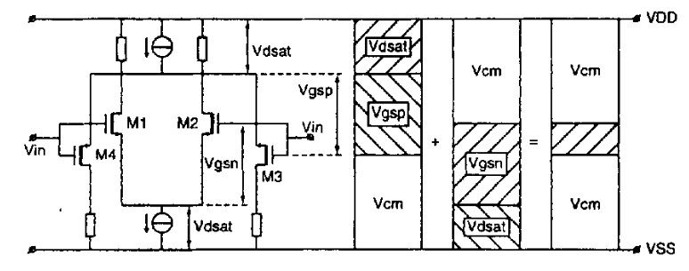
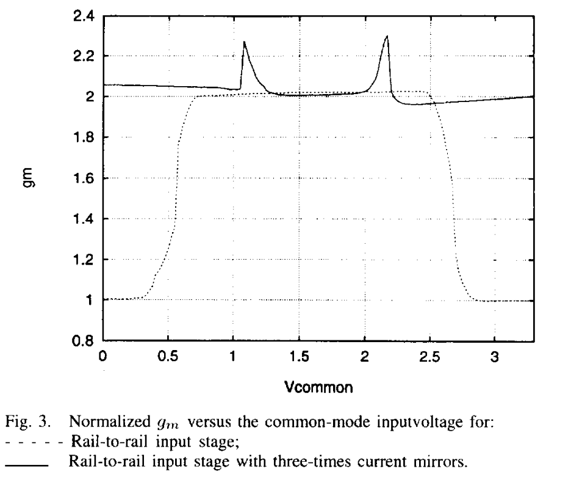
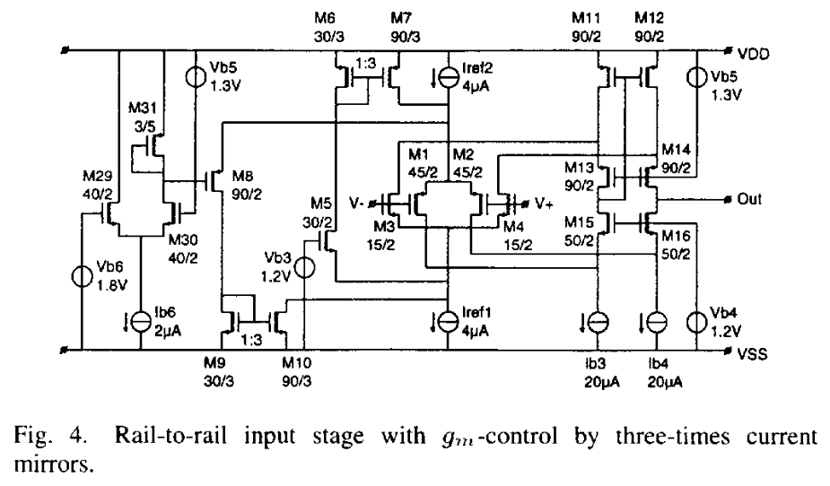
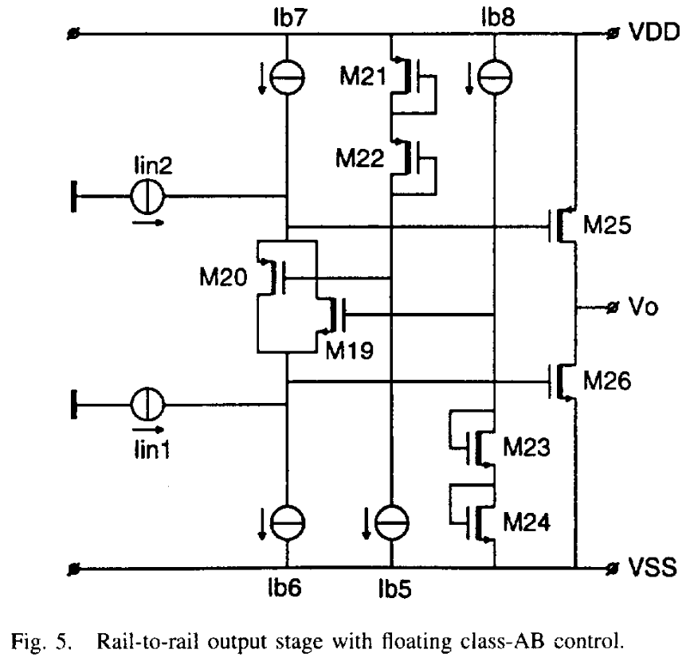

# A Compact Power-Efficient 3 V CMOS Rail-to-Rail Input/Output Operational Amplifier for VLSI Cell Libraries

!!! Cite 文献
    R. Hogervorst, J. P. Tero, R. G. H. Eschauzier and J. H. Huijsing, "A compact power-efficient 3 V CMOS rail-to-rail input/output operational amplifier for VLSI cell libraries," in IEEE Journal of Solid-State Circuits, vol. 29, no. 12, pp. 1505-1513, Dec. 1994

## 介绍

这篇文章是R2R文章中特别经典的一篇，非常适合用来入门，可以用来了解恒定跨导线性环、浮动电流源

## Constant Gm Rail to Rail Input Stage

为了实现R2R输入级，需要将输入级做成NMOS和PMOS对并联的结构，电压域至少要满足：$$\begin{equation}V_{\mathrm{sup,min}}=V_{\mathrm{gsp}}+V_{\mathrm{gsn}}+2V_{\mathrm{dsat}}\end{equation}$$
如果电压域达不到$V_{\mathrm{sup,min}}$，那么会使得电路整体处理不了中间电平的共模电压，如上图所示，左边第一个是PMOS的输入电压共模电平表示范围，中间的是NMOS作为输入管的输入电压范围，右边代表了二者并联决定的最终电路输入电压输入范围。
可以看到：**如果电压域（VDD-VSS）过小，当输入共模电压为中等输入电平时，电路会停止工作**

除此之外，这个电路结构还有一个很严重的缺点：**输入共模电平不同，跨导不同**

如上图虚线所示，当输入电平位于中间的时候，NMOS和PMOS都工作，因此跨导是二者的叠加，但是当输入电平过小或者过大的时候，跨导只由PMOS或者NMOS提供，减小了一倍。当我们设计频率补偿的时候，要按照最坏情况去设计，次极点要大于GBW的3倍，如果选择跨导为2，那么当输入电平过小或者过大的时候，GBW只有原本的一半，过设计了很多。因此我们最好要保证输入共模电平在全输入范围内跨导都恒定。因为$g_m \propto \sqrt{I_D}$，所以我们要在输入电平过小或者过大的时候，将电流提高为原本的4倍，这样就能很好的保证跨导接近不变。因此我们引入3倍电流镜结构：

$M_6,M_7,M_9,M_{10}$充当电流镜，$M_5,M_8$是电流开关，$M_5$的栅极偏置电压是$1.2V$，$M_8$的栅极偏置在一个固定电压下
+ 当输入电平很低（例如：$V_{SS}<V_{in,com}<V_{SS}+1V$）：只有PMOS输入管导通，NMOS输入管关闭，$M_3,M_4$管的源极电压下降，$M_5$管导通，电流从$M_5$走，经由$M_6,M_7$电流镜放大3倍，和$I_{ref2}$相加，四倍的尾电流进入PMOS输入对。当输入电压很小的时候，$M_1,M_2,M_8$的源极电压比输入电压高一个$V_{GS}$电位，因为输入对的gmid都很大，这导致了$V_{ov}$不会很大，也即$V_{GS}$不会很大，这说明$M_1,M_2$的源极电压也很低，这使得$M_8$关闭，不会有电流流过$M_8$
+ 当输入电平中等时（例如：$V_{SS}+1.3V<V_{in}<V_{DD}-1.3V$）：NMOS输入管和PMOS输入管均导通，$M_5,M_8$关闭，跨导自然就是并联的两倍，电流镜$M_6,M_7,M_9,M_{10}$不工作
+ 当输入电平很高时（例如：$V_{DD}-1V<V_{in}<V_{DD}$）：只有NMOS输入管导通，$M_8$导通，$M_5$关闭，下面的尾电流管流过4倍的$I_{ref}$
+ 当输入电平在过渡区（$V_{SS}+1V<V_{in}<V_{SS}+1.3V$ 或 $V_{DD}-1.3V<V_{in}<V_{DD}-1V$）的时候，一端跨导的提升先是大于另一端跨导的下降（因为注入是三倍注入），所以等效的总跨导会先上升，而后下降

同时为了保证只有NMOS和PMOS导通时的跨导一致，需要有：$$\begin{equation}\frac{(W/L)_P}{(W/L)_N}=\frac{\mu_N}{\mu_P}\end{equation}$$
如果$\mu_N,\mu_P$因为工艺偏差相差了15%，会导致跨导偏移7.5%（根据$(1+x)^{0.5}\approx1+0.5x$得来）

**CMRR**：当输入电压从低变高时，由PMOS导通过渡到NMOS导通，由于二者很难做到输入失调电压一致，所以在切换的过程中会导致很大的共模波动，从而恶化了CMRR。为了缓解这个问题，需要将共模的变化均摊到一个很大的输入共模变化范围中，在这里这个范围是：$V_{SS}+1V<V_{in}<V_{SS}+1.3V$ 和 $V_{DD}-1.3V<V_{in}<V_{DD}-1V$
$$\begin{equation}CMRR\propto\left(\frac{\Delta V_{os}}{\Delta V_{cm}}\right)^{-1}\end{equation}$$
在这里CMRR的定义从增益等效到了输入电压

**正反馈通路**：当输入共模电平偏置在一个$M_5$和$M_8$都导通的环境下时，$M_5\sim M_{10}$会组成正反馈通路，两个电流镜通过脚踩脚不断复制、放大电压。为了避免这种情况，引入了$M_{29}\sim M_{31}$管。当电压轨电压过小时，$M_{29}$流过大部分电流，导致$M_{31}$的$V_{gs}$压降很小，进一步导致$M_{8}$的$V_{gs}$压降很小，从而$M_8$关断，不会形成正反馈；当电压轨电压足够大时，$M_8$的栅极电压由$M_{31}$决定，只要控制得当就不会使得$M_5,M_8$同时导通

!!! warning 注意
    $M_5,M_8$两个管子无论在什么时候都==不能同时导通==，哪怕在过渡区的时候，也只能有一个管子是导通的

## Rail-to-Rail Class-AB Output Stage
<<<<<<< HEAD
=======

Class-AB输出级如上所示，输入信号经由NMOS和PMOS轨到轨输入对管转化为同相的输入电流$I_{in1},I_{in2}$
$M_{25},M_{26}$组成共源极相连的Class AB输出
浮动Class AB控制由$M_{19},M_{20}$组成
$M_{21}\sim M_{24}$组成浮动Class AB的栅极偏置电路
diy
>>>>>>> 84ff0289fed1f309104ef5a4f0c65cb3a7f785a3
