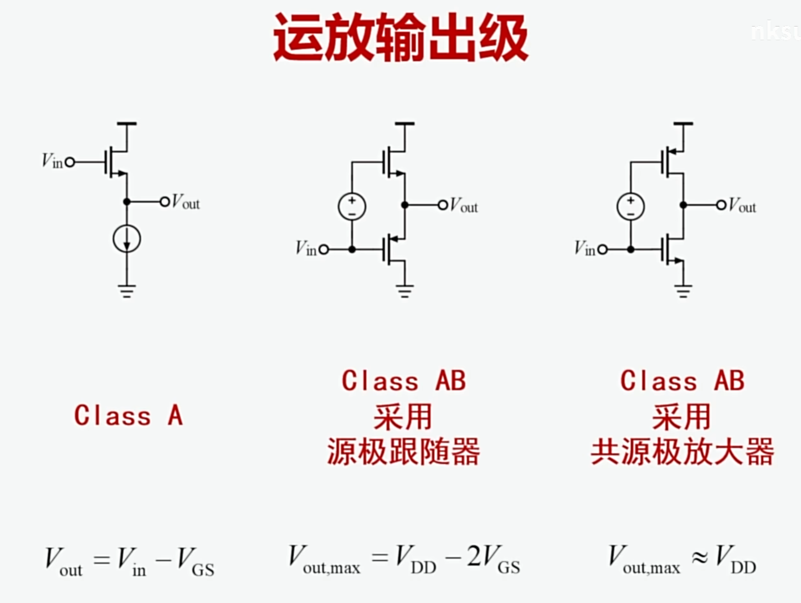
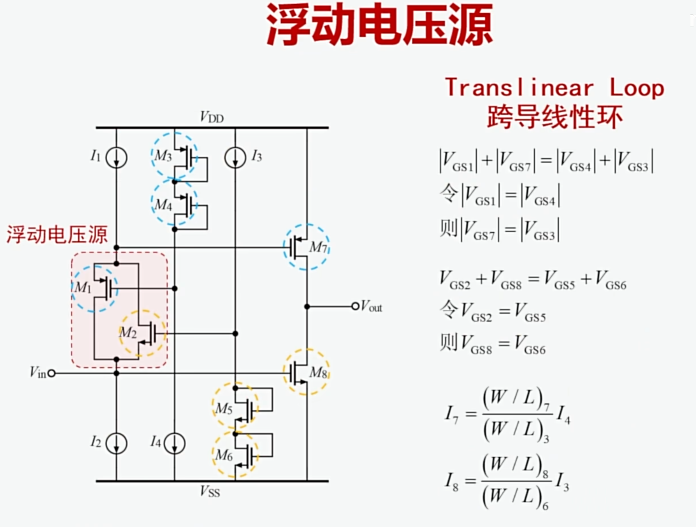
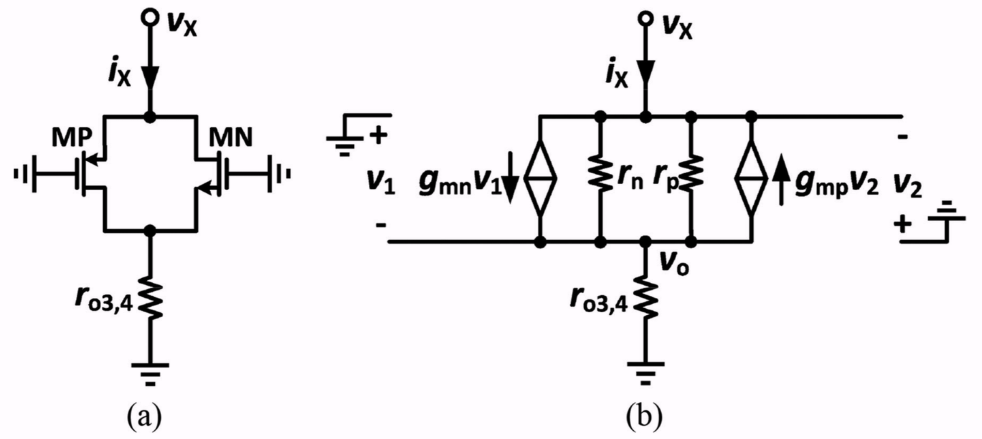
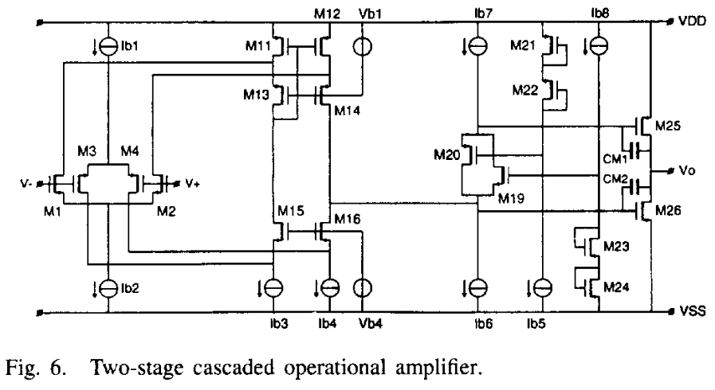
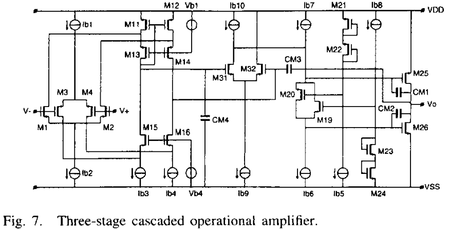
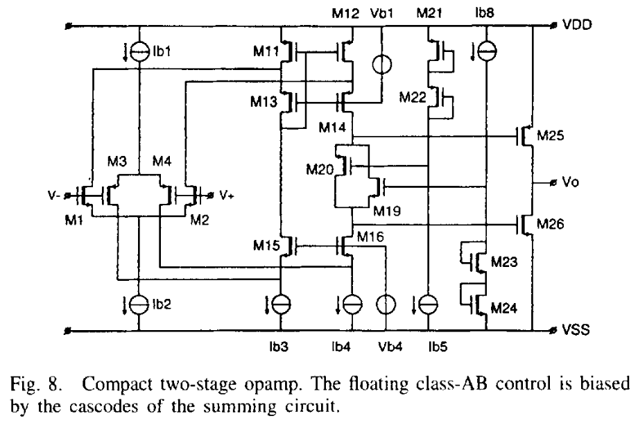
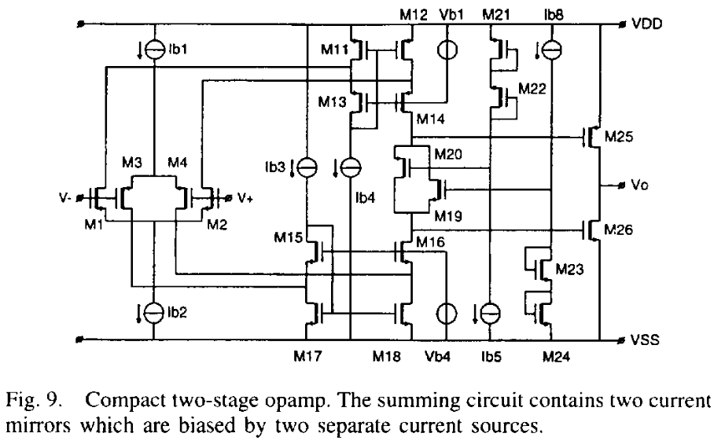
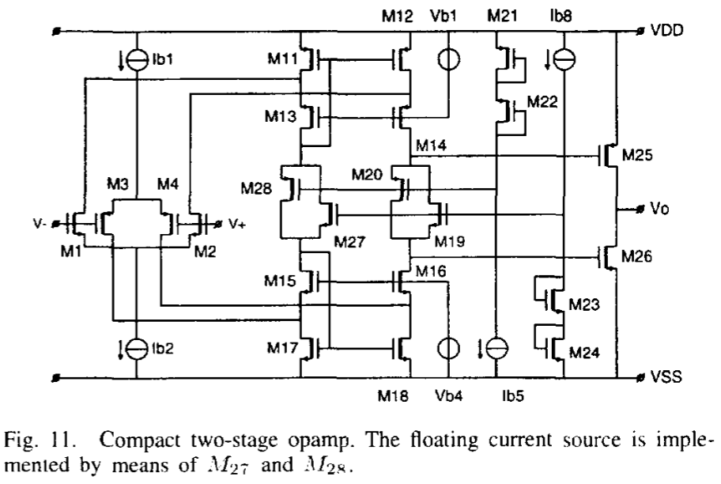
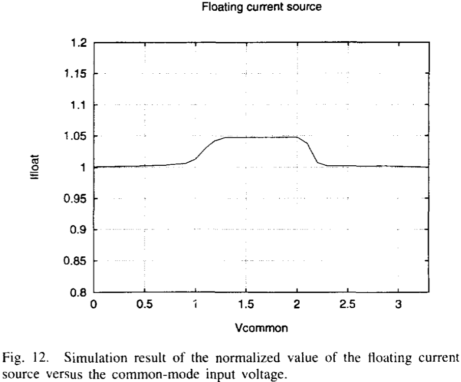
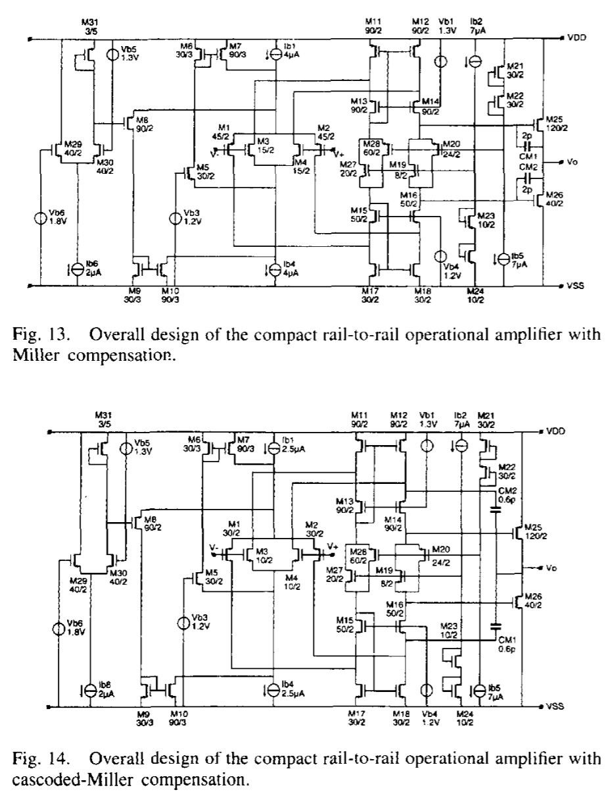

# A-Compact-Power-Efficient-3-V-CMOS-Rail-to-Rail-Input/Output-Operational-Amplifier-for-VLSI-Cell-Libraries

!!! Cite 文献
    R. Hogervorst, J. P. Tero, R. G. H. Eschauzier and J. H. Huijsing, "A compact power-efficient 3 V CMOS rail-to-rail input/output operational amplifier for VLSI cell libraries," in IEEE Journal of Solid-State Circuits, vol. 29, no. 12, pp. 1505-1513, Dec. 1994

## 介绍

这篇文章是R2R文章中特别经典的一篇，非常适合用来入门，可以用来了解恒定跨导线性环、浮动电流源

## Constant Gm Rail to Rail Input Stage

为了实现R2R输入级，需要将输入级做成NMOS和PMOS对并联的结构，电压域至少要满足：$$\begin{equation}V_{\mathrm{sup,min}}=V_{\mathrm{gsp}}+V_{\mathrm{gsn}}+2V_{\mathrm{dsat}}\end{equation}$$
如果电压域达不到$V_{\mathrm{sup,min}}$，那么会使得电路整体处理不了中间电平的共模电压，如上图所示，左边第一个是PMOS的输入电压共模电平表示范围，中间的是NMOS作为输入管的输入电压范围，右边代表了二者并联决定的最终电路输入电压输入范围。
可以看到：**如果电压域（VDD-VSS）过小，当输入共模电压为中等输入电平时，电路会停止工作**

除此之外，这个电路结构还有一个很严重的缺点：**输入共模电平不同，跨导不同**

如上图虚线所示，当输入电平位于中间的时候，NMOS和PMOS都工作，因此跨导是二者的叠加，但是当输入电平过小或者过大的时候，跨导只由PMOS或者NMOS提供，减小了一倍。当我们设计频率补偿的时候，要按照最坏情况去设计，次极点要大于GBW的3倍，如果选择跨导为2，那么当输入电平过小或者过大的时候，GBW只有原本的一半，过设计了很多。因此我们最好要保证输入共模电平在全输入范围内跨导都恒定。因为$g_m \propto \sqrt{I_D}$，所以我们要在输入电平过小或者过大的时候，将电流提高为原本的4倍，这样就能很好的保证跨导接近不变。因此我们引入3倍电流镜结构：

$M_6,M_7,M_9,M_{10}$充当电流镜，$M_5,M_8$是电流开关，$M_5$的栅极偏置电压是$1.2V$，$M_8$的栅极偏置在一个固定电压下

+ 当输入电平很低（例如：$V_{SS}<V_{in,com}<V_{SS}+1V$）：只有PMOS输入管导通，NMOS输入管关闭，$M_3,M_4$管的源极电压下降，$M_5$管导通，电流从$M_5$走，经由$M_6,M_7$电流镜放大3倍，和$I_{ref2}$相加，四倍的尾电流进入PMOS输入对。当输入电压很小的时候，$M_1,M_2,M_8$的源极电压比输入电压高一个$V_{GS}$电位，因为输入对的gmid都很大，这导致了$V_{ov}$不会很大，也即$V_{GS}$不会很大，这说明$M_1,M_2$的源极电压也很低，这使得$M_8$关闭，不会有电流流过$M_8$
+ 当输入电平中等时（例如：$V_{SS}+1.3V<V_{in}<V_{DD}-1.3V$）：NMOS输入管和PMOS输入管均导通，$M_5,M_8$关闭，跨导自然就是并联的两倍，电流镜$M_6,M_7,M_9,M_{10}$不工作
+ 当输入电平很高时（例如：$V_{DD}-1V<V_{in}<V_{DD}$）：只有NMOS输入管导通，$M_8$导通，$M_5$关闭，下面的尾电流管流过4倍的$I_{ref}$
+ 当输入电平在过渡区（$V_{SS}+1V<V_{in}<V_{SS}+1.3V$ 或 $V_{DD}-1.3V<V_{in}<V_{DD}-1V$）的时候，一端跨导的提升先是大于另一端跨导的下降（因为注入是三倍注入），所以等效的总跨导会先上升，而后下降

同时为了保证只有NMOS和PMOS导通时的跨导一致，需要有：$$\begin{equation}\frac{(W/L)_P}{(W/L)_N}=\frac{\mu_N}{\mu_P}\end{equation}$$
如果$\mu_N,\mu_P$因为工艺偏差相差了15%，会导致跨导偏移7.5%（根据$(1+x)^{0.5}\approx1+0.5x$得来）

**CMRR**：当输入电压从低变高时，由PMOS导通过渡到NMOS导通，由于二者很难做到输入失调电压一致，所以在切换的过程中会导致很大的共模波动，从而恶化了CMRR。为了缓解这个问题，需要将共模的变化均摊到一个很大的输入共模变化范围中，在这里这个范围是：$V_{SS}+1V<V_{in}<V_{SS}+1.3V$ 和 $V_{DD}-1.3V<V_{in}<V_{DD}-1V$
$$\begin{equation}CMRR\propto\left(\frac{\Delta V_{os}}{\Delta V_{cm}}\right)^{-1}\end{equation}$$
在这里CMRR的定义从增益等效到了输入电压

**正反馈通路**：当输入共模电平偏置在一个$M_5$和$M_8$都导通的环境下时，$M_5\sim M_{10}$会组成正反馈通路，两个电流镜通过脚踩脚不断复制、放大电压。为了避免这种情况，引入了$M_{29}\sim M_{31}$管。当电压轨电压过小时，$M_{29}$流过大部分电流，导致$M_{31}$的$V_{gs}$压降很小，进一步导致$M_{8}$的$V_{gs}$压降很小，从而$M_8$关断，不会形成正反馈；当电压轨电压足够大时，$M_8$的栅极电压由$M_{31}$决定，只要控制得当就不会使得$M_5,M_8$同时导通

!!! warning 注意
    $M_5,M_8$两个管子无论在什么时候都==不能同时导通==，哪怕在过渡区的时候，也只能有一个管子是导通的

## Rail-to-Rail Class-AB Output Stage

常见的运放输出级如上所示，一般理解的Class AB都是中间结构，当$V_{in}$上升时，上面NMOS流过的电流增加，下面PMOS流过的电流减小，电流有净输出，电流被“Push”出去，反之，电流被“Pull”进来，所以这也是他叫推挽的原因。但这个结构有一个缺点是$V_{out,max}=V_{DD}-2V_{GS}$，因为$V_{in}$最大是$V_{DD}$，最小是$V_{SS}$，和输出始终存在上下两个$V_{GS}$的压差，不能达输出Rail-to-Rail

而第三个结构就可以解决这个问题，因为当$V_{in}=V_{DD}$的时候，下面NMOS导通，上面PMOS截止，电流被“Pull”进来，反之，电流被“Push”出去，与第二种不同的是，这里是反向放大。在静态偏置条件下有：$$I_D=\frac{1}{2}\mu_nC_{ox}(\frac{W}{L})_N(V_{IN}-V_{SS}-V_{THN})^2=\frac{1}{2}\mu_pC_{ox}(\frac{W}{L})_P(V_{DD}-(V_{IN}+V_{B})-V_{THP})^2$$
从电流公式来看，这个电路主要有两个缺点：

+ 输出电流和$V_{DD},V_{SS}$有关，PSRR不好
+ 中间的偏置$V_B$需要做好，不然也会引入非线性，即要控制NMOS和PMOS的栅极差

文中提出的结构为：

Class-AB输出级如上所示，输入信号经由NMOS和PMOS轨到轨输入对管转化为同相的输入电流$I_{in1},I_{in2}$
$M_{25},M_{26}$组成共源极相连的Class AB输出
浮动Class AB电压源控制由$M_{19},M_{20}$组成
$M_{21}\sim M_{24}$组成浮动Class AB的栅极偏置电路

跨导线性环为：$M_{20},M_{25},M_{22},M_{21}$和$M_{19},M_{26},M_{23},M_{24}$
跨导线性环决定了输出的静态电流，因为根据公式:$$V_{GS19}+V_{GS26}=V_{GS23}+V_{GS24}$$
根据这个公式和电流公式可以确定输出级的电流和偏置电流的大小关系

假设前一级输入进来电流，$M_{19},M_{20}$的栅极电压升高，这导致$M_{20}$流过的电流增加，$M_{19}$流过的电流减小，输出$M_{25},M_{26}$的栅极电压也同样升高，这导致输出端“Pull”进电流来，直到$M_{20}$管流过全部的电流（$I_b$），这时候$M_{19}$几乎不流过电流（$I_{in1},I_{in2}$电流在这相互抵消），这样相当于钳死了$M_{20}$的$V_{GS}$电压，也钳死了$M_{25}$，最小电流也就定了（根据长宽比确定）
这样的好处是**速度更快**：晶体管不需要从完全截止的状态恢复，缩短了响应时间，同时也避免了可能的交越失真

**缺点**：

+ 同样对$V_{DD},V_{SS}$敏感
+ 额外多了一路偏置，影响失调、噪声——解决方案：**将浮动电压源移入放大器内部**

**小信号角度分析浮动电压源**

从小信号角度分析可得：$$\frac{v_o}{v_x}=\frac{g_{mp}}{g_{mn}}$$
因此只要我们通过设计让$g_{mp}=g_{mn}$（控制宽长比），就可以保证浮动电压源对小信号分析不产生影响（可近似短路）

## 电路拓扑结构

**两级Cascode**

这个结构主要有两个缺点

+ 因为浮动电压源小信号下近似短路，所以第一级的输出阻抗会再并上两个电流源$I_{b6},I_{b7}$，导致总的增益降低
+ 浮动电压源这一路会带来噪声和失调

**三级Cascode**

解决上述两个问题可采用三级Cascode结构，将浮动电压源和求和级分开，但这样所带来的缺点是**更低的带宽**和**更大的面积**

**Compact 两级运放**

将浮动电压源挪到Cascode求和电路里来形成的紧凑结构可以解决上述的面积、带宽问题，浮动电压源由Cascode求和电路偏置（此处忽略了米勒补偿电容）

**缺点**：

+ 输出级的静态电流大小受到共模输入电平的影响
  + 当输入逐渐减小的时候，$M_3,M_4$电流增加，通过1 : 3电流镜电流越来越大，但是$I_{b3},I_{b4}$电流不变，因此通过$M_{11}\sim M_{14}$流下来的电流要增加，因此流过$M_{19},M_{20}$的电流会增加，因此输出电流和输入共模电平相关
  

其中一个解决方案是引入两个电流源$I_{b3},I_{b4}$和电流镜，将PMOS和NMOS输入管接入电流镜，当输入逐渐减小的时候，虽然PMOS电流增加，但是通过电流镜，可以自适应地调节$M_{17}$的栅极电压，从而控制流过浮动电压源的电流不发生变化，当输入增加时同理分析
**缺点**：多了一条偏置电路和两个电流源，引入了额外的噪声和失调

改进方案是将另一端用一个电流源$I_{b3}$替代，上下都用自偏置电流镜
再稍加改进一下，可以将$I_{b3}$换成同样的浮动电压源结构：

同样这又组成了两个新的跨导线性环，这条电路的偏置电流和输出的关系很好定义
当共模输入电平增加时，$M_{11}$的栅极电压下降（自适应调节），$M_{17}$的栅极电压也会下降（自适应调节），这导致流过$M_{27}$的电流增加，流过$M_{28}$的电流下降，一赠一减反而让这条支路的电流近似不变

除此之外，还有个好处是这个电路的**输出电流对电源不敏感**
因为$M_{28}$的$|V_{GS}|=|V_{GS11}|-(|V_{GS21}|+|V_{GS22}|)$，这保证了浮动电压源的偏置电流与电源无关，如果上下两个电流镜做的很好的话，那么另一个浮动电压源也可以保证电流与电源不敏感，从而保证了输出对电源变化的不敏感

## 电路实现

一种是用普通Miller补偿，另一种是使用Cascode补偿
