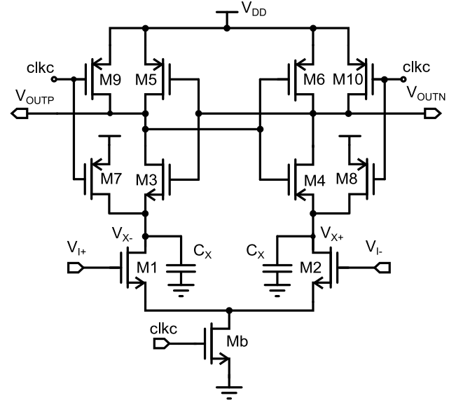

# An Energy-Efficient Comparator With Dynamic Floating Inverter Amplifier

!!! cite 文献
    X. Tang et al., "An Energy-Efficient Comparator With Dynamic Floating Inverter Amplifier," in IEEE Journal of Solid-State Circuits, vol. 55, no. 4, pp. 1011-1022, April 2020

## 1. 核心架构与创新点

### 1.1 FIA 拓扑与工作机制

论文提出的比较器由两级组成：`FIA 预放大器 + Strong-Arm (SA) Latch`。  
FIA 核心是 **CMOS 反相器型输入对**（NMOS+PMOS 同时贡献跨导），由一个**浮置储能电容  (floating reservoir capacitor)** $C_{RES}$ 供电，形成隔离电压域。

时序上：

1. `reset`：$C_{RES}$ 预充，输出节点 $V_{X+},V_{X-}$ 复位到 $V_{CM}=V_{DD}/2$。  
2. `integration`：FIA 对差分输入进行动态积分。  
3. `latch`：SA 锁存再生；当比较出结果后，关闭 FIA，避免 $C_{RES}$ 继续放电。

### 1.2 “浮地储能电容” $C_{RES}$ 的物理意义

$C_{RES}$ 不是传统意义上的“接地尾电容”，而是建立**浮置局部供电轨**。其关键效果：

- 输入级==输入电流 = 输出电流==的约束使积分节点共模电流近零，天然实现输出共模稳定；
- 隔离了输入共模扰动与工艺角失配对积分电流的直接耦合；
- 在动态过程中提供源退化（dynamic source degeneration），实现动态偏置并提升 $G_m/I_D$。

### 1.3 三大技术支柱

1. **Current Reuse**：CMOS 输入对同时导通，等效总跨导 $G_m=g_{m,n}+g_{m,p}$，在相同电流预算下显著提高有效跨导。  
2. **Dynamic Bias**：随着积分进行，$V_{GS}$ 下降，器件向弱反型/深亚阈推进，$G_m/I_D$ 提升，同时可以避免节点完全放电，节省能耗。  
3. **Input-CM Insensitivity**：浮置供电域自适应平移，保持 n/p 支路平衡，显著降低输入共模变化对噪声、失调、延时的影响。

## 2. 传统架构回顾与局限性

### 2.1 SA latch

**问题1：功耗过高**
低噪声 SA 通常使用两侧积分电容 $C_X$。每次比较周期中，这两只电容经历“充放电全摆幅”：

- 单支路能量尺度约 $C_XV_{DD}^2$，
- 差分两支路总计约 $2C_XV_{DD}^2$。  
这就是 SA 在低噪声设计下难以继续提升能效的硬下限项。

**问题2：输入共模电压敏感**
由于尾晶体管（Mb）工作在线性区，积分电流严重依赖输入共模电压，从而导致比较器性能（如失调、噪声和速度）的变化：

- 当输入共模过高时，尾电流会增大
- 当输入共模过低时，尾电流可能很小，甚至连输入差分对都偏置在了深亚阈值区
- 这会导致比较器的性能随着输入共模的变化而变

**问题3：输出共模电压一直在下降**
在积分过程中，当输出共模电压下降一个$V_{THN}$后积分过程就结束了，这限制了增益的上限，因为积分时间被定死了。

积分过程的时间约为：
$$T_{\mathrm{int}}\approx\frac{C_X}{I_D}\cdot V_{\mathrm{THN}}$$

积分过程中，Pre-Amp的增益约为：
$$A_{\mathrm{int}}\approx\frac{g_{m}}{C_{X}}\cdot T_{\mathrm{int}}\approx\frac{g_{m}}{I_{D}}\cdot V_{\mathrm{THN}}$$

传统上，输入晶体管工作在强反型区。详细分析表明，比较器的输入参考噪声主要由动态积分器决定，其与$g_m/I_D$和$C_X$成反比。
$$\sigma_{n,\mathrm{int}}^2\approx\frac{I_D}{g_m}\cdot\frac{4kT\gamma}{V_{\mathrm{THN}}C_X}$$
由此可见，我们需要让$g_m/I_D$和$C_X$尽可能的大。
比较器噪声和失调的计算均可以用下式来表示，即Latch项会被Pre-amp的增益给衰减
$$\sigma_{n(\mathrm{os}),\mathrm{in}}\approx\sqrt{\sigma_{n(\mathrm{os}),\mathrm{int}}^2+\frac{\sigma_{n(\mathrm{os}),\mathrm{latch}}^2}{A_{\mathrm{int}}^2}}$$
由此可见，要设计低噪声比较器，希望具有较大的积分增益\(A_{\text{int}}\)。

传统的SA Latch主要面临以下三个问题：

- 积分过程会在$V_{X+}/V_{X-}$下降一个$V_{THN}$后就停止了，但是$V_X$会一直下降到0，也就是电容$C_X$被完全放电了，这是很大的浪费
- 积分增益$A_{int}$被$V_{THN}$限制，导致Pre-Amp的增益可能比10都小
- 尾电流管工作在线性区，使得$I_D$与输入共模电平强相关，从而会影响比较器的性能（噪声、失调、速度等）

#### 2.2 动态偏置 (DB) 的增益机理
DB 通过尾电容抬升源电位，压缩输入对过驱动 $(V_{GS}-V_{TH})$：
- 提升 $g_m/I_D$（更接近弱反型高效率区）；
- 当输入对被“软关断”后，终止继续放电，降低无效能耗。  
因此 DB 相比纯 SA 通常可显著改善 FoM。

#### 2.3 传统结构输入共模敏感性的根因
- SA/DB 的尾管常在**线性区**，尾电流 $I_D$ 对输入共模 $V_{I,CM}$ 强相关；
- $I_D$ 变化直接导致积分斜率、有效积分时间、预放增益变化；
- 进一步引发噪声、失调、延迟的联动漂移。  
本质是：尾电流通道未隔离共模扰动。

### 3. 数学推导与理论模型 (Mathematical Derivations)

#### 3.1 增益分析（式 5–9）
弱反型近似下：
\[
G_m(t)\approx 2\frac{I_D(t)}{nU_T}=\frac{I_{AMP}(t)}{nU_T}\tag{5}
\]

差分输出：
\[
\Delta V_{X,DM}(t)=\frac{\Delta V_{I,DM}}{C_X}\int_0^t G_m(\tau)\,d\tau
\approx \frac{\Delta V_{I,DM}}{nU_TC_X}\int_0^t I_{AMP}(\tau)\,d\tau \tag{6}
\]

电流随动态退化：
\[
I_{AMP}(t)=\frac{I_{AMP}(0^+)}{1+\frac{I_{AMP}(0^+)}{nU_TC_{TAIL}}t}\tag{7}
\]

源电位变化：
\[
\Delta V_S(t)=\frac{1}{2C_{RES}}\int_0^t I_{AMP}(\tau)d\tau
= nU_T\ln\!\left(1+\frac{I_{AMP}(0^+)}{2nU_TC_{RES}}t\right)\tag{8}
\]

积分增益：
\[
A_V(T_{INT})=\frac{\Delta V_{X,DM}(T_{INT})}{\Delta V_{I,DM}}
=\frac{2C_{RES}\Delta V_S(T_{INT})}{nC_XU_T}\tag{9}
\]

论文给出的典型量级：$C_{RES}=2\ \text{pF}$、$C_X\approx 250\ \text{fF}$、$\Delta V_S\approx125\ \text{mV}$（1 mV 输入），理论增益约 60，考虑有限 $r_o$ 后仿真约 30，仍明显高于 SA（常 <10 量级）。

#### 3.2 噪声分析（式 12, 15, 17）
- **SA：**
\[
\sigma^2_{in,SA}(T_{INT})=\frac{2nkT}{V_{THN}C_X}\cdot\frac{I_D}{g_m}\tag{12}
\]
- **DB：**
\[
\sigma^2_{in,DB}(T_{INT})=\frac{2nkT}{C_p\Delta V_{X,CM}(T_{INT})}\cdot\frac{I_D}{g_m}\tag{15}
\]
- **FIA：**
\[
\sigma^2_{in,FIA}(T_{INT})=\frac{2nkT}{C_{RES}\Delta V_S(T_{INT})}\cdot\frac{I_D}{G_m}\tag{17}
\]

结论：FIA 同时利用更高 $G_m/I_D$ 与更高积分增益压制后级锁存噪声。

#### 3.3 能量效率 FoM（式 21–22）
定义：
\[
FoM = E\cdot \sigma_{in}^2 \tag{18}
\]

FIA：
\[
FoM_{FIA}=4nkT\cdot V_{DD}\cdot \frac{I_D}{G_m}\tag{21}
\]

相对 SA：
\[
\frac{FoM_{SA}}{FoM_{FIA}}=\frac{V_{DD}}{V_{THN}}\cdot
\frac{(G_m/I_D)_{FIA}}{(g_m/I_D)_{SA}}\tag{22}
\]

代入文中典型值：$V_{DD}=1.2\ \text{V}$，$V_{TH}\approx0.55\ \text{V}$，且 FIA 平均 $G_m/I_D$ 比 SA 高约 $2.5\times$，理论效率提升可超 $5\times$；实测系统级超过 $7\times$（相对 SA）。

### 4. 关键设计细节与鲁棒性分析 (Design Details & Robustness)

#### 4.1 工艺角稳定性（无专用 CMFB）
传统 CMOS DB 积分器在 SF/FS 角易出现单边主导并拉到电源轨，积分失效。  
FIA 通过浮置域自适应平移 $V_{S+},V_{S-}$：
- SF：域下移，抑制过强 pMOS；
- FS：域上移，抑制过强 nMOS。  
因此无需独立 CMFB 即可维持双支路电流平衡。

#### 4.2 寄生模型（式 23–25）
含寄生时，共模电流关系：
\[
I_{P+}(t)-I_{P-}(t)=I_{X,CM}(t)\tag{23}
\]
\[
\Delta V_{X,CM}(t)=-(\Delta V_{S+}(t)+\Delta V_{S-}(t))\frac{C_P}{C_X}\tag{24}
\]
\[
\Delta V_{X,CM}\approx -2\Delta V_{I,CM}\frac{C_P}{C_X}\tag{25}
\]

文中实现：$C_{RES}$ 采用 2 pF MoM，后仿寄生约 1.5%，$C_X\approx250$ fF，则输出共模扰动约为输入共模扰动的 $1/4$，相对简单 CMOS-DB（共模增益约 20）可提升 >30 dB CMRR。

#### 4.3 为什么选 $C_{RES}=2$ pF
折中逻辑：
- 太小：预放增益不足，锁存噪声抬升；
- 太大：动态偏置效应减弱，$G_m/I_D$ 提升变小，且面积变大；
- 速度上大 $C_{RES}$ 有利于预放相位，但不一定带来最优综合 FoM。  
最终选 2 pF，在能效、速度、面积三者之间取得平衡；相对同噪声 SA，面积约 +30%。

### 5. 实验结果与性能对比 (Measurements & Comparison)

#### 5.1 180 nm 原型关键实测
- 工艺：180 nm CMOS  
- 供电：1.2 V  
- 输入等效噪声（RMS）：**46 μV（FIA）** vs **62 μV（SA）**  
- 能耗（$V_{I,DM}=1$ mV, $V_{CM}=0.6$ V）：**0.98 pJ/comp（FIA）** vs **4.1 pJ/comp（SA）**  
- 输入共模扫描下：FIA 噪声波动约较 SA 降低 4 倍  
- 失调共模敏感性（10 片）：**5.3 mV（SA）** vs **0.9 mV（FIA）**  
- 延迟共模敏感性：$V_{I,CM}$ 从 0.6 V 到 0.4 V，SA 延迟约恶化 $10\times$，FIA 仅约 +15%

#### 5.2 设计参数（文中可明确提取）
- $C_{RES}=2$ pF  
- $C_X\approx 250$ fF（含积分节点寄生）  
- 输入晶体管尺寸（表 I）：  
  - $M_1,M_2$: $W=44\ \mu m,\ L=0.18\ \mu m$  
  - $M_3,M_4$: $W=22\ \mu m,\ L=0.18\ \mu m$

#### 5.3 对比结论
- 相对 SA：系统能效提升 **>7×**（论文主结论）  
- 相对当时次优动态比较器（DB 类）：**>2.5×**  
- 在低噪声目标下，同时获得了输入共模/工艺角鲁棒性，这是 FIA 相比既有 SA/DB 路线的决定性优势。
