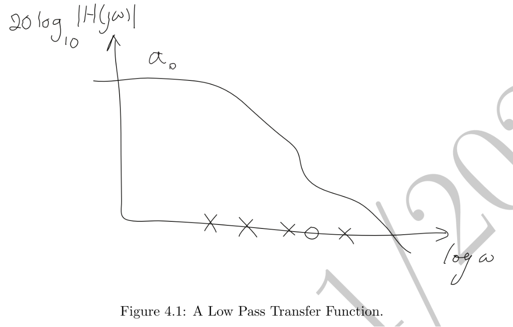
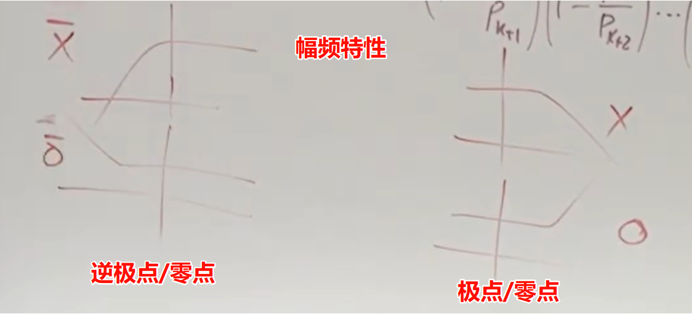
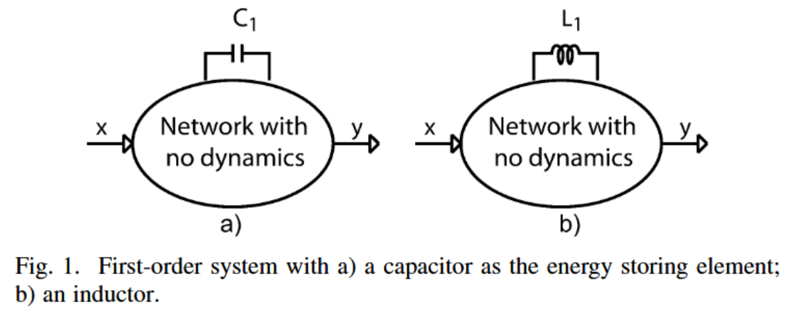
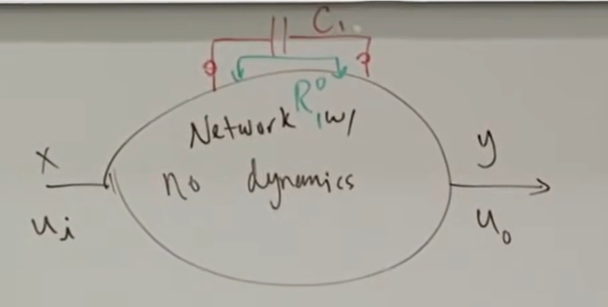
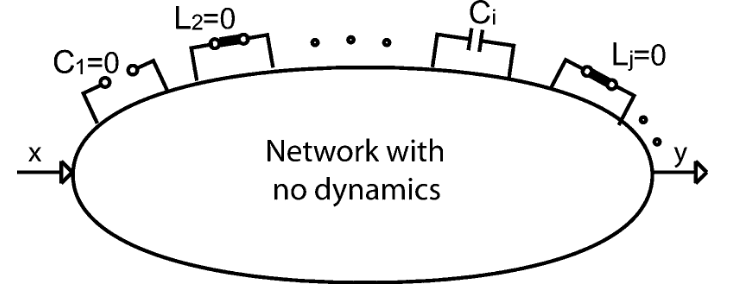
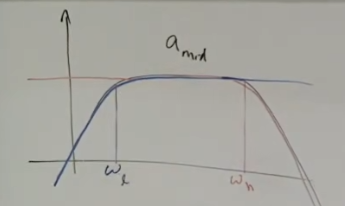

# Time and Transfer Constant(TTC) Theory

## 文献

> A. Hajimiri, "Generalized Time- and Transfer-Constant Circuit Analysis," in IEEE Transactions on Circuits and Systems I: Regular Papers, vol. 57, no. 6, pp. 1105-1121, June 2010.
> 郑立博, 解昊炜, 郭宇锋, 刘轶. 一种基于广义时间和传递常数的快速分析法[J]. 微电子学, 2023, 53(1): 81-88.

## 1.简单介绍

在一般情况下，针对复杂的电路图，如果要用传递函数去分析他的幅频特性，KCL/KVL是分析的首选，但是如果电路过于复杂，计算量十分庞大，不仅要保证计算的过程中不出错（不老眼昏花），还要保证手算的结果化简、合并起来显得合理（这种分析只能到最后再去近似，而不能中途近似，否则结果可能会出现巨大偏差）。很多时候这需要靠Mathematica软件去进行符号运算。尽管如此，最后求解出来的传递函数也可能会很复杂，并不能够很直观的看出优化的主导因素。在传统的教材书中，也有很多例如开路时间常数（OCT）、短路时间常数（SCT）法进行化简的方法，但是并不普适，并没有将电感也包含进来（尽管大多数电路中只会有电容）。哪怕最终结果的代数表达式已经求出，也很难从中洞察出最需改进的点，

基于此，Hajimiri教授提出了一种Time and Transfer Constant（TTC）的方法

## 2. 传递函数的基本性质

对于单输入单输出的线性时不变网络来说，传递函数可以被定义为电路的任意两个端口（包括同一端口）电压/电流之比（$Voltage \ gain=V/V$, $Z=V/I$, $Y=I/V$, $Current \ gain=I/I$）。

若输入输出均为电压，则传递函数可以表示为：$H(s)\equiv v_o(s)/v_i(s)$
代表了电压的增益

若是电流源驱动，同时在电流源一侧测电压，则传递函数表示为$Z(s)\equiv v_o(s)/i_i(s)$
代表了从电流源一侧看进去的电路阻抗

若输入是电压源驱动，测从电压源流出的电流，则传递函数是$Y(s)\equiv i_o(s)/v_i(s)$

值得注意的是$Y(s)=1/Z(s)$，所以在放置测试源的时候我们需要注意到底想要的是导纳还是阻抗，二者之间的零极点相反。

传递函数的一般表达式如下所示：
$$\begin{equation}H(s)=\frac{a_0+a_1s+a_2s^2+\ldots+a_ms^m}{1+b_1s+b_2s^2+\ldots+b_ns^n}\end{equation}$$

系数$a_{i},b_{j}$都是实数，$s$代表复频率$jw$，$a_0$是电路的DC传递函数，很多时候代表了电路的直流增益

==注意==：在特殊情况下，分子的**1**也可能不存在，比如在传统的积分电路中，$H(s)=\frac{1}{s}$，这时候分母在计算的时候趋于无穷，可以根据求倒数的方式，将极点变成零点来求

根据基本代数原理，可以将式(1)改写为：

$$\begin{equation}H(s)=a_0\cdot\frac{\left(1-\frac{s}{z_1}\right)\left(1-\frac{s}{z_2}\right)\cdots\left(1-\frac{s}{z_m}\right)}{\left(1-\frac{s}{p_1}\right)\left(1-\frac{s}{p_2}\right)\cdots\left(1-\frac{s}{p_n}\right)}\end{equation}$$

$a_0$代表直流增益，$p_i$代表极点(pole)，$z_j$代表零点(zero)，并且极点和零点总是以实数或者共轭复数形式出现

这里可以注意一下的是，我们所熟知的时间常数都是实数，而极点却是可以以共轭复数的形式出现的，这就告诉我们，==极点和时间常数并不是一一对应的关系==，只有当储能器件之间不存在耦合关系的时候才会一一对应。

分母的阶数，*n*，取决于电路中**独立**的储能器件数量

传递函数的极点是电路的内在固有属性，并不取决于输入和输出的类型选择；而传递函数的零点取决于输入输出的选择。因此我们可以在分析电路的一开始就确定电路的极点，而零点则会根据人为选择的输入输出不同而改变。

### 注

1、式（1）和式（2）最适合用来描述低通系统，如下图所示：

但如果遇到带通系统或者高通系统的话这么描述就不合理了。
针对带通系统来说，可以改写为下式：

$$\begin{equation}H(s)=\frac{\left(1-\frac{z_1}{s}\right)\ldots\left(1-\frac{z_k}{s}\right)}{\left(1-\frac{p_1}{s}\right)\ldots\left(1-\frac{p_k}{s}\right)}\cdot a_{mid}\cdot\frac{\left(1-\frac{s}{z_{k+1}}\right)\ldots\left(1-\frac{s}{z_m}\right)}{\left(1-\frac{s}{p_{k+1}}\right)\ldots\left(1-\frac{s}{p_n}\right).}\end{equation}$$

$a_{mid}$代表了带通传递函数的中频增益，$a_{mid}$的左半部分的极点和零点数一定要相等，不然中频段的增益不会是平的，左边的极点和零点分别称为反极点*inverse pole*和反零点*inverse zero*，反极点和反零点的幅频曲线与零/极点关于各自的零/极点相互==镜像==；相频曲线相同（但左半平面的逆零点是从-90度增到0度；左半平面的逆极点是从90度到0度）

2、根据式（1）和式（2）可以将分子和分母的系数($a_i,b_j$）均用极点和零点表示出来：
$$\begin{aligned}
  &b_1 = - \sum_i \frac{1}{p_i} \quad , \quad \frac{a_1}{a_0} = - \sum_i \frac{1}{z_i} \\
  &b_2 = \sum_i \sum_{j}^{i < j} \frac{1}{p_i p_j} \quad , \quad \frac{a_2}{a_0} = \sum_i \sum_{j}^{i < j} \frac{1}{z_i z_j}\\
  &\vdots \qquad \qquad\qquad\quad, \qquad \vdots\\
  &b_n = \frac{(-1)^n}{p_1 p_2 \ldots p_n} \quad , \quad \frac{a_m}{a_0} = \frac{(-1)^m}{p_1 p_2 \ldots z_m}
\end{aligned}$$

很多时候可以根据$b_1,b_2$的值去做一些简化计算（当零/极点相距较远的时候）

## 3. 一阶系统

### 3.1 一阶系统引入

如下图所示，先从一阶系统开始考虑。一阶系统可以抽象为一个电容或电感与内部的与频率无关的器件（如电阻和受控源）组成的电路结构，*x*是输入，*y*是输出

一个储能元件对系统的影响是可能同时引入一个零点和极点（是否真的存在还需要具体电路具体分析），一阶系统的传递函数可以表示为：
$$\begin{equation}H(s)=\frac{a_0+a_1s}{1+b_1s}\end{equation}$$

式（4）中$a_0$代表低频传递函数，极点$p=-\frac{1}{b_1}$，将$b_1$称为极点时间常数(pole time constant)，$\tau\equiv b_{1}$，零点$z=-\frac{a_0}{a_1}$

若电路中不存在零点，则也可以说零点在无穷远处。

### 3.2 定义符号

我们将符号的上下标全部利用进来，比如$H_a^b$，下标代表所对应的电容C或电感L的值为0（对于电容就是开路，对于电感就是短路）；上标代表所对应的电容C或电感L的值为$\infty$（电容短路，电感开路）

再例如$R_1^0$代表没有电容或电感的值为无穷大，而$C_1$或$L_1$为零值，表现为电容开路或电感短路

### 3.3 一阶系统公式推导

对于一阶系统来说，系统内只有一个电容或电感，在低频下电容开路电感短路，而$H^0$则代表电路中没有储能元件的值是无穷大的，值全部为0，对应于电容和电感刚好就是开路和短路，因此可以得到：
$$a_0=H^0$$

对于带有电容的一阶系统($C_1$)来说，唯一一个时间传递函数就是$\tau_1$，这个值等于$R_1^0C_1$，$R_1^0$的下标1代表了电容$C_1$，上标0代表没有储能元件的值是$\infty$，$R_1^0$这个值就代表了从电容端看进去的阻抗（内部所有独立源，电压源短路，电流源开路）

于是我们可以得到：
$$\tau_1\equiv R_1^0C_1=b_1$$
对于电感来说，
$$\tau_1\equiv\frac{L_1}{R_1^0}$$

由于电容总是与*s*同时出现，所以传递函数的形式可以再次改写为以下形式：
$$\begin{equation}H(s)=\frac{a_{0}+\alpha_{1}C_{1}s}{1+\beta_{1}C_{1}s}\end{equation}$$
其中$\beta_1=R_1^0$，当*s*趋于无穷时，有：
$$\begin{equation}H^1\equiv H|_{C_1\to\infty}=\frac{\alpha_1}{\beta_1}\end{equation}$$
$H^1$的上标1代表了电容$C_1$的值趋于无穷，在电路中表现为短路，联立式（4）（5）（6）可以得到：
$$a_1=\alpha_1C_1=R_1^0C_1H^1=\tau_1H^1$$

因此我们最终将传递函数式子改写为了：
$$\begin{equation}
H(s)=\frac{H^{0}+\tau_{1}H^{1}s}{1+\tau_{1}s}
\end{equation}$$

因此仅通过三种低频计算求解出$H^0,H^1,R_1^0$，即可得到精确的一阶系统传递函数表达式

## 4. 高阶系统

在上一节中，我们只认定系统中存在1个储能元件，因此传递函数的分子和分母最多为一阶，而不存在其他高阶项。
在本节中我们将通过详细的推导，将分子分母推广到**N**阶，即电路中存在*N*个储能元件。简单起见，首先推导均以电容为例，然后再推广到包含电感的例子中。

### 4.1 零值时间常数（ZVT）

首先先分析公式（1）中的$a_1$与$b_1$
任何具有储能元件的系统，都可以表示为下图所示的电路框图：

从一种直观的理解上可以看到，电路的传递函数中系数*s*出现的唯一方式是作为电容器或电感器的乘法因子，如$C_is,L_is$，因此$b_1$肯定是电路中所有储能元件的线性组合，而不能用例如$C_iC_j$形式的出现，因为这会引入$s^2$。从这个角度可以推断出，$b_k$代表是$s^k$肯定是*k*个不同储能元件相乘的非重复线性组合，这种观点对于分子$a_k$也适用。因此可将传递函数改写为下式：
$$\begin{equation}\begin{aligned}H(s)= & \frac{a_0+\left(\sum_{i=1}^N\alpha_1^iC_i\right)s+\left(\sum_i^{1\leqslant i}\sum_j^{<j\leqslant N}\alpha_2^{ij}C_iC_j\right)s^2+\ldots}{1+\left(\sum_{i=1}^N\beta_1^iC_i\right)s+\left(\sum_i^{1\leqslant i}\sum_j^{<j\leqslant N}\beta_2^{ij}C_iC_j\right)s^2+\ldots}\end{aligned}\end{equation}$$
推导系数$\alpha,\beta$的基本思想是为储能元件选择一组极值（零和无穷大，或者等效地开路和短路），以便我们能够以一种方式隔离并表达参数。

#### 4.1.1 $b_1$的推导
因为公式（8）的普适性，对于无论是零值还是无穷大值的储能系统均适用，因此我们先考虑一种简单的情况——即整个电路中只有单一电容$C_i$，因此其遵循一阶系统的传递函数表达式：
$$\begin{equation}H_i(s)=\frac{a_0+\alpha_1^iC_is}{1+\beta_1^iC_is}\end{equation}$$

图中可以看到，这个时候对于电容来说就是开路，对于电感来说就是短路
从式（7）中我们已经推导出了
$$\begin{equation}\tau_i^0=R_i^0C_i\end{equation}$$
$R_i^0$代表了从电容$C_i$处看进去的阻抗，并且其余储能元件的值均为0，这也是上标为0的原因。
从式（9）（10）中又可以推导出：
$$\begin{equation}\beta_1^i=R_i^0\end{equation}$$
同样的，我们也可以将$C_j,C_k...$这些电容前面的系数$\beta_1^j,\beta_1^k...$均求出来，最终解得：
$$\begin{equation}b_1=\sum_{i=1}^N\tau_i^0\end{equation}$$
$\tau_i^0$的系数由零值时间常数(ZVT)给出。
即使在有电感的情况下，$b_1$也是由电容和电感的组合累加而成的，因此也可以通过将除了电感$L_j$以外的储能元件置零，从而得到相似的时间常数：
$$\begin{equation}\tau_j^0=\frac{L_j}{R_j^0}\end{equation}$$

式（10）和（13）给出了电容或电感的零值时间常数，再根据式（1）（2），我们可以得出：
$$\begin{equation}b_{1}=-\sum_{i=1}^{N^{\prime}}\frac{1}{p_{i}}=\sum_{i=1}^{N}\tau_{i}^{0}\end{equation}$$
式（14）揭示出了所有的极点倒数和等于所有零值时间常数的和，而这个值就等于$b_1$

需要注意的是极点和零值时间常数间并不是一一对应的，==只有当所有的储能元件之间不存在耦合关系的时候，才会有极点和零值时间常数一一对应的关系==，而系数$N^{'}$的值和$N$之间也不一定相等，有可能电路中电容有三个，而只有两个初始条件，这样的话电路最多只有两个极点（如$C_{gs},C_{gd},C_L$之间），但是零值时间常数有三个。这也是极点累加到$N^{'}$而零值时间常数累加到$N$的原因。

#### 4.1.2 $a_1$的推导

分子中$a_1$的确定可以用来估计零点，采用与推导$b_1$相类似的方法，当电路中其他储能元件设为0，而$C_{i}\rightarrow\infty$时，式（8）可化简为：
$$\begin{equation}H^i\equiv H|_{\begin{array}{l}C_i\to\infty \\
C_j=0 \\
i\neq j\end{array}}=\frac{\alpha_1^i}{\beta_1^i}\end{equation}$$
根据式（11），我们可以得到：$\alpha_{1}^{i}=R_{i}^{0}H^{i}\rightarrow a_1 ^i=\alpha_1^iC_i=R_i^0C_iH^i=\tau_i^0H^i$

将公式推广到所有储能元件，即有：
$$\begin{equation}a_1=\sum_{i=1}^N\tau_i^0H^i\end{equation}$$
式中$\tau_i^0$可以和求$b_1$的时候一样，通过求解ZVT即可，而对于$H^i$的求解也很简单，将第$i$个储能器件的值设为$\infty$，而其他储能器件全部置零即可，然后求此时系统的传递函数

最后可以得出结论，如果将高阶系统只估计到一阶，那么传递函数的表达式为：
$$H(s)=\frac{H^0+(\sum_{i=1}^N\tau_i^0H^i)s}{1+(\sum_{i=1}^N\tau_i^0)s}$$

判断单个储能元件是否引入了零点很简单，只需要通过观察储能器件（电容短路或是电感开路），判断传递函数是否为0即可，若传递函数为0（$H^i=0$），则代表该储能元件没有引入零点；若传递函数非0（$H^i\neq 0$），则代表该储能元件引入了一个零点，如果传递函数的正负属性与直流传递函数($H^0$)相反，则还代表引入的是一个右半平面零点

### 4.2 高阶项的时间和传递常数（TTC）分析
在前面的章节中，我们只分析了一阶系统或者是只考虑了一阶项（$a_1,b_1$）的传递函数，在本章中，我们会逐渐将传递函数的表达式推广到高阶项，从而供读者解出具有任意精度的传递函数，读者可在任意阶处终止分析，从而得到符合自己个性化需求的传递函数

在这里重写式（8）：
$$\begin{aligned}H(s)= & \frac{a_0+\left(\sum_{i=1}^N\alpha_1^iC_i\right)s+\left(\sum_i^{1\leqslant i}\sum_j^{<j\leqslant N}\alpha_2^{ij}C_iC_j\right)s^2+\ldots}{1+\left(\sum_{i=1}^N\beta_1^iC_i\right)s+\left(\sum_i^{1\leqslant i}\sum_j^{<j\leqslant N}\beta_2^{ij}C_iC_j\right)s^2+\ldots}\end{aligned}$$
并做以下声明：
对于高阶项来说，为了避免相同电容的重复排列，有：$\alpha^{mn}_2=\alpha^{nm}_2,\beta^{mn}_2=\beta^{nm}_2$，更高项($\alpha^{ijk...}_l,\beta^{ijk...}_l$)也一样

这一次，针对更高项，我们先考虑$b_2$，将$C_i$设为无穷值，考虑$C_j$，而将其他储能器件置零，如下图所示：

得到新的时间常数：$$\begin{equation}\tau_j^i=R_j^iC_j\end{equation}$$
在这种情况下，式（8）可以表示为：
$$\begin{equation}\begin{aligned}H(s)|_{C_i\to\infty}=\frac{C_is\cdot\left(\alpha_1^i+\alpha_2^{ij}C_js\right)}{C_is\cdot\left(\beta_1^i+\beta_2^{ij}C_js\right)}=\frac{\alpha_1^i}{\beta_1^i}\cdot\frac{1+\frac{\alpha_2^{ij}}{\alpha_1^i}C_js}{1+\frac{\beta_2^{ij}}{\beta_1^i}C_js}\end{aligned}\end{equation}$$
因此针对这个系统来说，依旧是一个一阶系统，而这个系统的时间常数正是式（17），因此不难得到$$\begin{equation}\beta_2^{ij}=\beta_1^iR_j^i=R_i^0R_j^i\end{equation}$$
在$b_2$系数的计算中，我们可以有规律地更换储能器件，进而将全部的储能器件都包含进来，从而组成完整的$b_2$，这样可以得到：
$$\begin{equation}b_2=\sum_i^{1\leqslant i}\sum_j^{<j\leqslant N}R_i^0C_iR_j^iC_j=\sum_i^{1\leqslant i}\sum_j^{<j\leqslant N}\tau_i^0\tau_j^i\end{equation}$$
需要注意的一点是，正如前面所说的，系数不能重复，组合不能重复，$\beta^{mn}_2=\beta^{nm}_2$，因此$$\begin{equation}\tau_i^0\tau_j^i=\tau_j^0\tau_i^j\end{equation}$$
在实际计算的时候我们可以哪个方便用哪个

而对$a_2$的计算，我们可以将$C_i,C_j$均设为$\infty$，而其他储能元件置0，则有：
$$\begin{equation}H^{ij}\equiv H|_{\underset{i\neq j\neq k}{\operatorname*{\operatorname*{C_i,C_j\to\infty}}}}=\frac{\alpha_2^{ij}}{\beta_2^{ij}}\end{equation}$$
由此解得：$\alpha_2^{ij}=R_i^0R_j^iH^{ij}$
因此$$
\begin{equation}\begin{aligned}
a_2 & =\sum_i^{1\leqslant i}\sum_j^{<j\leqslant N}R_i^0C_iR_j^iC_jH^{ij}=\sum_i^{1\leqslant i}\sum_j^{<j\leqslant N}\tau_i^0 \tau_j^i H^{ij}
\end{aligned}\end{equation}
$$

将这种思想引入到更高项，可以得到：
$$\begin{equation}b_n=\sum_i^{1\leqslant i<j<k}\sum_{j}^{...\leqslant N}\ldots\tau_i^0\tau_j^i\tau_k^{ij}\ldots\end{equation}$$
$$\begin{equation}a_n=\sum_i^{1\leqslant i<}\sum_j^{j<k}\sum_{k\cdots}^{...\leqslant N}\ldots\tau_i^0\tau_j^i\tau_k^{ij}\ldots H^{ijk\ldots}\end{equation}$$

总结来看，证明的思路就是将所有的储能元件置于无穷或0，然后只考虑1个储能元件的变化，这样从每次的分析来看，我们考虑的都是一阶系统！

将这一结论用于电感也是一样：
$$\begin{equation}\tau_i^{jk...}=C_iR_i^{jk...}\end{equation}$$
$$\begin{equation}\tau_l^{mn...}=\frac{L_l}{R_l^{mn...}}\end{equation}$$
需要注意的是，根据前面提到的系数组合不能重复的原则，我们有：
$$\begin{equation}R_i^0R_j^iR_k^{ij}\ldots R_m^{ijk\ldots}=R_j^0R_k^j\ldots R_m^{jkl\ldots}R_i^{jkl\ldots}\end{equation}$$

从推导$a_n,b_n$中我们可以看出，极点只与储能元件及其网络本身有关，而与输入输出端口无关（在实际求解时间常数时，输入和输出端口电压源短路，电流源开路）；而对于零点的求解，不仅与储能元件和网络本身有关，还与输入输出的端口类型及选择有关！

## 5. 相关推论

### 5.1 极点和零点个数判断

从式（24）可以判断出系统的最高阶数，从而确定系统的极点个数：取决于可以为储能元件设置的最大独立初始条件数量
而零点数量根据（25）可以看出，取决于最高阶非零传递常数$H^{ijk...}$，换句话说，电路中的零点数量等于在产生非零传输常数的同时，能够同时具有无限值的储能元件的最大数量。

### 5.2 极点解耦

正如前文式（14）提到的，极点数量和时间常数数量并不相等，也不符合一一对应的关系，但是当储能元件之间相互解耦的时候，这种一一对应的关系就成立了，也即当时间常数在其他储能元件的短路和开路的组合中不发生变化时：
$$\begin{equation}\tau_N^0=\tau_N^i=\tau_N^{ij}=\cdots=\tau_N^{ij...m}\end{equation}$$
对分子解耦的推导：

因此可以将$(1+\tau_N^0s)$解耦出来，这样的话极点和时间常数间就是一一对应的了，该概念可以推广到一组或多组时间常数，这些时间常数可以与其他时间常数解耦，但在内部是耦合的。

### 5.3 无限值时间常数（IVT）

根据式（3），针对带通系统，我们可以将其分解为高通部分+低通部分的组合
$$H(s)=\frac{\left(1-\frac{z_1}{s}\right)\ldots\left(1-\frac{z_k}{s}\right)}{\left(1-\frac{p_1}{s}\right)\ldots\left(1-\frac{p_k}{s}\right)}\cdot a_{mid}\cdot\frac{\left(1-\frac{s}{z_{k+1}}\right)\ldots\left(1-\frac{s}{z_m}\right)}{\left(1-\frac{s}{p_{k+1}}\right)\ldots\left(1-\frac{s}{p_n}\right).}$$

高频部分（右边）的3dB点$w_n$可依据上文求得，而低频部分（左边）的3dB点$w_l$则需要通过无限值时间常数（IVT）求得

假设零点均在0处（可以简化计算，对结果也不会产生很大影响），那么左边部分的高通部分传递函数可以表示为：
$$
\begin{equation}\begin{gathered}
H(s)
\begin{aligned}
\approx\frac{a_ns^n}{1+b_1s+b_2s^2+\ldots+b_ns^n}
\end{aligned} \\
\Large=\frac{a_{mid}}{1+\frac{b_{n-1}}{b_ns}+\ldots+\frac{1}{b_ns^n}}
\approx \frac{a_{mid}}{1+\frac{b_{n-1}}{b_ns}}\end{gathered}\end{equation}
$$
$a_{mid}=a_n/b_n$代表带通增益，而$w_l$的主导项是$b_{n-1}/b_n$，因此可以解得：
$$
\begin{equation}\begin{gathered}
\omega_{l}\approx\frac{b_{n-1}}{b_n}
=\frac{1}{\tau_1^{23...n}}+\frac{1}{\tau_2^{13...n}}+\ldots+\frac{1}{\tau_n^{12...(n-1)}}\\=\sum_{i=1}^N\frac{1}{\tau_i^\infty}
\end{gathered}\end{equation}
$$
这代表，针对带通系统，低频处的零点$w_l$可根据IVT进行估计，而$\tau_i^{\infty}$代表的是$\tau_i^{12...(i-1)(i+1)...n}$，零点的计算是考虑所有无限值时间常数的倒数和，对于电容和电感来说：
$$
\begin{equation}\tau_i^\infty=C_iR_i^\infty\end{equation}
$$
$$
\begin{equation}\tau_l^\infty=\frac{L_l}{R_l^\infty}\end{equation}
$$

## 6. 应用

### 6.1 共射级电路

共射级电路如下图所示，共有三个电容$C_{\mu},C_{\pi},C_L$
其直流增益：$a_0=H^0=-g_mR_2\cdot\frac{r_\pi}{r_\pi+R_1}$

在实际进行分析频率特性前，我们可以先判断电路中共有几个极点和几个零点，判断思路如下进行：

+ 由于电路中共有3个电容，所以最多可以引入3个极点和3个零点
+ 先判断极点：
  + 可以给$C_{\pi}$和$C_L$设一个初始条件，如$C_{\pi}$的电压为1V，$C_L$的电压为10V，那么$C_{\mu}$的电压就已经固定了（9V），不能再为其设置初始条件，所以虽然有3个电容，但是总共只能设置2个初始条件，也就是说只有2个极点，虽然可以有3个时间常数
+ 再来判断零点：
  + 分别让$C_{\mu},C_{\pi},C_L$趋于无穷，可以发现只有在$C_{\mu} \rightarrow\infty$的时候，输出不为0，且输入和输出并不反相，因此可以得知电路中只有一个右半平面零点
+ 所以该电路有2个极点，1个零点
+ 如果要精确计算，我们需要计算的是$a_0,a_1,b_1,b_2$

**计算$b_1$：**
根据公式（14），我们可以分别求得：
$$
\tau_\pi^0=C_\pi R_\pi^0=C_\pi(R_1\|r_\pi)\\
\tau_\mu^0=C_\mu R_\mu^0=C_\mu\left[R_1\|r_\pi+R_2+g_m(R_1\|r_\pi)R_2\right]\\
\tau_L^0=C_LR_L^0=C_LR_2
$$
所以可得：
$$
b_1=\sum_i\tau_i^0=\tau_\pi^0+\tau_\mu^0+\tau_L^0
$$

**计算$b_2$：**
根据公式（20）可以计算$b_2$，$b_2$的表达式可以为
$$
b_2=\tau_{\pi}^0\tau_{\mu}^{\pi}+\tau_{\pi}^0\tau_{L}^{\pi}+\tau_{\mu}^0\tau_{L}^{\mu}=\tau_{L}^0\tau_{\mu}^{L}+\tau_{L}^0\tau_{\pi}^{L}+\tau_{\pi}^0\tau_{\mu}^{\pi}
$$
根据求$b_1$时候的公式，我们可知$\tau_{\mu}^0$公式非常复杂，所以在求解时，我们尽量避开，因此采用后面一种表达式

计算之后不难得出：
$$
\tau_{\mu}^L=(R_1\|r_\pi)C_{\mu}\\
\tau_{\pi}^L=(R_1\|r_\pi)C_{\pi}\\
\tau_{\mu}^{\pi}=R_2C_{\mu}
$$
因此解得：$$b_2=\begin{aligned}
(r_\pi\|R_1)R_2\cdot(C_\pi C_\mu+C_\pi C_L+C_\mu C_L)
\end{aligned}$$

**计算$a_1$：**
根据式（16）及前文分析可知，我们只需要计算$H^{\mu}$即可
$$
H^{\mu}=\frac{r_{\pi}\|1/g_m\|R_2}{R_1+r_{\pi}\|1/g_m\|R_2}
$$

因此我们可以求得整个式子为：$$H(s)=H^0\cdot\frac{1+\frac{H^\mu}{H^0}\tau s}{1+b_1s+b_2s^2}=H^0\cdot\frac{1-\frac{C_\mu}{g_m}s}{1+b_1s+b_2s^2}$$

由此可解出相应的零点和极点

### 6.2 Cascode电路

不难看出：$C_e=C_{c1}+C_{\pi 2},C_L=C_{\mu 2}+C_{c2}+C_o$
因此我们仅需分析4个电容即可
电路中对4个电容总共可以设置3个初始条件，所以有3个极点
而$C_{\mu1}\rightarrow \infty$后，输出不为0，因此有1个零点且位于右半平面

**计算$b_1$：**
$$\tau_{\pi1}^0=C_{\pi 1}(R_1\|r_{\pi})\\
\tau_{\mu 1}^0=C_{\mu 1}[(R_1\|r_{\pi})+r_m+g_mr_m(R_1\|r_{\pi})]\approx C_{\mu 1}[2(R_1\|r_{\pi})+r_m]\\
\tau_{e}^0=C_er_m\\
\tau_L^0=C_LR_2
$$
从这个计算中可以看出,$\tau_{\mu 1}^0$是主导因素，3dB带宽可以直接通过$1/\tau_{\mu 1}^0$来估计；而$\tau_L^0$与另外三个时间常数解耦（即无论另外三个电容处于短路还是开路状态，$\tau_L^0$均不变），因此最终表达式可以写成：
$$H(s)=H^0\cdot\frac{1+\frac{a_1}{a_0}s}{(1+b_1^{\prime}s+b_2^{\prime}s^2)}\cdot\frac{1}{1+\tau_L^0s}$$
因此在我们后续计算$b_2^{\prime}，a_1^{\prime}$的时候，均不用考虑电容$C_L$
而$b_1^{\prime}=\tau_{\pi1}^0+\tau_{\mu 1}^0+\tau_{e}^0$

**计算$b_2^{\prime}$：**
对于$b_2^{\prime}$的计算，不需要再关注电容$C_L$，这里直接视为开路
因为$\tau_{\pi1}^0,\tau_{e}^0$较为简单，所以计算$b_2^{\prime}$时用下式：
$$
b_2^{\prime}=\tau_{\pi1}^0\tau_{\mu1}^{\pi1}+\tau_{\pi1}^0\tau^{\pi1}_e+\tau_{e}^0\tau^{e}_{\mu 1}=r_m(R_1\|r_{\pi})(C_{\pi1}C_{\mu 1}+C_{\pi1}C_e+C_{\mu 1}C_e)
$$

**计算$a_0$：**
$a_0$代表了低频增益，将所有电容视为开路，有：$$a_0=-g_mR_2\frac{r_{\pi}}{r_{\pi}+R_1}$$

**计算$a_1$：**
$a_1$主要由电容$C_{\mu 1}$引入，根据公式（16），只需要计算$H^{\mu 1}$即可:
$$H^{\mu 1}\approx \frac{\frac{r_m\|r_m\|r_{\pi}}{R_1+r_m\|r_m\|r_{\pi}}}{r_m}R_2$$
因此可解得$$a_1=H^{\mu 1}\tau_{\mu 1}^0\rightarrow\frac{a_1}{a_0}=\frac{H^\mu\tau_\mu^0}{H^0}=-\frac{C_\mu}{g_m}$$

这代表系统有一个右半平面零点

### 6.3 源随器的输入阻抗

如下图a)所示：因为直接求解输入阻抗会出现有些值趋于无穷，不太好表示，所以在这里我们选择求解输入导纳，将输入导纳取倒数即可得到输入阻抗

在源随器的输入处施加一个电压源，通过测得输入电流得到输入导纳：
很容易通过分析得到：$Y^0=0,Y^{\pi}=0,Y^L=0,Y^{\pi L}=\infty$，而又由于$\tau_L^{\pi}=\tau_{\pi}^L=0$，因此我们得不到一个输入导纳的表达式

这个问题可以通过引入一个电阻$r_x$解决，这样$$Y^{\pi L}=\frac{1}{r_x}$$
而$$\tau_{\pi}^0=C_{\pi}r_m\\\tau_L^0=C_L(r_m+r_x)\\\tau_{L}^{\pi}=r_xC_L$$

因此最终可求得导纳表达式为：
$$Y(s)|_{r_x\rightarrow 0}=\frac{r_mC_1C_2s^2}{1+r_m(C_\pi+C_L)s}$$

将这个导纳表达式翻转一下就是阻抗表达式：
$$Z(s)=\frac{1}{Y(s)}=\frac{g_m}{C_\pi C_Ls^2}+\frac{1}{(C_\pi\|C_L)s}$$

## 一些补充

1、在考虑相位裕度的时候，如果传递函数的频率如果刚好在极点处，会带来3dB的功率下降（$10log10(P_o/P_i)$），并且有45°的相移。在10倍极点频率处的话会有90°相移和20dB的增益下降。如果在1/10频率处的话，也会有3~5度的相移影响。
