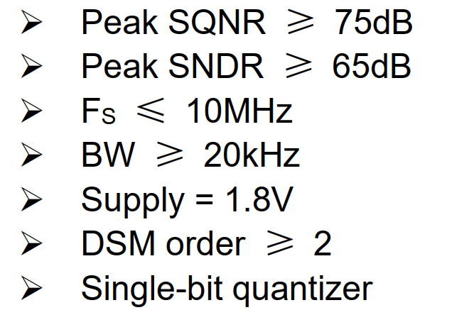

# Delta-Sigma ADC

研一上，txy-模拟集成电路设计，期末大作业

## 具体指标

180nm，开关电容（SC）-DSM

## 参数分析

因为$$\frac{Fs}{2BW}=OSR$$
根据参数要求，取最极限的要求：$$OSR=\frac{10M}{2\cdot 20k}=250$$
最大$SQNR$与阶数（order，L）和量化器（N-bit）之间的关系为：
$$\mathrm{SQNR}=6.02N+1.76+(20L+10)\log(\mathrm{OSR})-10\log\left(\frac{\pi^{2L}}{2L+1}\right)$$
当$L=2,N=1,OSR=128$时，$SQNR=100.24dB$满足条件

这么取是为了给设计留有充分的裕量

我们假设这款DSADC的应用场景是音频信号，所以频率范围要覆盖$0-24kHz$
所以我们取$BW=24kHz,OSR=128,F_s=2\cdot BW \cdot OSR = 6.144MHz$，满足设计要求

具体设计指标为:
|  指标   | 参数  |
|  ----  | ----  |
| $F_s$  | $6.144MHz$ |
| $BW$  | $24kHz$ |
| $OSR$  | $128$ |
| $Order(L)$  | $2$ |
| $Bit(N)$  | $1$ |
| $SQNR_{ideal}$  | $100.24dB$ |

## 行为级仿真
