# 全差分Folded-Cascode-OTA+CT CMFB

## 电路设计指标

采取TSMC 40nm工艺

## 电路整体框架

因为是设计OTA，输出是电流，不能用电阻当负载和接反馈，所以选择电容负载+反馈

## 静态建立误差

假设是单极点系统，当输入给入一个阶跃的时候，输出电压的函数为：

静态建立误差就来自于$\frac{T_0}{1+T_0}$，误差$\frac{1}{1+T_0}\approx\frac{1}{T_0}$记为$\epsilon_0$
要使得静态建立误差小于1%，则$T_0>100$

而我们采取的结构为：

这个电路的直流增益约为$g_{m1,2}\times [(g_{m5,6}r_{o5,6}r_{o7,8})||(g_{m3,4}r_{o3,4}(r_{o9,10}||r_{o1,2})]\times g_{m11,12}(r_{o11,12}||r_{o13,14})\approx \frac{1}{6}(g_mr_o)^3$
而$\beta=\frac{C_f}{C_f+C_s+C_{in}}<\frac{C_f}{C_f+C_s}\approx 0.11$
所以我们需要$$T_0=0.11\times \frac{1}{6}(g_mr_o)^3>100\Rightarrow g_mr_o>18$$

## 动态建立误差

一样同上文所述，动态误差取决于$1-e^{(-t/\tau)}$

建立误差与3dB带宽的关系为：

建立时间需要小于$10ns$，所以有：$$t_s=4.6\tau=4.6/\omega_c<10ns\Rightarrow \omega_c>73.2MHz$$

## 分析压摆过程

只有当输入的差分电压值超过$\sqrt{2}V_{ov}=\sqrt 2 \times 2 \times \frac{id}{gm}$的时候才会有压摆过程，而输出摆幅要求大于0.5V，反馈回输入端的电压$$V_{in,swing}=\beta V_{out,swing}<0.11\times V_{out,swing}<2\sqrt 2 \frac{id}{gm}$$
只有满足上式则不会有压摆过程，那么有$$\frac{g_m}{i_d}<\frac{2\sqrt{2}}{0.11V_{out,swing}}$$
当$V_{out,swing}=0.5V$时，$g_m/i_d<51$，当$V_{out,swing}=1.1V$时，$g_m/i_d<23$
因此整个电路不存在压摆过程

## 噪声分析

用普通的两级运放简单估计：

假设$\beta=0.11,\gamma=1,g_{m1}=g_{m11},g_{m2}=g_{m22}$，则上式可写为：
$$\frac{2kT}{0.11C_c}+\frac{3kT}{1pF+(1-0.11)\times 0.125pF}<\frac{(800uV_{rms})^2}{2}$$
最终解得对$C_c$的限制条件为：$$C_c>0.24pF$$

## 稳定性分析

结合上述分析，下面就可以对电路进行稳定性环路的分析了，二级运放的简化图如下所示：

对零极点、增益分析有：
$$
\begin{cases}
T_0=\beta A_{v1}A_{v2}=\beta G_{m1}R_1G_{m2}R_2 \\
\omega_{p1}\approx \frac{1}{R_1R_2G_{m2}C_c} \\
GBW \approx \frac{\beta G_{m1}}{C_c} \\
\omega_{p2}\approx \frac{G_{m2}}{C_1+C_2+C_1C_2/C_c}=\frac{G_{m2}}{C_{gg1}+C_{Ltot}+C_{gg1}C_{Ltot}/C_c}\\
\omega_z=\frac{1}{C_c(G_{m2}^{-1}-R_z)}
\end{cases}
$$
为了要求相位裕度大于60度，我们这里最好设置70度，这要求$\omega_{p2}=3GBW$
先估计$C_c$
$$C_c\approx0.3\times 1.3C_{Ltot}=0.43pF$$
然后根据$\omega_{p2}=3GBW$，有：

这里取的$C_{gg}$估计约为$0.5pF$，在实际设计的时候因为负载管取的gmid会比较高，这会导致电流效率偏低，因此我们需要较大的W和L，因此输入电容值不会小，这也符合常理。
总之，如果$C_{gg}$前期预估的越大，那么对于$g_{m11,12}$的要求越高
因为之前求过$\omega_c>73.2MHz$，这个是闭环函数的3dB带宽，同时也是环路增益的GBW，根据GBW可以求得：$$g_{m1,2}>2mS$$
所以我们对第二级跨导的需求是：$$g_{m11,12}>4mS$$

对于零点，这里让他移到左边无穷远处$R_z=g_{m11,12}^{-1}=250\Omega$

## 阶段总结

在实际设计仿真的时候，我们要测的是电路环路，而针对上面的所有分析，我们现在掌握的设计条件有：
$$
\begin{cases}
T_0>100(40dB) \\
g_mr_o>18\\
GBW >73.2MHz \\
C_c=0.43pF \\
R_z=250\Omega\\
\end{cases}
$$

最后，由于需要保证共模电平不偏离，要让第一级的压摆占主导，这需要满足$I_{B2}>\frac{C_c+C_{Ltot}}{2C_c}I_{B1}=1.8I_{B1}$
其中$I_{B1}$为第一级放大的尾电流，$I_{B2}$为每一侧的尾电流
但是由于我们前面的分析，只要$g_m/i_d<23$，就不存在压摆过程。因此这里为了保证两级放大管的gmid相同，我们让$I_{B1}=I_{B2}$即可

## gmid设计

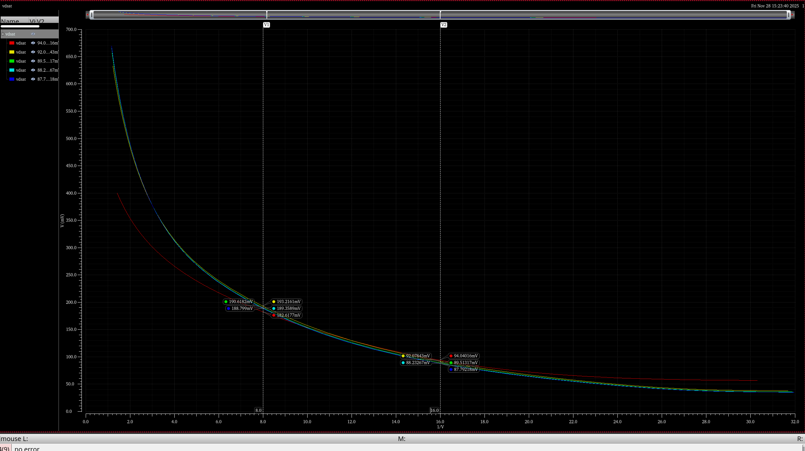
对NMOS从100n扫到5u，要让每个管子的vdsat小于200mV，这对于gmid的要求是大于8，而对于放大管而言，$V_{DS}-V_{dsat}>50mV$，这是因为要保证放大管位于深饱和区，尽量增大输出电阻$r_o$，取gmid=16时差不多

但是在本设计中，第一级输入管用PMOS，而由于本设计中共模电平$450mV$较低，这意味着第二级的输入电平较高，若用NMOS的话会造成较大的$V_{GS}$，所以我们第二级也用PMOS，保证较大的gmid，这对噪声也有好处

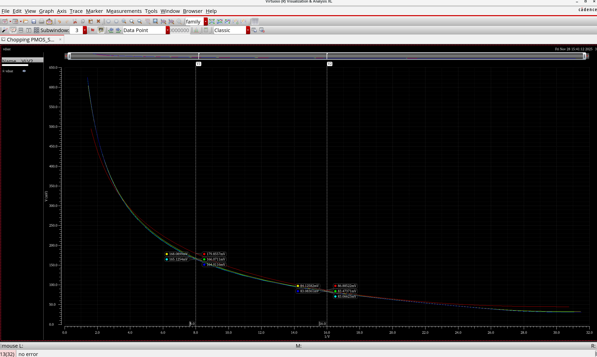
对PMOS仿真也同样如此，我们的设计要在8~16中取gmid

### 长设计

#### PMOS放大管

根据前面的设计，我们需要保证放大管的$g_mr_o>18$
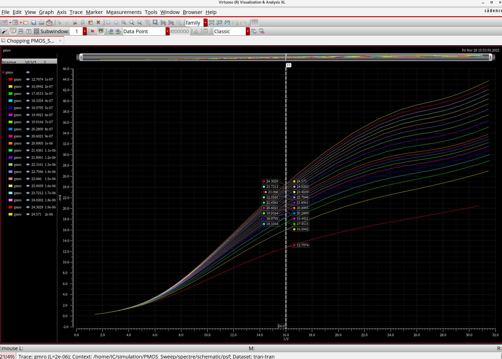
取放大管的$g_m/i_d=16$，而要使得$g_mr_o>18$，我们可以为了留裕量，让第一级和第二级放大管的PMOS取$L=0.5u$

#### PMOS电流管

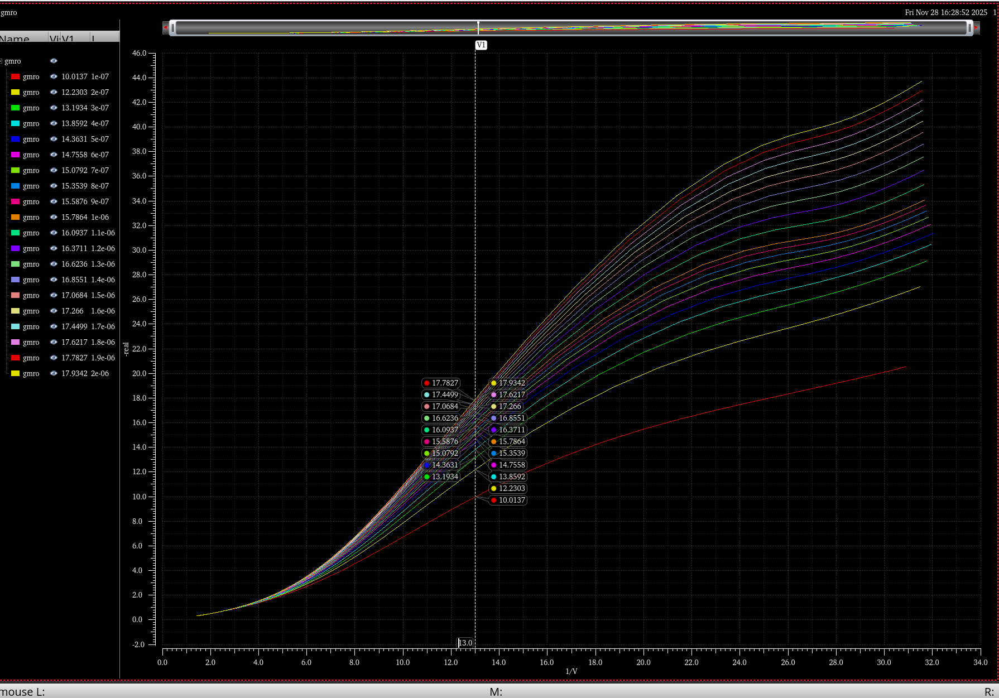
取电流管的$g_m/i_d=12$，这里最好也要保证$g_mr_o>18$，但是对于这个工艺比较难，我们可以取$L=0.5u$，缺少的增益靠后面补

#### NMOS电流管

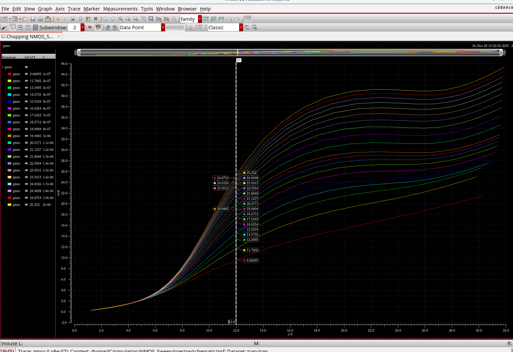
在这里NMOS全部作为电流管使用，取电流管的$g_m/i_d=12$，保证$g_mr_o>18$，我们可以取$L=1u$

### 宽设计

#### PMOS放大管

根据前文条件，取$g_{m1,2}=2mS$，根据$g_m/i_d=16$，可以求得电流$I_{B1}/2=125\mu A$
于是第一级的尾电流管电流$I_{B1}=250\mu A$
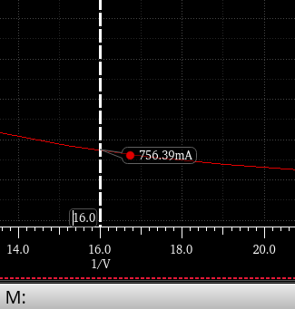
根据$I_D/W$在gmid=16的时候取756.39m，可以求得$W_{1,2}=165\mu m$

而第二级放大管的电流是第一级的两倍，所以直接让其等于两倍就好,$W_{11,12}=330\mu m$

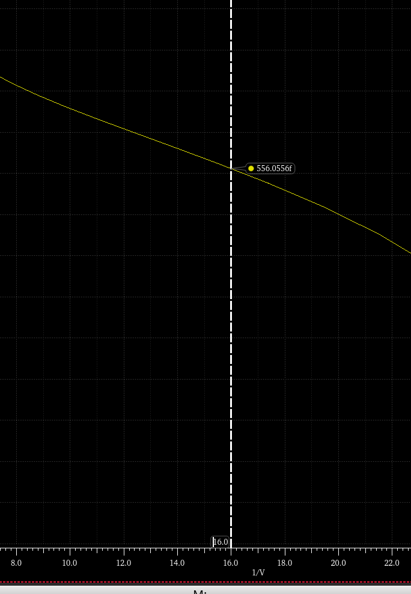
此时测得第一级的$C_{gg}=556fF$，与我们的实现估计差不多

#### PMOS电流管

电流管的$L=0.5\mu m ,g_m/i_d=12$
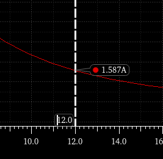
对于$M_0$管，$I_{B1}=250\mu A$，求得$W_0=158\mu m$

对于$M_{5,6,7,8}$管，$I_{5,6,7,8}=125\mu A$，求得$W_{5,6,7,8}=79\mu m$

#### NMOS电流管

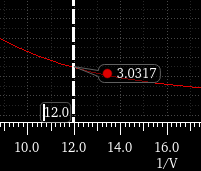
对于$M_{3,4}$管,$I_{3,4}=125\mu A$，求得$W_{3,4}=41 \mu m$
对于$M_{9,10，13，14}$管,$I_{3,4}=250\mu A$，求得$W_{9，10，13，14}=82 \mu m$

### 总结

根据以上设计，同时为了保证宽长都是偶数，不要出现奇数（或质数）的原则，我们设计的宽长比为：
|  MOS管   | W($\mu m$)  | L($\mu m$)  |
|  ----  | ----  | ----  |
| $M_0$  | 160 |0.5 |
| $M_{1,2}$  | 165 |0.5 |
| $M_{3,4}$  | 42 |1 |
| $M_{5,6,7,8}$  | 80 |0.5 |
| $M_{9,10}$  | 84 |1 |
| $M_{11,12}$  | 330 |0.5|
| $M_{13,14}$  | 84 |1 |

## 共模反馈

先使用理想的共模反馈进行仿真（假设输出共模电平为450mV）：
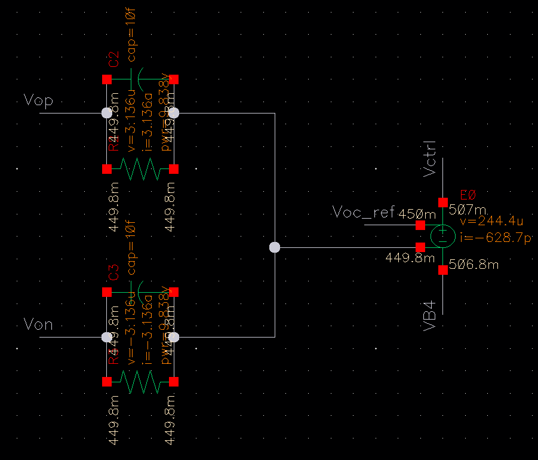
这里的电阻和电容并联取值要大，尤其是电阻，这保证了放大能力
由于我在这用的是直流仿真，因此电容的取值不用太在意，主要验证一下DC点
输入是450mV共模电平，可以看到输出是正常的

下一步是将理想的共模反馈换成实际的

这里采用的连续时间共模反馈（CT CMFB）如下图：
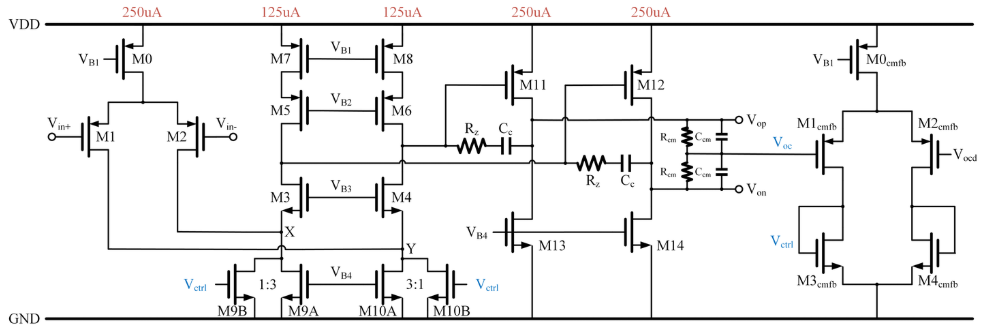
下面需要分析稳定性

### 共模反馈稳定性分析

这里需要分析一下开环的GBW和共模环路的GBW，我们需要保证共模环路的GBW至少是开环差分GBW的1/3才能保证共模能顺利建立

#### 开环的差模稳定性

这里和前文求得环路增益的区别就是少了反馈系数$\beta$，且由于是差模环路，后面共模检测+反馈的部分我们在差模分析的时候都可以当作不存在

因此可以直接写出：$$
\begin{cases}
A_{DM}\approx g_{m1,2}\left(g_mr_o^2/3\right)\cdot g_{m11,12}r_o/2=g_{m1,2}\cdot g_{m11,12}\cdot g_mr_o^3/6 \\
\omega_{p1,DM}\approx\frac{1}{g_{m11,12}R_{2,DM}R_{1,DM}C_C}\\
\omega_{p2,DM}\approx\frac{g_{m11,12}}{C_{L,tot}+C_{gg11,12}+C_{L,tot}C_{gg11,12}/C_C} \\
\omega_{z,DM}\approx\frac{g_{m11,12}}{C_C(1-R_Zg_{m11,12})}=\frac{1}{C_C(g_{m11,12}^{-1}-R_Z)} \\
GBW_{DM}=A_{DM}\cdot\omega_{p1}\approx g_{m1,2}/C_C\\
\end{cases}$$

#### 共模环路的稳定性

共模环路的等效图如下所示：
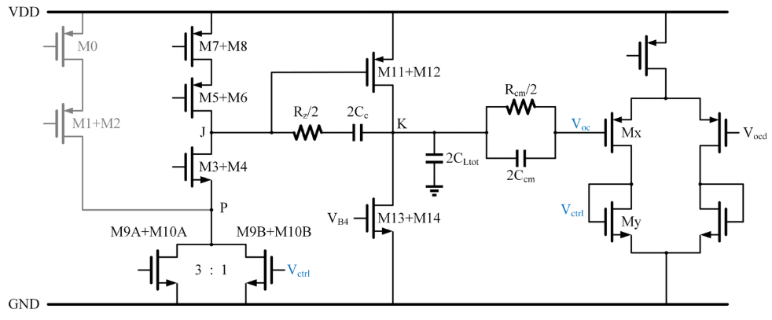
在分析的时候由于左侧$M_{0,1,2}$相比于$M_{9,10}$大了$g_mr_o$倍，所以直接不考虑
从$V_{oc}$处断环，注入信号后分析出的共模环路增益为：
$$\begin{aligned}T_{0,CM}=&-\frac{v_{ctrl}}{v_{oc}}\frac{v_{j}}{v_{ctrl}}\frac{v_{k}}{v_{j}}\\=&\frac{g_{mx}}{2g_{my}}\cdot\frac{1}{2}g_mr_o^2g_{m9B,10B}\cdot g_{m11,12}\frac{r_o}{2}\\=&\frac{1}{8}g_mr_o^3\cdot\frac{g_{mx}}{g_{my}}\cdot\frac{3}{8}g_{m1,2}\cdot g_{m11,12}\\=&\frac{18}{64}A_{DM}\frac{g_{mx}}{g_{my}}\end{aligned}$$

在这里，$g_{mx}/i_d=16,g_{my}/i_d=12$，所以$T_{0,CM}=\frac{3}{8}A_{DM}$，增益和差模相比约下降了8.5dB

第一个极点为：$$\begin{aligned}\omega_{p1,CM}&\approx\frac{1}{2g_{m11,12}\frac{r_o/2}{2}\frac{g_mr_o^2}{4}2C_c}\\&=\frac{1}{g_{m11,12}\begin{pmatrix}g_{m}r_{o}^{3}/4\end{pmatrix}C_{c}}=\frac{2}{3}\omega_{p1,DM}\end{aligned}$$

第二个极点为：$$\omega_{p2,CM}\approx\frac{2g_{m11,12}}{2C_{Ltot}+2C_{gg11,12}+2C_{Ltot}2C_{gg11,12}/2C_C}=\omega_{p2,DM}$$

消零电阻的位置为：$$\omega_{z{1,CM}}\approx\frac{1}{2C_{C}\left[\left(2g_{m11,12}\right)^{-1}-R_{z}/2\right]}=\omega_{z,DM}$$

这里只有第一级极点的位置发生了改变，因为原本有一个并联关系，现在并联的另一端被忽略了（因为变成了cascode级，阻抗相比另一端增大了太多）

误差放大器同样也贡献了零极点对：
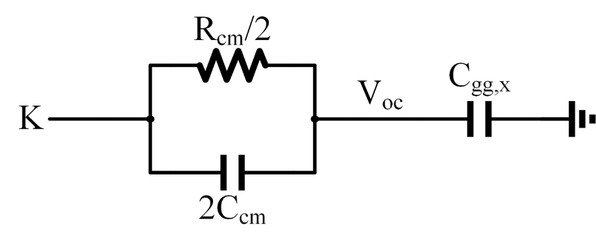
$$\begin{aligned}\frac{V_{OC}}{V_{K}}(s)&=\frac{1+s\frac{R_{cm}}{2}2C_{cm}}{1+s\frac{R_{cm}}{2}(2C_{cm}+C_{gg,x})}\\&=\frac{1+sR_{cm}C_{cm}}{1+sR_{cm}(C_{cm}+C_{gg,x}/2)}\end{aligned}$$
解得零极点为：$$\begin{aligned}&\omega_{p3,CM}=\frac{1}{R_{cm}(C_{cm}+C_{gg,x}/2)}\\&\omega_{z2,CM}=\frac{1}{R_{cm}C_{cm}}\end{aligned}$$
针对这个零极点，我们只需要让$C_{cm}>>C_{gg,x}$就能保证这对零极点对的影响降低

最后还有一个误差放大器输出端的极点：$$\omega_{p4,CM}\approx\frac{g_{my}}{C_{gg,y}+C_{gg,9B,10B}}$$
这通常由$C_{gg,9B,10B}$来决定

在单极点近似下：$$\begin{aligned}GBW_{CM}&=T_{0}\cdot\omega_{p1,CM}\\&=\frac{3}{64}g_{m}r_{o}^{3}\cdot\frac{g_{mx}}{g_{my}}\cdot g_{m1,2}\cdot g_{m11,12}\cdot\frac{1}{g_{m11,12}\left(g_{m}r_{o}^{3}/4\right)C_{C}}\\&=\frac{3}{16}\frac{g_{mx}}{g_{my}}\frac{g_{m1,2}}{C_{C}}\approx\frac{1}{3}GBW_{DM}\end{aligned}$$

由于$g_{m1,2},C_c,\omega_{p1,CM},\omega_{p2,CM},\omega_{z1,CM}$这些参数几乎都与差模增益、稳定性强稳定，我们前期已经设计好了，不好再去改变，所以能改变的只有$g_{mx},g_{my}$，通过让$g_{mx}/i_d=16,g_{my}/i_d=9$，从而让$GBW_{CM}=\frac{1}{3}GBW_{DM}$

而为了满足单极点近似，我们需要让第二级极点最好在GBW的2倍之外，即：$$\omega_{p4,CM}>2\cdot GBW_{CM}$$
为什么不是第二第三个极点，而是第四个极点作为第二级极点呢：因为第二个极点在差模分析的时候已经分析过了，大约在3倍$GBW_{DM}$处，而第三个极点和零点只要$C_{cm}$足够大，这对零极点可以相互抵消，所以我们能修改的，并且需要考虑的只有第四个极点

而在我们前面的仿真中：$g_{m1,2}=2mS,C_c=0.43pF,C_{gg9,10}=170.3fF$，这样大致估算出来的$g_{my}=0.53mS$
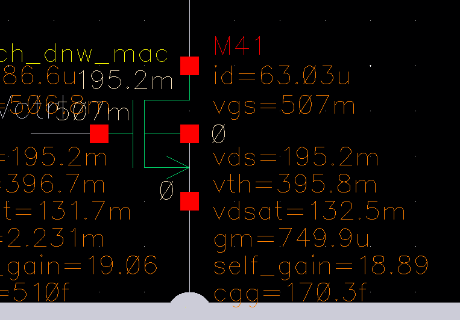

而我们在前面假设中,$g_{my}/i_d=9$，所以求得$i_d=60\mu A$，因为电流镜的分比，这里大约取为$62.5\mu A$
最终设计的参数为：
|  MOS管   | W($\mu m$)  | L($\mu m$)  |
|  ----  | ----  | ----  |
| $M_{0,cmfb}$  | 80 |0.5 |
| $M_{1,2,cmfb}$  | 84 |0.5 |
| $M_{3,4,cmfb}$  | 12 |1 |

## 仿真

### DC仿真

开环仿，不用闭环的原因是全局的CMFB保证了每个高阻点的电平均有定义，不会和单端差分一样“抢电流”

仿真后发现输出共模电平还是偏高的，反馈回控制端的电压会偏低，这意味着PMOS贡献的电流太少了，能力不够，因此我们还需要进一步改进PMOS的尺寸
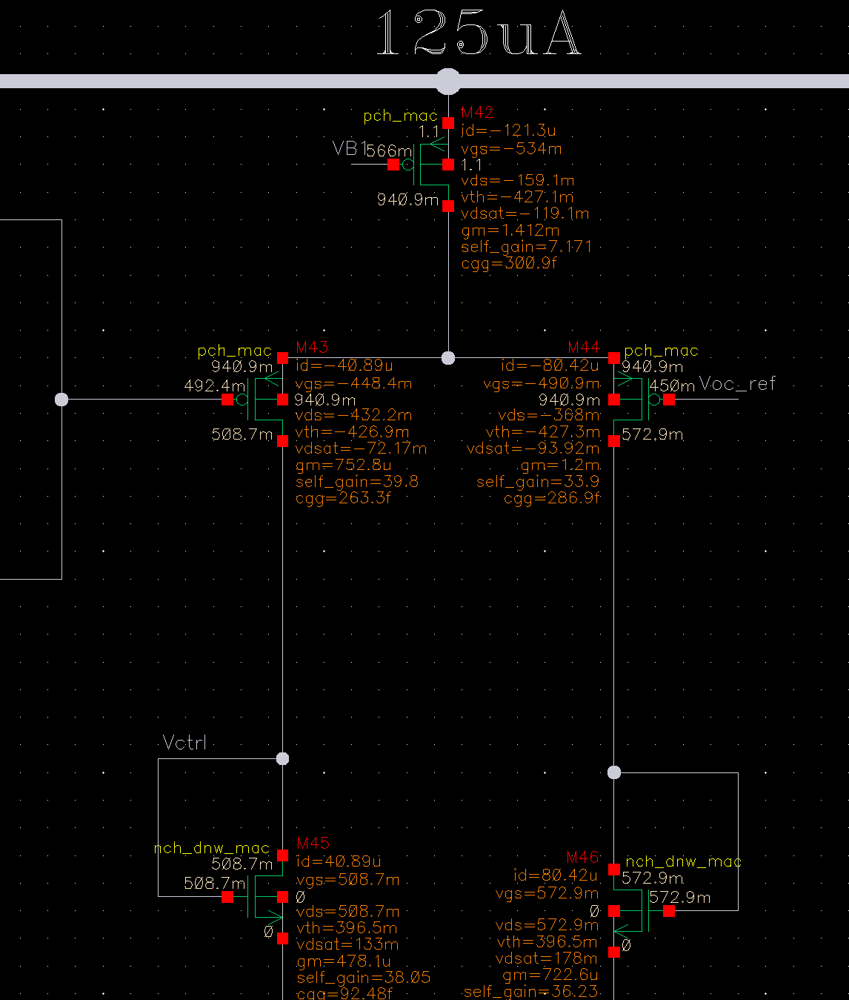

改正后仿真为：这里改的太极限了，完全是凑出来的，实际中还是会差一点的
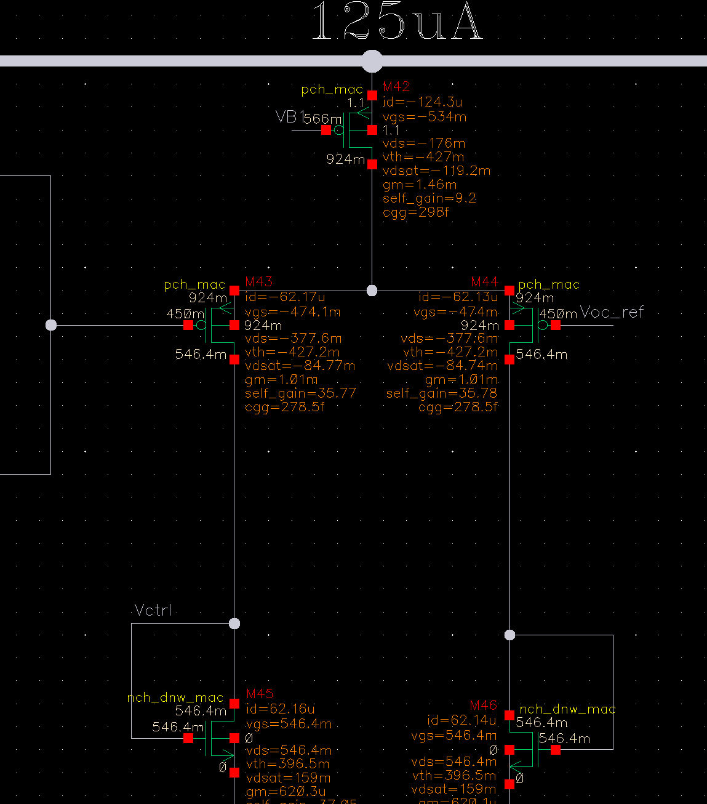
第一级流过的电流变多了
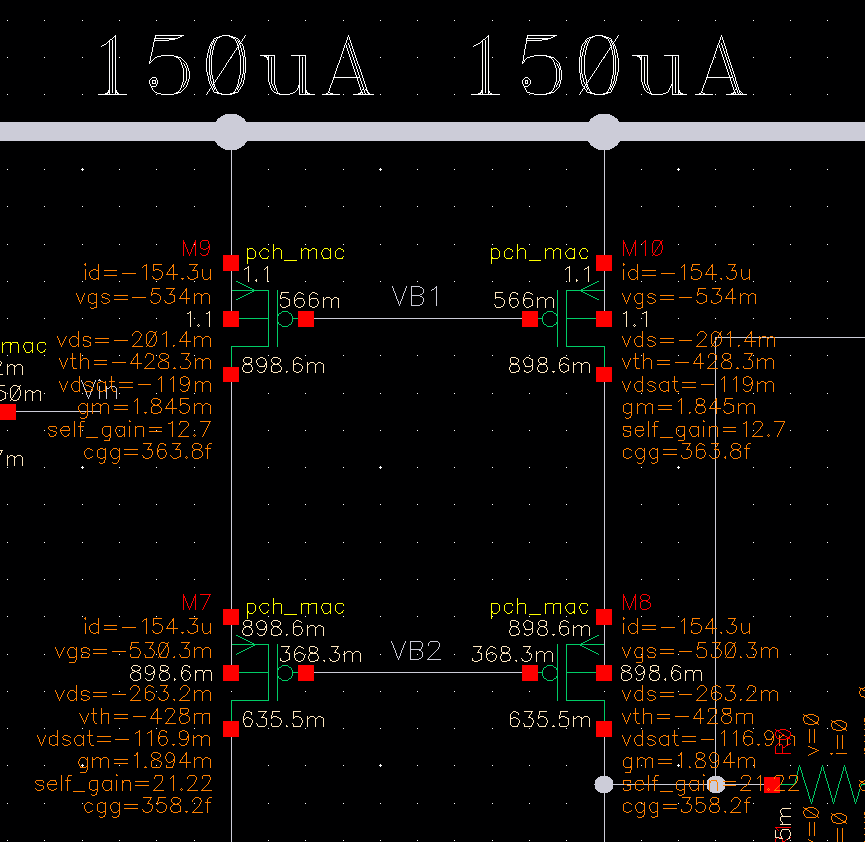

此时的电路尺寸为：
|  MOS管   | W($\mu m$)  | L($\mu m$)  |
|  ----  | ----  | ----  |
| $M_0$  | 160 |0.5 |
| $M_{1,2}$  | 165 |0.5 |
| $M_{3,4}$  | 42 |1 |
| $M_{5,6,7,8}$  | 99 |0.5 |
| $M_{9,10}$  | 84 |1 |
| $M_{11,12}$  | 330 |0.5|
| $M_{13,14}$  | 84 |1 |
| $M_{0,cmfb}$  | 80 |0.5 |
| $M_{1,2,cmfb}$  | 84 |0.5 |
| $M_{3,4,cmfb}$  | 12 |1 |

输出范围：大约为$-745.7779mV\sim 745.7804mV$
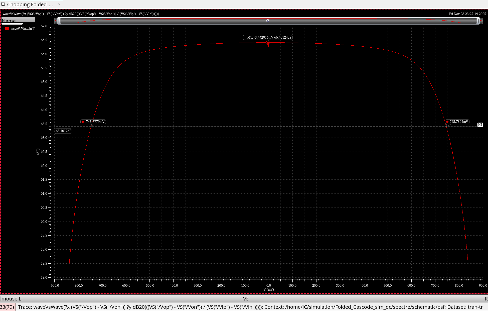

输入范围：大约为$0\sim 652mV$
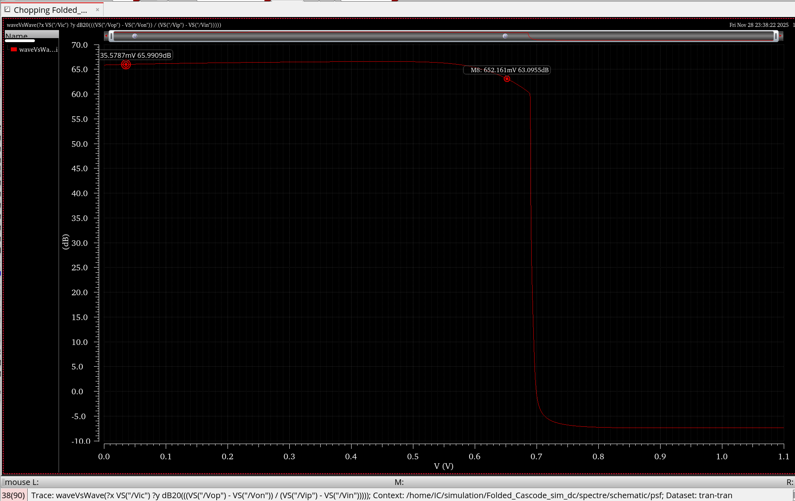
这个定义是给输入一个很小的差分电压($0.1\mu V$)，然后扫共模电压，当差模增益下降3dB的时候，就是输入范围

### 重新设计

经过多轮仿真，发现前面的参数始终“凑不到”一个合适的值，包括改了CMFB后也不行
猜测是因为前期gmid曲线$V_D=200mV$取的太过极端了！这会导致我们无法避免地使用大尺寸晶体管，这对寄生电容的引入是灾难性的，因此我们需要根据前面的条件，重新选择管子尺寸

因此我重新选择了一批参数进行仿真
这次我的原则是让PMOS和NMOS的L分别设为$L_{PMOS}=100nm,L_{NMOS}=500nm$，这么选择的原因是，PMOS作为放大管，在$100nm$的时候，因为$V_D\approx 700mV$，这时候$g_mr_o>18$，已经满足条件了，之所以之前不满足，是因为我们取的$V_D=200mV$太小了
而$L_{NMOS}=500nm$的原因是，在这个放大器中，NMOS全是作为负载管来使用，$V_{DS}\approx 200mV$，这个增益确实有点小了

我们在前期设计时，遵循的原则是放大管$g_mi_d=16$，负载管$g_mi_d=9$，这能减小对于尺寸的要求，也能够减小寄生和噪声

最终设计的参数如下：（待补充）

## 全差分失调的仿真

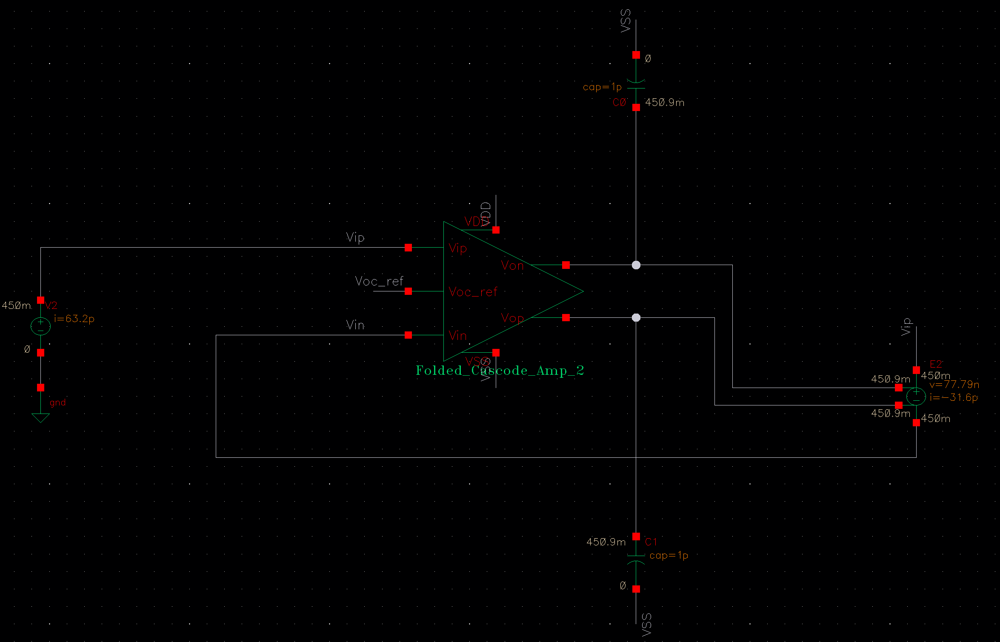
如图所示，这个运放的增益有大概$60dB$，如果这个增益还觉得不够的话，可以在后面加一级理想运放VCVS用来提高增益，然后再反馈回输入的另一端用作单位反馈
这样避免了全差分的不对称性（如果不加理想增益级，直接将Vop接到Vin，全差分的天然对称性就被破坏了，此时仿真mc会有系统失调）
但是这个增益级也不能太大，不然会将前面的误差电平放大到一个特别大的地步，导致输出饱和（10~100足够）
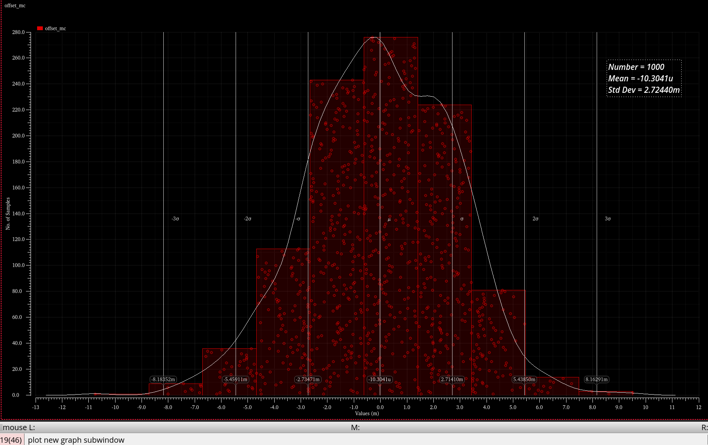