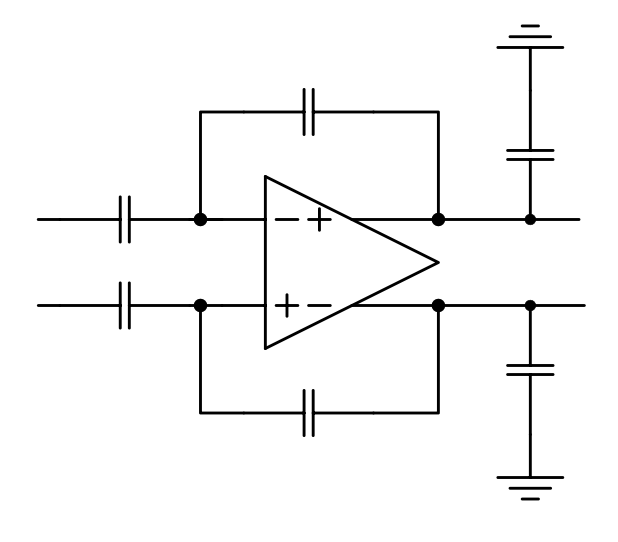
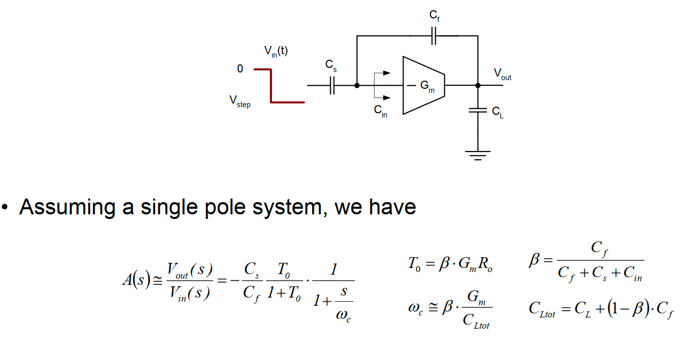
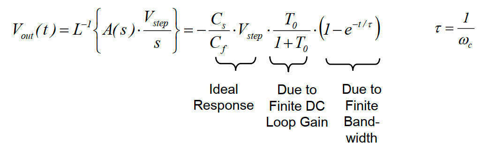
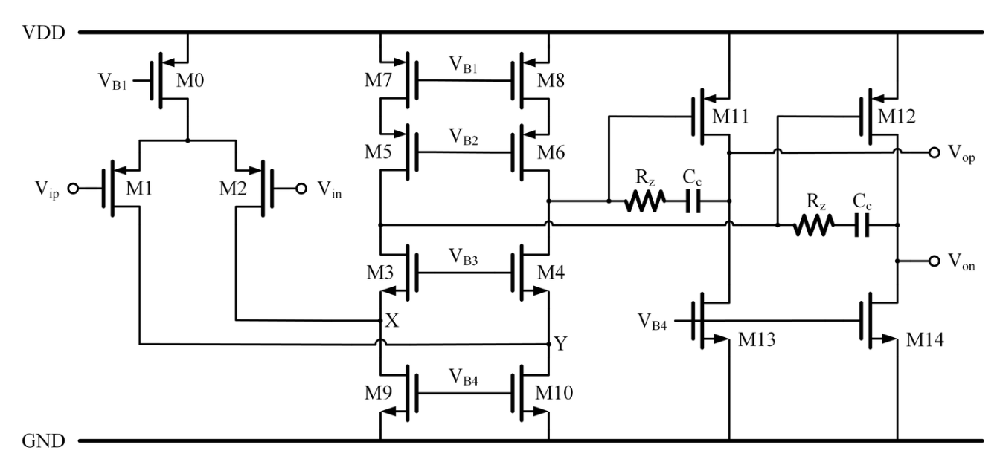
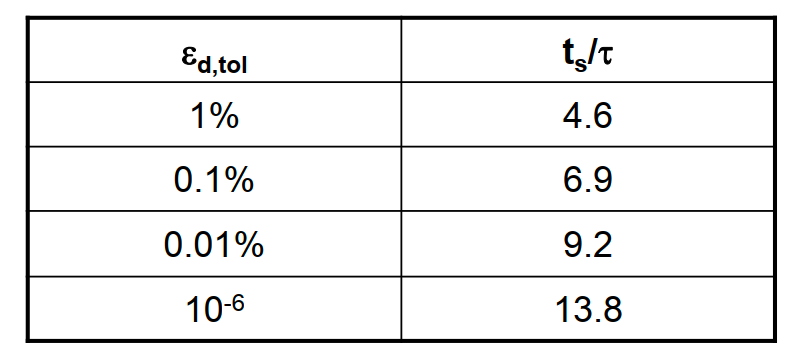
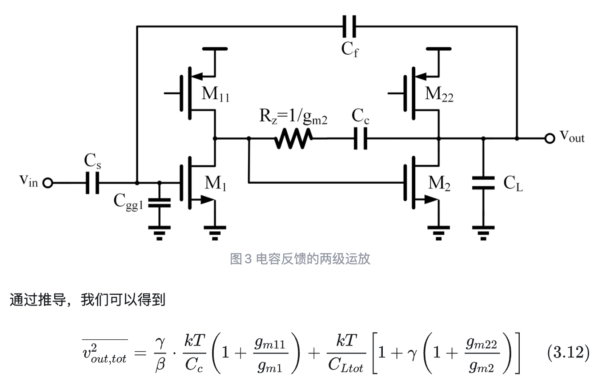
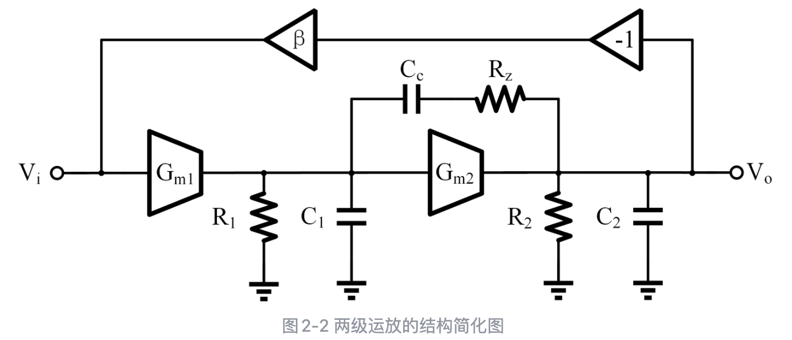

# 全差分Folded-Cascode-OTA+CT CMFB

## 电路设计指标

采取TSMC 40nm工艺

## 电路整体框架

因为是设计OTA，输出是电流，不能用电阻当负载和接反馈，所以选择电容负载+反馈

## 静态建立误差

假设是单极点系统，当输入给入一个阶跃的时候，输出电压的函数为：

静态建立误差就来自于$\frac{T_0}{1+T_0}$，误差$\frac{1}{1+T_0}\approx\frac{1}{T_0}$记为$\epsilon_0$
要使得静态建立误差小于1%，则$T_0>100$

而我们采取的结构为：

这个电路的直流增益约为$g_{m1,2}\times [(g_{m5,6}r_{o5,6}r_{o7,8})||(g_{m3,4}r_{o3,4}(r_{o9,10}||r_{o1,2})]\times g_{m11,12}(r_{o11,12}||r_{o13,14})\approx \frac{1}{6}(g_mr_o)^3$
而$\beta=\frac{C_f}{C_f+C_s+C_{in}}<\frac{C_f}{C_f+C_s}\approx 0.11$
所以我们需要$$T_0=0.11\times \frac{1}{6}(g_mr_o)^3>100\Rightarrow g_mr_o>18$$

## 动态建立误差

一样同上文所述，动态误差取决于$1-e^{(-t/\tau)}$

建立误差与3dB带宽的关系为：

建立时间需要小于$10ns$，所以有：$$t_s=4.6\tau=4.6/\omega_c<10ns\Rightarrow \omega_c>73.2MHz$$

## 分析压摆过程

只有当输入的差分电压值超过$\sqrt{2}V_{ov}=\sqrt 2 \times 2 \times \frac{id}{gm}$的时候才会有压摆过程，而输出摆幅要求大于0.5V，反馈回输入端的电压$$V_{in,swing}=\beta V_{out,swing}<0.11\times V_{out,swing}<2\sqrt 2 \frac{id}{gm}$$
只有满足上式则不会有压摆过程，那么有$$\frac{g_m}{i_d}<\frac{2\sqrt{2}}{0.11V_{out,swing}}$$
当$V_{out,swing}=0.5V$时，$g_m/i_d<51$，当$V_{out,swing}=1.1V$时，$g_m/i_d<23$
因此整个电路不存在压摆过程

## 噪声分析

用普通的两级运放简单估计：

假设$\beta=0.11,\gamma=1,g_{m1}=g_{m11},g_{m2}=g_{m22}$，则上式可写为：
$$\frac{2kT}{0.11C_c}+\frac{3kT}{1pF+(1-0.11)\times 0.125pF}<\frac{(800uV_{rms})^2}{2}$$
最终解得对$C_c$的限制条件为：$$C_c>0.24pF$$

## 稳定性分析

结合上述分析，下面就可以对电路进行稳定性环路的分析了，二级运放的简化图如下所示：

对零极点、增益分析有：
$$
\begin{cases}
T_0=\beta A_{v1}A_{v2}=\beta G_{m1}R_1G_{m2}R_2 \\
\omega_{p1}\approx \frac{1}{R_1R_2G_{m2}C_c} \\
GBW \approx \frac{\beta G_{m1}}{C_c} \\
\omega_{p2}\approx \frac{G_{m2}}{C_1+C_2+C_1C_2/C_c}=\frac{G_{m2}}{C_{gg1}+C_{Ltot}+C_{gg1}C_{Ltot}/C_c}\\
\omega_z=\frac{1}{C_c(G_{m2}^{-1}-R_z)}
\end{cases}
$$
为了要求相位裕度大于60度，我们这里最好设置70度，这要求$\omega_{p2}=3GBW$
先估计$C_c$
$$C_c\approx0.3\times 1.3C_{Ltot}=0.43pF$$
然后根据$\omega_{p2}=3GBW$，有：

==这里取的$C_{gg}$估计约为$0.5pF$== 要在40nm工艺下验证一下

因为之前求过$\omega_c>73.2MHz$，这个是闭环函数的3dB带宽，同时也是环路增益的GBW，根据GBW可以求得：$$g_{m1,2}>2mS$$
所以我们对第二级跨导的需求是：$$g_{m11,12}>4mS$$

对于零点，这里让他移到左边无穷远处$R_z=g_{m11,12}^{-1}=250\Omega$

## 阶段总结

在实际设计仿真的时候，我们要测的是电路环路，而针对上面的所有分析，我们现在掌握的设计条件有：
$$
\begin{cases}
T_0>100(40dB) \\
g_mr_o>18\\
GBW >73.2MHz \\
C_c=0.43pF \\
R_z=250\Omega\\
\end{cases}
$$